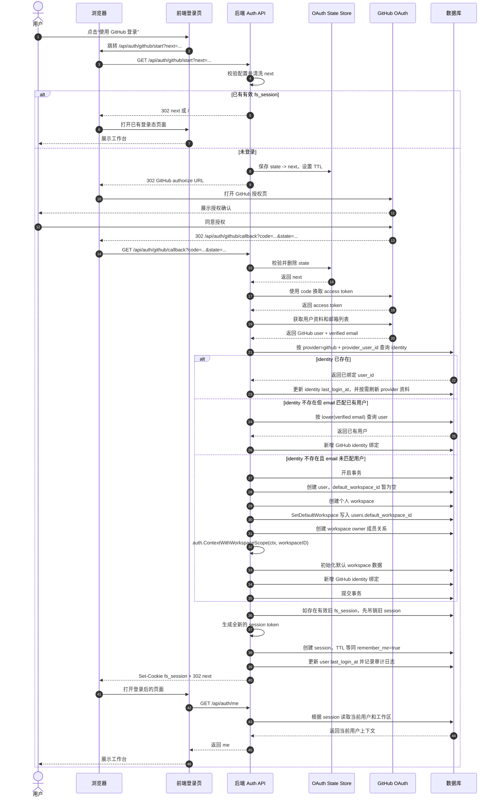
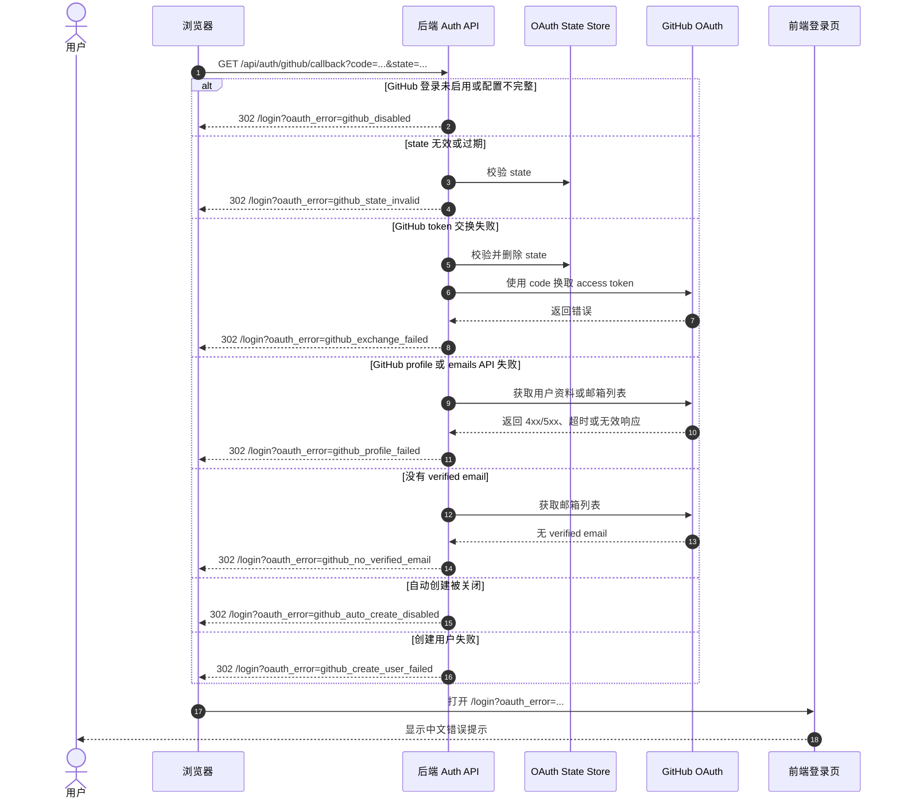

# GitHub 登录功能设计

## 目标

为登录页的“使用 GitHub 登录”按钮接入 GitHub OAuth，并采用“首次 GitHub 登录自动创建用户和个人工作区”的策略。

登录成功后继续复用现有后端 session 机制：后端签发 `fs_session` HttpOnly Cookie，前端不保存 GitHub token，GitHub access token 只在回调期间用于读取用户资料和邮箱。

## 设计结论

- 首次 GitHub 登录自动创建本地用户和个人工作区。
- OAuth `state` 使用服务端短期存储，单次使用，回调后删除。
- OAuth state store 通过接口注入，v1 使用进程内实现，后续可替换为 Redis 或数据库短期表。
- GitHub 登录 session 默认等同 `remember_me=true`，使用现有 remember TTL，未配置时为 30 天。
- 不向现有 `users` 表新增 `username` 或 `avatar_url` 字段；GitHub login 和头像保存在 `auth_identities`。
- 为了区分密码账号和 OAuth 自动创建账号，建议给 `users` 新增 `password_set` 字段。
- `auth_identities` 保持项目现有的 `id TEXT PRIMARY KEY` 风格，同时用 `(provider, provider_user_id)` 做唯一约束。
- v1 不支持“已登录账号绑定 GitHub”。如果已有有效 `fs_session` 访问 `/api/auth/github/start`，直接重定向到首页或安全的 `next`，不发起 OAuth。
- GitHub OAuth 路由必须是公开路由，不能经过 `authMiddleware.Required()` 或 `RequirePasswordSettled()`。
- GitHub callback 创建新 session 前必须清理或吊销已有 `fs_session`，避免 session fixation 风险。
- 登录页需要读取 `oauth_error` query param 并展示中文错误提示；GitHub 按钮使用 `<a href="...">` 做整页跳转。

## 账号策略

GitHub OAuth 回调成功后，后端按照下面顺序解析账号：

1. 如果已经存在 GitHub identity 映射，直接登录对应用户。
2. 如果不存在 identity，但 GitHub 返回的 verified email 匹配本地已有用户，则绑定 GitHub identity 后登录。
3. 如果本地也没有对应用户，则自动创建用户、个人工作区和 owner 成员关系，再绑定 GitHub identity 并登录。

创建 GitHub 自动注册用户时使用现有 `model.User` 能表达的字段：

- `email`: GitHub 返回的 verified primary email；如果没有 primary，则使用第一个 verified email。
- `display_name`: GitHub name，缺失时使用 GitHub login。
- `password_hash`: 生成一个不可猜的随机明文密码，例如 UUID 或 32 字节 `crypto/rand` base64，再用现有 `auth.HashPassword` 得到 bcrypt hash。这样字段内容仍是合法 bcrypt hash，但用户实际不知道明文密码。
- `password_set`: `false`。
- `must_change_password`: `false`。
- `role`: `user`。
- `status`: `active`。
- `default_workspace_id`: 创建用户时先留空或 NULL，创建 workspace 后再用现有 `SetDefaultWorkspace` 写入。

`username` 和 `avatar_url` 当前不属于 `users` 表，也不属于 `model.User`。第一版不新增这两个用户字段：

- GitHub login 写入 `auth_identities.provider_login`。
- GitHub avatar URL 写入 `auth_identities.avatar_url`。
- 如果后续产品需要在全站展示头像，再单独设计 `users.avatar_url` 的迁移和前端展示。

## 自动创建事务

自动创建用户必须在同一个数据库事务中完成，避免新用户创建成功但缺少默认工作区，导致后续 `/api/auth/me` 或登录态校验失败。

推荐事务顺序：

1. 预先生成 `user_id` 和 `workspace_id`。
2. `INSERT INTO users (...)`，其中 `default_workspace_id` 留空或 NULL，`password_set = false`。
3. `INSERT INTO workspaces (...)`，其中 `owner_user_id = user_id`。
4. `UPDATE users SET default_workspace_id = workspace_id WHERE id = user_id`，沿用现有 `SetDefaultWorkspace` 行为。
5. `INSERT INTO workspace_members (...)`，其中 `role = 'owner'`。
6. 用 `auth.ContextWithWorkspaceScope(ctx, workspace_id)` 包装 context，再调用现有 workspace 默认数据初始化逻辑 `provisioning.EnsureDefaultWorkspaceData(scopeCtx, tx)`。
7. `INSERT INTO auth_identities (...)`。
8. 写入审计日志。
9. 创建 session 并更新 `users.last_login_at`。

这个顺序与现有 `admin_users.go` 和 `bootstrap/auth_bootstrap.go` 的创建模式保持一致。PostgreSQL 和 SQLite 都有 `DEFERRABLE INITIALLY DEFERRED` 的 default workspace 约束，但不要同时在 `INSERT users` 和 `SetDefaultWorkspace` 重复写同一个值。

现有 `workspaces` 表对 `owner_user_id` 有唯一约束，因此并发回调或重复创建时必须依赖事务和唯一约束兜底。若创建过程中遇到 email 或 identity 唯一冲突，应重新查询已存在用户或 identity，再继续登录流程，不应直接让用户看到 500。

并发场景的处理规则：

- 两个 callback 同时命中同一个新 GitHub 账号时，只有一个 `INSERT auth_identities` 会成功；另一个遇到 `(provider, provider_user_id)` 唯一冲突后，重新查询 identity 并继续创建 session。
- 两个 callback 同时使用同一个 verified email 创建本地用户时，只有一个 `INSERT users` 会成功；另一个遇到 `users_email_lower_idx` 唯一冲突后，按 email 重新查询 user，再尝试创建或查询 identity。
- 两个 callback 同时为同一个已有 email 绑定 GitHub identity 时，第二个 `INSERT auth_identities` 遇到唯一冲突后，重新查询 identity 并继续登录。
- 两个 callback 同时尝试为同一个用户创建 workspace 时，`UNIQUE(owner_user_id)` 是最后兜底；冲突后应重新查询用户的 `default_workspace_id`。

## GitHub OAuth 配置

GitHub 登录需要创建 GitHub OAuth App，配置位置是 GitHub 账号或组织的 Developer settings，不是仓库的 Repository security。

生产环境推荐配置：

- Homepage URL: `https://all-note.jinrunlab.site`
- Authorization callback URL: `https://all-note.jinrunlab.site/api/auth/github/callback`

后端运行时需要读取以下环境变量：

```env
AUTH_GITHUB_ENABLED=true
AUTH_GITHUB_CLIENT_ID=github_oauth_client_id
AUTH_GITHUB_CLIENT_SECRET=github_oauth_client_secret
AUTH_GITHUB_REDIRECT_URL=https://all-note.jinrunlab.site/api/auth/github/callback
AUTH_GITHUB_AUTO_CREATE_USERS=true
AUTH_GITHUB_STATE_TTL=10m
AUTH_GITHUB_ALLOWED_REDIRECT_HOSTS=all-note.jinrunlab.site
```

`AUTH_GITHUB_STATE_TTL` 可选，未配置时建议默认 10 分钟。

`AUTH_GITHUB_REDIRECT_URL` 在生产环境推荐显式配置，并且必须和 GitHub OAuth App 的 Authorization callback URL 完全一致。如果后续需要支持多个访问域名，v1 不应直接信任任意 Host header，而应采用下面两种方式之一：

- 为每个域名创建独立 OAuth App，并部署对应的 `AUTH_GITHUB_REDIRECT_URL`。
- 新增允许列表配置，例如 `AUTH_GITHUB_ALLOWED_REDIRECT_HOSTS`，只在 Host 命中允许列表时，才基于 `X-Forwarded-Proto` 和 Host 动态构造 callback URL。

当前 v1 实现没有动态构造 callback URL：如果没有显式 `AUTH_GITHUB_REDIRECT_URL`，GitHub provider 不会被视为可用。基于可信反向代理 `X-Forwarded-Proto` 和 Host 的动态 callback URL 方案可作为后续版本扩展，但必须先校验 Host 属于允许列表，避免 Host header 注入。

如果部署流程通过 GitHub Actions 发布，可以把 `AUTH_GITHUB_CLIENT_ID` 和 `AUTH_GITHUB_CLIENT_SECRET` 存到 Repository Secrets，再由部署流程注入到服务器环境变量。Repository Secrets 只对 CI/CD 有效，不能替代线上服务的运行时配置。

## OAuth State Store

OAuth state 使用接口隔离，避免 handler 直接依赖进程内 map：

```go
type OAuthStateStore interface {
	Save(ctx context.Context, state, next string, ttl time.Duration) error
	Consume(ctx context.Context, state string) (next string, err error)
}
```

接口语义：

- `Save` 写入随机 state、清洗后的 next 和过期时间。
- `Consume` 必须是原子操作：读取成功后立即删除，保证 state 只能用一次。
- state 不存在、已过期或已消费时，`Consume` 返回统一的 `ErrOAuthStateInvalid`。

v1 进程内实现建议：

- 使用 `map[string]oauthStateEntry` 保存 state。
- 用 `sync.Mutex` 或 `sync.RWMutex` 保护读写。
- 每条记录包含 `next` 和 `expiresAt`。
- 启动一个 cleanup goroutine，每 2 分钟删除过期条目。
- cleanup 删除过期条目时应分批处理，例如每轮最多删除 1000 条，避免 map 很大时长时间持锁。
- cleanup goroutine 在服务启动时创建，在服务关闭时通过 context cancellation 停止。

启动位置建议放在 `backend/cmd/server/main.go` 的 `router.Setup` 之前，或 router/server 组装 Auth handler 的位置：创建一个全局 `OAuthStateStore` 实例，注入 GitHub OAuth handler。后续切 Redis 时只替换实现，不改 handler 流程。

## 后端接口

### `GET /api/auth/providers`

公开读取可用登录方式，供登录页决定是否展示 GitHub 登录入口。

Response:

```json
{
  "providers": ["github"]
}
```

行为：

- 当 `AUTH_GITHUB_ENABLED=true` 且 client id、client secret、callback URL 配置完整时，返回 `github`。
- 当 GitHub 登录未启用或配置不完整时，返回空数组。
- 该端点不需要 session，也不能挂 `RequirePasswordSettled()`。

### `GET /api/auth/github/start`

发起 GitHub 授权。

Query:

- `next`: 登录成功后的站内跳转地址。

行为：

1. 检查 GitHub OAuth 是否启用。
2. 如果 GitHub OAuth 未启用或配置不完整，重定向到 `/login?oauth_error=github_disabled`。
3. 如果请求已经带有有效 `fs_session`，v1 直接重定向到安全的 `next` 或 `/`，不发起 OAuth，也不绑定 GitHub identity。
4. 使用后端统一的 `sanitizeOAuthNext` 清洗 `next`。
5. 生成随机 `state`，将 `state -> next` 写入 `OAuthStateStore`。
6. 重定向到 GitHub OAuth authorize URL。

建议 scope：

```text
read:user user:email
```

第一版推荐使用进程内 `map + mutex + TTL cleanup` 保存 OAuth state，因为当前服务部署形态是单实例。若后续部署为多实例，应替换为 Redis 或数据库短期表。state 回调成功或失败后都要删除，保证 single-use。

已登录用户绑定 GitHub identity 不属于 v1 范围。后续如果要做账号绑定，应新增登录态保护的 `POST /api/auth/github/link/start` 与 callback，避免和“用 GitHub 登录并切换账号”的语义混在一起。

## 路由注册

GitHub OAuth 路由必须注册在公开 auth 路由组下，与当前 `POST /api/auth/login` 同级，不经过 `authMiddleware.Required()`，也不经过 `RequirePasswordSettled()`。

建议注册位置：

```go
authRoutes := api.Group("/auth")
authRoutes.POST("/login", handler.Login(cfg.Store, cfg.Auth))
authRoutes.GET("/providers", handler.AuthProviders(cfg.Auth))
authRoutes.GET("/github/start", handler.GitHubOAuthStart(cfg.Store, cfg.Auth, cfg.OAuthStateStore))
authRoutes.GET("/github/callback", handler.GitHubOAuthCallback(cfg.Store, cfg.Auth, cfg.OAuthStateStore))
authRoutes.POST("/logout", authMiddleware.Optional(), handler.Logout(cfg.Store, cfg.Auth.Cookie))
authRoutes.GET("/me", authMiddleware.Required(), handler.Me(cfg.Store))
authRoutes.POST("/change-password", authMiddleware.Required(), handler.ChangePassword(cfg.Store))
```

`router.Config` 需要扩展 GitHub OAuth 配置和 `OAuthStateStore` 注入项，或者把它们作为 `config.AuthConfig` 的子配置传入。不要把 OAuth 路由挂到 `protected := api.Group("")` 下，否则未登录用户会被鉴权中间件拦截，已登录但未设置密码的 OAuth 用户也可能被 `RequirePasswordSettled()` 拦截。

### `GET /api/auth/github/callback`

处理 GitHub 授权回调。

Query:

- `code`: GitHub 授权码。
- `state`: GitHub 原样返回的 state。

行为：

1. 检查 GitHub OAuth 是否启用；未启用或配置不完整时重定向到 `/login?oauth_error=github_disabled`。
2. 校验 `state` 是否存在、未过期、未使用；读取并删除对应 `next`。
3. 使用 `code` 向 GitHub 换取 access token。
4. 请求 GitHub user profile。
5. 请求 GitHub emails，并选择 verified primary email；如果没有 primary，则选择第一个 verified email。
6. 查找或创建本地用户。
7. 写入或更新 GitHub identity。
8. 创建新 session 前先处理已有 `fs_session`：如果 cookie 对应有效 session，则吊销旧 session；无论旧 cookie 是否有效，都不要复用旧 token。
9. 创建本地 session，TTL 使用 `sessionTTL(authCfg, true)`，即等同 `remember_me=true`。
10. 写入新的 `fs_session` Cookie，覆盖浏览器里的旧 cookie。
11. 重定向到 `next`，缺失或非法时回到首页。

失败时统一重定向回：

```text
/login?oauth_error=<error_code>
```

常见错误码：

- `github_disabled`: 后端未启用 GitHub 登录。
- `github_state_invalid`: state 校验失败或过期。
- `github_exchange_failed`: code 换 token 失败。
- `github_profile_failed`: 拉取 GitHub 用户或邮箱失败，包括 GitHub `/user`、`/user/emails` 返回 4xx/5xx、超时或响应格式无效。
- `github_no_verified_email`: 未获取到 verified email。
- `github_auto_create_disabled`: 新 GitHub 用户被配置拒绝自动创建。
- `github_create_user_failed`: 自动创建用户失败。

## Session Fixation 防护

GitHub callback 不能复用请求中已有的 `fs_session` token。即使浏览器里已有旧 cookie，也必须生成全新的 session token。

推荐处理：

1. callback 开始时读取请求里的 `fs_session` cookie。
2. 如果 cookie 存在，尝试按当前 `SessionSecret` 计算 token hash 并查找 session。
3. 如果旧 session 有效，先吊销旧 session。
4. 如果旧 session 无效、过期或已吊销，不报错，继续 OAuth 登录流程。
5. 创建新 session 时必须调用 `auth.GenerateSessionToken()` 生成新 token。
6. 响应中写入新的 `fs_session` Cookie，覆盖旧 cookie。
7. 如果 callback 在创建新 session 前失败，可以同时写 expired session cookie，清理明显无效或攻击者预置的 cookie。

`POST /api/auth/login` 后续也可以采用同样策略，但 GitHub callback 是 v1 必须覆盖的路径，因为它会跨站重定向，且用户更可能在公共电脑或共享浏览器中触发。

## next 校验

后端必须独立校验 `next`，不能只依赖前端 `safeNext`。

推荐规则：

1. 空值返回 `/`。
2. 必须以 `/` 开头。
3. 不能以 `//` 开头。
4. 不能以 `/\` 开头。
5. 不能包含反斜杠 `\`。
6. 使用 `net/url` 解析后，`IsAbs()` 必须为 `false`，`Host` 必须为空。
7. 不满足条件时统一降级到 `/`。

需要覆盖的攻击样例：

- `https://evil.com/phishing`
- `//evil.com/phishing`
- `\evil.com`
- `/\evil.com`
- `/%5Cevil.com`

## 数据模型

### users

当前 `users` 表和 `model.User` 没有 `username` 与 `avatar_url` 字段，本设计不要求新增这两个字段。

建议新增 `password_set`，用于让密码修改接口区分“密码错误”和“该账号尚未设置密码”。

PostgreSQL:

```sql
ALTER TABLE users
  ADD COLUMN IF NOT EXISTS password_set BOOLEAN NOT NULL DEFAULT true;
```

SQLite:

```sql
ALTER TABLE users
  ADD COLUMN password_set INTEGER NOT NULL DEFAULT 1;
```

Go model:

```go
PasswordSet bool `json:"password_set"`
```

GitHub 自动创建用户时 `password_set=false`。`ChangePassword` 在校验当前密码前先检查该字段；如果为 false，返回明确错误码 `PASSWORD_NOT_SET`，避免只返回模糊的 `INVALID_CREDENTIALS`。

实现时需要同步更新：

- `backend/internal/model/auth.go` 的 `User` 结构体。
- PostgreSQL migration，新建下一号 migration 文件，添加 `users.password_set`。
- SQLite schema 初始化逻辑 `createSQLiteAuthTables`，让新库直接带上 `password_set`。
- SQLite 既有库迁移逻辑，给已有 `users` 表补列。
- `postgres/auth.go` 与 `sqlite/auth.go` 的 `CreateUser`、用户扫描 SQL 和扫描函数。
- 现有密码账号迁移后默认 `password_set=true`；GitHub 自动创建账号写入 `false`。

### auth_identities

新增 `auth_identities` 表，用于保存外部身份与本地用户的绑定关系。

Go model:

```go
type AuthIdentity struct {
	ID             string  `json:"id"`
	UserID         string  `json:"user_id"`
	Provider       string  `json:"provider"`
	ProviderUserID string  `json:"provider_user_id"`
	ProviderLogin  string  `json:"provider_login"`
	Email          string  `json:"email"`
	AvatarURL      *string `json:"avatar_url,omitempty"`
	CreatedAt      int64   `json:"created_at"`
	UpdatedAt      int64   `json:"updated_at"`
	LastLoginAt    *int64  `json:"last_login_at,omitempty"`
}
```

PostgreSQL:

```sql
CREATE TABLE auth_identities (
  id TEXT PRIMARY KEY,
  user_id TEXT NOT NULL REFERENCES users(id) ON DELETE CASCADE,
  provider TEXT NOT NULL,
  provider_user_id TEXT NOT NULL,
  provider_login TEXT NOT NULL,
  email TEXT NOT NULL,
  avatar_url TEXT,
  created_at TIMESTAMPTZ NOT NULL DEFAULT now(),
  updated_at TIMESTAMPTZ NOT NULL DEFAULT now(),
  last_login_at TIMESTAMPTZ,
  UNIQUE (provider, provider_user_id)
);

CREATE INDEX idx_auth_identities_user_id ON auth_identities(user_id);
CREATE INDEX idx_auth_identities_email_lower ON auth_identities(lower(email));
```

SQLite:

```sql
CREATE TABLE IF NOT EXISTS auth_identities (
  id TEXT PRIMARY KEY,
  user_id TEXT NOT NULL REFERENCES users(id) ON DELETE CASCADE,
  provider TEXT NOT NULL,
  provider_user_id TEXT NOT NULL,
  provider_login TEXT NOT NULL,
  email TEXT NOT NULL,
  avatar_url TEXT,
  created_at INTEGER NOT NULL,
  updated_at INTEGER NOT NULL,
  last_login_at INTEGER,
  UNIQUE (provider, provider_user_id)
);

CREATE INDEX IF NOT EXISTS idx_auth_identities_user_id
  ON auth_identities(user_id);

CREATE INDEX IF NOT EXISTS idx_auth_identities_email_lower
  ON auth_identities(lower(email));
```

保留 `id TEXT PRIMARY KEY` 是为了和项目现有实体风格一致。真正防重复依赖 `(provider, provider_user_id)` 唯一约束。

`updated_at` 的语义只表示 identity 资料变更时间。每次 GitHub 登录都更新 `last_login_at`；只有当 `provider_login`、`email` 或 `avatar_url` 与 GitHub 最新返回值不一致时，才更新这些字段和 `updated_at`。

GitHub 允许用户改用户名和头像，因此每次登录都应比较并刷新 `auth_identities` 里的 `provider_login`、`email` 和 `avatar_url`。本地 `users.display_name` v1 不自动覆盖，避免用户在系统内改名后被 GitHub 资料覆盖。

实现时需要同步更新：

- PostgreSQL migration，新建下一号 migration 文件，创建 `auth_identities` 表和索引。
- SQLite schema 初始化逻辑 `createSQLiteAuthTables`，让新库直接带上 `auth_identities`。
- SQLite 既有库迁移逻辑，给已有数据库补建 `auth_identities` 表和索引。
- `backend/internal/model/auth.go` 新增 `AuthIdentity`。
- `postgres/auth.go` 与 `sqlite/auth.go` 实现 identity repository 方法。

## Repository 变更

`AuthRepository` 需要新增 identity 相关方法：

```go
GetAuthIdentity(ctx context.Context, provider, providerUserID string) (*model.AuthIdentity, error)
CreateAuthIdentity(ctx context.Context, identity *model.AuthIdentity) error
UpdateAuthIdentityFromProvider(ctx context.Context, identity *model.AuthIdentity, loginAt time.Time) error
ListAuthIdentitiesByUser(ctx context.Context, userID string) ([]model.AuthIdentity, error)
```

`UpdateAuthIdentityFromProvider` 用于每次登录后的刷新：总是写 `last_login_at`，只有 provider 资料变化时更新 `provider_login`、`email`、`avatar_url` 和 `updated_at`。

`ListAuthIdentitiesByUser` v1 登录流程不一定会用到，但建议纳入 repository 接口，方便后续“已关联账号”设置页复用。

自动创建用户可复用现有方法：

- `CreateUser`
- `CreateWorkspace`
- `SetDefaultWorkspace`
- `AddWorkspaceMember`
- `CreateSession`
- `UpdateUserLastLogin`
- `RecordAuditEvent`

## 登录时序图



## 失败流程



## 前端交互

登录页中的 GitHub 按钮改为真实链接跳转：

```tsx
<a className="auth-oauth-btn" href={githubLoginHref}>
  <GithubIcon />
  使用 GitHub 登录
</a>
```

其中 `githubLoginHref` 指向：

```text
/api/auth/github/start?next=<当前 next 或首页>
```

使用 `<a>` 而不是 `button onClick` 的原因：

- 支持右键在新标签页打开。
- 不需要 JavaScript fetch 处理跨站重定向。
- 浏览器天然处理 GitHub 授权跳转和最终 `fs_session` Cookie 写入。

如果 URL 带有 `oauth_error`，登录页展示中文错误提示。例如：

| 错误码 | 中文提示 |
| --- | --- |
| `github_disabled` | GitHub 登录暂未启用 |
| `github_state_invalid` | 登录状态已过期，请重新尝试 |
| `github_exchange_failed` | GitHub 授权失败，请稍后重试 |
| `github_profile_failed` | 无法读取 GitHub 用户信息 |
| `github_no_verified_email` | GitHub 账号没有已验证邮箱 |
| `github_auto_create_disabled` | 当前暂不允许 GitHub 新账号自动注册 |
| `github_create_user_failed` | 创建账号失败，请稍后重试 |

`Login.tsx` 需要读取 `oauth_error` query param，并在页面加载或 query 变化时设置错误提示：

```tsx
const oauthError = searchParams.get('oauth_error')

useEffect(() => {
  if (!oauthError) return
  setError(oauthErrorMessage(oauthError))
}, [oauthError])
```

建议新增 `oauthErrorMessage(code: string)`，未知错误码返回“GitHub 登录失败，请重新尝试”。

登录页还应调用公开的 `GET /api/auth/providers`：

- 返回包含 `github` 时显示 GitHub 登录入口。
- 返回空数组时隐藏 GitHub 登录入口。
- 请求失败时建议隐藏 GitHub 登录入口，并保留邮箱登录，避免用户点击后只看到 `github_disabled`。

前端 `safeNext` 与后端 `sanitizeOAuthNext` 的职责边界：

| 层 | 职责 |
| --- | --- |
| 前端 `safeNext` | 基本 UX 保护，避免生成明显错误的链接 |
| 后端 `sanitizeOAuthNext` | 安全边界，强制执行全部重定向规则 |

前端可以保持轻量校验，但后端必须覆盖所有开放重定向防护规则。

## 安全要求

- `state` 必须随机、短期有效、服务端保存，并且只能使用一次。
- `next` 只能接受安全的站内相对路径，禁止外部 URL、protocol-relative URL 和反斜杠变体。
- 只使用 GitHub verified email 创建或绑定账号。
- GitHub email 匹配本地用户时必须使用大小写不敏感匹配。
- 不把 GitHub client secret 暴露给前端。
- GitHub access token 仅在 callback 请求生命周期内短期持有，读取用户资料和邮箱后立即丢弃，不写入数据库、日志或前端响应。
- v1 可以不主动吊销 GitHub access token，以保持实现简单；如果后续要进一步降低泄露风险，可在完成资料读取后调用 GitHub token revocation API。
- GitHub 自动注册必须受 `AUTH_GITHUB_AUTO_CREATE_USERS` 控制，方便线上临时关闭开放注册。
- GitHub 自动创建用户的 `password_hash` 不得为空，也不得是可登录密码。
- GitHub callback 创建新 session 前必须吊销可识别的旧 session，并始终签发全新的 session token。
- 登录、自动创建用户、创建 workspace、绑定 identity 都应写入审计日志。

## 审计日志

建议使用以下 action 名称：

| 事件 | action |
| --- | --- |
| GitHub 登录 | `auth.login.github` |
| 自动创建用户 | `auth.user_auto_created` |
| 绑定 identity | `auth.identity_linked` |
| 首次 workspace 创建 | `auth.workspace_auto_created` |

审计 metadata 可以包含：

- `provider`: `github`
- `provider_login`
- `provider_user_id`
- `email`
- `ip`
- `user_agent`

不要记录 GitHub access token、OAuth code、client secret。

## 测试建议

后端测试：

- `GET /api/auth/providers` 在 GitHub 配置完整时返回 `["github"]`，禁用或配置不完整时返回空数组。
- `AUTH_GITHUB_ENABLED=false` 时，`/api/auth/github/start` 重定向到 `/login?oauth_error=github_disabled`。
- `AUTH_GITHUB_ENABLED=false` 时，`/api/auth/github/callback` 重定向到 `/login?oauth_error=github_disabled`。
- `/api/auth/github/start` 会生成 state 并重定向到 GitHub。
- 已登录用户访问 `/api/auth/github/start` 会直接重定向到安全的 `next` 或 `/`，不会发起 GitHub OAuth。
- OAuth state 只能使用一次，过期或重复 callback 会失败。
- OAuth state cleanup 会删除过期条目，并能随服务 context 取消而停止。
- OAuth state cleanup 分批删除过期条目，不会在大量 state 下长时间持锁。
- callback 能拒绝错误或过期的 state。
- callback 能处理已存在 identity 的登录。
- 已存在 identity 登录时会更新 `last_login_at`，并在 provider login、email、avatar 变化时更新资料和 `updated_at`。
- callback 能处理 email 匹配已有用户时的自动绑定。
- callback 能处理首次登录时的用户、工作区、默认工作区和成员关系创建。
- `provisioning.EnsureDefaultWorkspaceData` 调用前必须使用 `auth.ContextWithWorkspaceScope` 注入 workspace ID。
- 首次创建后 `users.default_workspace_id` 必须等于新 workspace ID。
- 首次创建后不会违反 `workspaces` 的 `UNIQUE(owner_user_id)`。
- 并发两个 GitHub callback 时不会创建重复用户、workspace 或 identity。
- callback 在没有 verified email 时返回 `github_no_verified_email`。
- GitHub `/user` 或 `/user/emails` 返回 4xx/5xx、超时或无效 JSON 时返回 `github_profile_failed`。
- `AUTH_GITHUB_AUTO_CREATE_USERS=false` 时，新 GitHub 用户返回 `github_auto_create_disabled`。
- `AUTH_GITHUB_REDIRECT_URL` 缺失时，GitHub provider 不会被视为可用；动态 callback URL 留作后续版本扩展。
- GitHub 返回的 email 大小写与已有用户不一致时仍能匹配。
- GitHub 登录 session TTL 等同 `remember_me=true`。
- GitHub callback 创建新 session 前会吊销可识别的旧 session，并用新 token 覆盖旧 `fs_session` cookie。
- `next` 外部 URL、`//evil.com`、`\evil.com`、`/\evil.com` 和 `/%5Cevil.com` 都会降级到 `/`。
- GitHub 自动创建用户无法使用密码登录。
- `password_set=false` 的用户调用 `ChangePassword` 会返回 `PASSWORD_NOT_SET`。

前端测试：

- `GET /api/auth/providers` 返回 `github` 时显示 GitHub 登录入口，返回空数组或请求失败时隐藏入口。
- GitHub 登录入口是 `<a>`，`href` 指向 `/api/auth/github/start`。
- 当前 URL 的 `next` 能被透传。
- `oauth_error` 能显示正确中文提示。
- 未知 `oauth_error` 显示通用 GitHub 登录失败提示。
- GitHub 登录按钮使用整页跳转，不使用 fetch。
## 实现同步说明

- 当前 v1 实现要求显式配置 `AUTH_GITHUB_REDIRECT_URL`。`AUTH_GITHUB_ALLOWED_REDIRECT_HOSTS` 会被解析并保留给后续动态 callback URL 方案，但它不会在缺少 `AUTH_GITHUB_REDIRECT_URL` 时单独让 GitHub provider 变为可用。
- 这样可以保证 GitHub authorize 请求和 token exchange 请求使用同一个精确 `redirect_uri`，避免 Host header 注入或空 redirect URI 配置导致线上登录失败。
