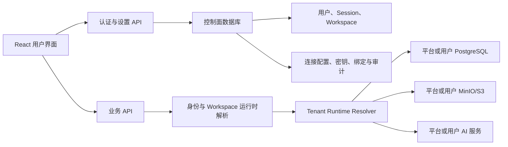

# 用户级存储、AI 配置与图片上传设计

## 结论

FlowSpace 应拆成两层：

- **控制面**继续由服务端维护，保存登录账号、session、用户设置、连接配置、加密凭据、迁移任务和审计记录。控制面数据库仍是服务启动所必需的最小基础设施。
- **用户数据面**按当前 session 的 `workspace_id` 动态选择 PostgreSQL、MinIO/S3 和 AI 服务。业务数据不再绑定到进程启动时的唯一配置。

不能把认证数据也放进用户自行配置的 PostgreSQL。用户登录前还不知道应该连接哪一个数据库，而且当用户数据库不可用时，登录、修复配置和回滚入口仍必须可用。

用户界面第一版提供以下选择：

| 能力 | 默认选择 | 用户可选 |
| --- | --- | --- |
| 业务数据 | 平台内置存储 | 自定义 PostgreSQL |
| 文件与图片 | 平台内置对象存储 | 自定义 MinIO / S3 兼容存储 |
| 文本 AI | 平台默认 | 自定义 OpenAI-compatible 服务、关闭 |
| 语音转写 | 平台默认 | 复用文本 AI、独立转写服务、关闭 |

用户不做任何选择时，各项直接绑定到该 workspace 的**具体平台默认 endpoint version**。数据库、对象存储、文本 AI 和语音转写分别判断，用户可以只自定义其中一项，其余能力继续使用默认值；新老用户都不需要先完成设置才能使用系统。平台默认不是随环境变量漂移的 NULL，而是可审计、不可变、可被旧对象和迁移任务继续引用的 system profile version。

SQLite 保留为部署级本地/测试 provider，不作为普通用户设置项。让网页用户填写服务器文件路径既不安全，也无法在多实例部署中稳定工作。

## 背景与当前架构观察

当前项目已经具备可复用的基础：

- 多用户认证已将业务数据按 `workspace_id` 隔离。
- `storage.Provider` 和 `storage.Store` 已支持 PostgreSQL / SQLite。
- 对象存储已有 `objectstore.Store` 与 MinIO 实现。
- 语音转写已有 HTTP client。
- 右上角已有账号菜单，编辑器基于 Tiptap 和 Markdown。

但当前资源仍是部署级单例：

- `backend/cmd/server/main.go` 启动时只打开一个 `storage.Store`、一个 MinIO store 和一个转写 client。
- `backend/internal/router/router.go` 把同一个 store 注入所有 handler。
- roadmap 与日语注音直接从 `AI_*` 环境变量读取模型配置。
- 同步、移动端发布、转写和对象清理仍有部分路径依赖全局 `repository` facade。
- 图片尚未进入编辑器扩展、上传 API 和对象生命周期。

因此本次改造的核心不是“把环境变量存入数据库”，而是建立按请求、按 workspace 解析资源的运行时边界。

## 目标

1. 每个用户可以独立配置业务 PostgreSQL、MinIO/S3 和 AI 服务。
2. 登录后的每个请求只使用当前 session 所属 workspace 的资源。
3. 配置失败时仍可登录和进入设置页修复，不静默切到其他数据源。
4. 切换数据库不造成“数据突然消失”，必须经过迁移、校验和显式启用。
5. 切换对象存储后，旧图片和语音仍能通过原存储配置读取。
6. API key、数据库密码、MinIO secret 不以明文入库、不回传前端、不进入日志与审计 metadata。
7. 用户可在笔记中通过选择、拖拽和粘贴上传图片，也可上传个人头像。
8. 保持现有 API shape 和 workspace 隔离语义，允许分阶段上线。

## 非目标

第一版不做：

- 用户自行配置 SQLite 文件路径。
- 在一次请求中跨多个业务数据库执行原子事务。
- 多云对象存储之间自动持续双写。
- 数据库在线双写迁移；第一版采用短暂 workspace 只读窗口。
- 公网匿名图片 URL；图片默认需要登录并由后端鉴权读取。
- 自动把 FlowSpace 私有图片上传到 Notion 或复制到 Obsidian。第一版同步正文可以保留图片引用，但外部系统的附件搬运另行实现。
- 普通管理员读取其他用户的明文凭据。

## 关键领域决策

### 配置面向用户，归属面向 workspace

产品上称为“我的设置”，用户通过头像进入；存储/AI 运行时以后端 `workspace_id` 作为绑定键，昵称、时区和头像等身份资料仍以 `user_id` 为键。

原因：

- 当前业务数据已经归属于 workspace。
- v1 一个用户拥有一个默认 workspace，体验上等同用户级配置。
- 未来增加团队 workspace 时，不需要把存储配置从 `user_id` 再迁移一次。

权限规则：

- v1 只有 workspace owner 可以修改连接配置。
- 普通成员只能查看“由空间管理员管理”的状态，不显示 endpoint 和任何凭据状态细节。
- 平台管理员默认只能查看连接健康状态，不能读取或导出用户凭据。

### 控制面与数据面分离



控制面保存：

- `users`、`auth_identities`、`workspaces`、`workspace_members`、`sessions`
- 用户资料与用户级头像内容
- 服务连接 profile、加密凭据、当前绑定
- 数据迁移任务、连接测试结果、审计事件
- 媒体对象目录与对象存储 profile 版本

数据面保存：

- notes、tasks、events、folders、projects、roadmaps
- sync targets/state/bindings
- search index
- mobile sync、voice note、transcription job 等 workspace 业务数据

即使用户选择独立 PostgreSQL，目标库仍保留 `workspace_id` 字段和约束。这样允许多个 workspace 安全地共享同一数据库，也能复用现有 repository 查询和迁移逻辑。

### 控制库配置与平台默认数据配置分离

控制面连接是服务启动的根依赖，不能同时表示“平台默认 tenant 数据库”。配置明确拆为：

```text
FLOWSPACE_CONTROL_DATABASE_URL             # 只打开控制面；绝不导入 profile
FLOWSPACE_CONTROL_DATABASE_DRIVER          # 默认 postgres；仅单实例兼容模式可为 sqlite
FLOWSPACE_CONTROL_SQLITE_PATH               # 仅 control driver=sqlite 时使用
FLOWSPACE_PLATFORM_DATA_DATABASE_DRIVER    # postgres 或单实例兼容的 sqlite
FLOWSPACE_PLATFORM_DATA_DATABASE_URL       # postgres 平台默认 tenant 候选配置
FLOWSPACE_PLATFORM_DATA_SQLITE_PATH         # sqlite 平台默认 tenant 候选配置
```

- `FLOWSPACE_CONTROL_DATABASE_URL` 在进程启动、登录、设置和 runtime 解析中始终指向同一控制面。生产/多实例部署要求它是 PostgreSQL；若保留单实例 SQLite control 兼容模式，应使用独立的 control driver/path 配置，仍不得复用平台数据变量。
- 平台默认 data、MinIO 和 AI 环境变量只由显式 bootstrap/reconcile 命令读取，并在这个**已经打开的控制面**中创建新的不可变 system candidate version。普通启动和业务请求不会因此切换 binding。
- 首次升级时，可把 control URL 与 platform data URL 都设置为原 `FLOWSPACE_DATABASE_URL` 指向的数据库，以完成原地 adopt；升级完成后二者独立演进，旧变量进入一次性兼容读取并尽快废弃。
- 修改 platform data URL 不会改变服务连接的控制面；修改 control URL 则是一次明确的控制面迁移/灾备操作，不属于用户设置或 system profile 更新流程。

## 后端运行时架构

### 新增边界

建议把当前单一 `Store` 拆为以下职责，并在类型层阻止普通业务代码绕过写栅栏：

```go
type ControlStore interface {
    Auth() AuthRepository
    Profiles() ServiceProfileRepository
    Bindings() RuntimeBindingRepository
    Migrations() StorageMigrationRepository
    Media() MediaRepository
    Audit() AuditRepository
}

// 只能读取 tenant 数据，不暴露 Transact 或任何写 repository。
type TenantReadStore interface {
    Notes() NoteReadRepository
    Tasks() TaskReadRepository
    Sync() SyncReadRepository
    Jobs() JobReadRepository
}

// 写 repository 只在已经持有 anchor 锁的事务中存在。
type TenantWriteTx interface {
    Notes() NoteWriteRepository
    Tasks() TaskWriteRepository
    Sync() SyncWriteRepository
    Jobs() JobWriteRepository
    Commit(ctx context.Context) error
    Rollback(ctx context.Context) error
}

type TenantFencedWriter interface {
    BeginFencedWrite(ctx context.Context, workspaceID string, expectedEpoch int64) (TenantWriteTx, error)
}

type TenantRuntime struct {
    Data          TenantReadStore
    Writer        TenantFencedWriter
    ObjectStore   objectstore.Store
    ChatClient    ai.ChatClient
    SpeechClient  transcription.Transcriber
    BindingRevision int64
    Epoch         int64
    Mode          RuntimeMode
}

// 只注入迁移器/修复器，不得注入 handler、service 或普通 worker。
type TenantMaintenanceStore interface {
    Migrate(ctx context.Context) error
    ImportSnapshot(ctx context.Context, snapshot TenantExport) error
    Verify(ctx context.Context) error
}

type TenantRuntimeResolver interface {
    Resolve(ctx context.Context, workspaceID string, snapshot RuntimeSnapshot) (*TenantRuntime, error)
    Invalidate(workspaceID string)
}
```

请求流程：

1. 认证中间件只访问 `ControlStore`，验证 Cookie/Watch token，并写入 `user_id`、`workspace_id`。
2. 设置、登录和健康检查接口不解析用户数据面。
3. 每个业务请求从控制面读取持久化 `RuntimeSnapshot{mode, epoch, binding_revision}`；LISTEN/NOTIFY 或其他通知只用于加速缓存失效，不能替代这次持久版本校验。
4. 业务路由进入 `TenantRuntimeMiddleware`，用服务端 session 中的 `workspace_id` 和 snapshot 解析当前 binding。
5. resolver 只复用与 snapshot revision/epoch 完全匹配的连接池与客户端，并把 `TenantRuntime` 写入 request context。
6. handler/service 从 request context 只能获取 `TenantReadStore` 和 `TenantFencedWriter`；客户端不能通过 body/header 指定 `workspace_id`、epoch 或 profile id。
7. 写请求必须调用 `BeginFencedWrite(workspaceID, snapshot.epoch)`，写 repository 只从返回的 `TenantWriteTx` 获得；控制面不可用、mode 不允许写入、epoch 不匹配时一律 fail closed。
8. 原有 `storage.Store.Transact`、可写 repository 和底层 `*sql.DB` 不进入 tenant 生产接口；migration/adopt 使用独立的 `TenantMaintenanceStore`，避免为了运维能力重新打开旁路。

### 持久化运行时状态与跨实例写栅栏

进程内 cache invalidation 只影响性能，不承担正确性。控制面新增：

```sql
CREATE TABLE workspace_runtime_state (
  workspace_id TEXT PRIMARY KEY REFERENCES workspaces(id) ON DELETE CASCADE,
  mode TEXT NOT NULL CHECK (mode IN (
    'active', 'draining', 'migrating', 'activating', 'blocked'
  )),
  epoch BIGINT NOT NULL DEFAULT 1 CHECK (epoch > 0),
  binding_revision BIGINT NOT NULL DEFAULT 1 CHECK (binding_revision > 0),
  storage_operation_kind TEXT CHECK (storage_operation_kind IN ('migration', 'rebind')),
  storage_operation_id TEXT,
  updated_by TEXT NOT NULL REFERENCES users(id),
  updated_at TIMESTAMPTZ NOT NULL DEFAULT now(),
  CHECK ((storage_operation_kind IS NULL) = (storage_operation_id IS NULL)),
  CHECK (
    (mode = 'active' AND storage_operation_id IS NULL)
    OR (mode IN ('draining', 'migrating', 'activating') AND storage_operation_id IS NOT NULL)
    OR mode = 'blocked'
  )
);
```

每个 tenant database 还必须有本地 anchor，所有 tenant 业务表外键引用它：

```sql
CREATE TABLE tenant_workspaces (
  workspace_id TEXT PRIMARY KEY,
  write_mode TEXT NOT NULL CHECK (write_mode IN ('active', 'fenced', 'retired')),
  epoch BIGINT NOT NULL CHECK (epoch > 0),
  updated_at TIMESTAMPTZ NOT NULL DEFAULT now()
);
```

所有写操作统一使用 `BeginFencedWrite(ctx, workspaceID, expectedEpoch)` 创建 `TenantWriteTx`：

1. 在同一个 tenant database 事务中先对 `tenant_workspaces` 对应行取得共享锁。
2. 校验 `write_mode='active'` 且本地 epoch 等于控制面 snapshot epoch。
3. 只把绑定该事务的 write repositories 包装成 `TenantWriteTx` 返回；在持有该锁的同一事务中执行领域写入并提交。
4. `TenantWriteTx` 不能被缓存、跨 goroutine 共享或在提交后继续使用；commit 前再次验证事务未失效。

上述共享/排他行锁协议是 PostgreSQL 语义。SQLite provider 只支持单服务实例，通过 `BEGIN IMMEDIATE` 和进程内 drain 实现同一接口；部署声明为多实例时，控制面或任一 active data endpoint 为 SQLite 都必须拒绝启动/拒绝激活，不能把进程锁包装成分布式栅栏。

迁移 coordinator 使用排他锁执行 fence。排他锁会等待已经取得共享锁的写事务全部提交或回滚；fence 提交后，旧 epoch 的新写事务即使来自缓存过期的其他实例，也会被 tenant anchor 拒绝。

迁移协议：

1. 以 `workspace_runtime_state.mode='active'`、当前 epoch 和当前 data binding revision 为前置条件做 CAS，切到 `draining`，同时把 epoch 增加 1 并绑定 `storage_operation_kind/id`。
2. 在源 tenant store 排他锁定 anchor；等待旧 epoch 写事务排空后，把源 anchor 改为 `fenced` 和新 epoch。
3. fence 成功后控制面把 mode 改为 `migrating`。只有此时才能建立源库一致性快照并开始复制。
4. 初始化目标 anchor 为同一个新 epoch，但保持 `fenced`，完成复制和校验。
5. 激活时同时校验 storage operation id、migration epoch、source binding revision 和当前 runtime revision；在一个控制面事务中把 mode 改为 `activating`、CAS 更新 data binding 并递增 binding revisions，但此时仍不接受业务读写。
6. 将目标 anchor 从 `fenced` 改为 `active`，再把源 anchor 从 `fenced` 改为 `retired`；任何时刻最多一个 anchor 可以 active。
7. 最后以 `mode='activating' + storage_operation_id + epoch` 做 CAS，把控制面 mode 改为 `active` 并清空 operation 字段。若中途失败，workspace 保持 `activating/blocked`，幂等恢复器只允许完成目标激活，不回头重新激活源。
8. 所有实例下一请求都会读取新 persistent revision；旧实例即使短暂持有源连接，源 anchor 也会拒绝写入。

目标 anchor 激活与控制面 binding 无法做跨库原子事务，因此使用带 `storage_operation_id + epoch` 的可恢复状态机，而不是假装有分布式事务。每一步都幂等；恢复器根据控制面状态和两端 anchor 状态只能推进到一个合法终态。迁移在进入 `activating` 之前失败时，可以把源 anchor 以新 epoch 恢复为 active 并保持原 binding；进入 `activating` 后只允许向前完成。迁移期间读取可以继续来自源库；进入 `activating` 后短暂阻塞读，直到目标 active。

### 必须淘汰全局 repository

动态数据库与进程级 `repository.SetStore()` 不兼容。迁移顺序应为：

1. 先把普通业务、Notion/Obsidian 同步、mobile sync、转写 worker 和 cleanup worker 改成显式依赖 `TenantReadStore` / `TenantFencedWriter`，而不是完整 `storage.Store`。
2. 删除运行时 `repository.CurrentStore()`、`WithScopedStore()` 和包级 active store。
3. 测试 helper 可以保留局部 facade，但不能进入生产请求或 worker；增加架构测试，禁止 `handler/service/worker` 包导入可写 `storage.Store`、调用普通 `Transact` 或持有底层数据库句柄。

这是用户级数据库功能的前置门槛，不应一边保留全局 store 一边增加动态 resolver。

### 连接池与缓存

不能每个请求重新连接 PostgreSQL 或 MinIO：

- cache key 使用 `workspace_id + binding_revision + epoch + endpoint_version_id`。
- PostgreSQL 默认每个 profile `MaxOpenConns=5`、`MaxIdleConns=2`，全局再设置连接池总量上限。
- 使用 singleflight 防止并发首请求重复建池。
- 30 分钟无访问的 profile 进入 LRU 回收；控制面通知触发立即 invalidate，但每请求的 persistent snapshot 校验才是正确性来源。旧连接等待在途请求结束再关闭。
- 连接建立、迁移和健康检查有独立超时；业务请求不触发 schema migration。
- MinIO 与 AI client 同样按 profile version 缓存，不按裸 API key 缓存。

### 后台任务

当前 worker 面向单一 store。改造后使用 `TenantWorkerCoordinator`：

1. 从控制面读取启用且健康的 workspace bindings 与持久 runtime snapshot。
2. 轮询 workspace，逐个解析 tenant runtime。
3. 每次 claim 前重新读取当前 runtime snapshot；使用本次 snapshot 的 epoch 调用 `BeginFencedWrite`，并把 `lease_token + execution_epoch` 写入 lease。
4. heartbeat、complete、fail 以及 worker 的每次领域写都必须携带相同 lease token，但在各自执行时重新读取当前 runtime snapshot 并通过 `BeginFencedWrite`；不能复用创建任务时的 epoch，也不能绕过请求中间件的栅栏。
5. job 保存具体 `object_endpoint_id`、`ai_endpoint_id`、profile version 和模型等不可变**资源快照**；重试默认继续使用创建任务时的配置版本。另存的 `created_epoch` 只用于审计和判断任务是否跨过迁移，不作为后续写入 epoch。
6. coordinator 收到 `draining` 后停止该 workspace 的新 claim，等待已有 lease 写入完成或超时失效，再允许 migration fence。
7. 迁移复制排队任务时保留资源快照和 `created_epoch`，但不复制有效 lease；旧 lease 一律失效，目标库任务在新 runtime 下重新 claim 并取得新的 `execution_epoch`。旧 worker 向源 anchor 完成任务会因 fence/epoch 不匹配被拒绝。
8. 单个用户资源故障只标记该 workspace degraded，不阻塞其他 workspace。

第一版可以轮询；规模增大后再把跨 workspace 的 job 索引移动到控制面队列。

## 配置数据模型

### 用户资料

```sql
CREATE TABLE user_profiles (
  user_id TEXT PRIMARY KEY REFERENCES users(id) ON DELETE CASCADE,
  locale TEXT NOT NULL DEFAULT 'zh-CN',
  time_zone TEXT NOT NULL DEFAULT 'Asia/Shanghai',
  created_at TIMESTAMPTZ NOT NULL DEFAULT now(),
  updated_at TIMESTAMPTZ NOT NULL DEFAULT now()
);

CREATE TABLE user_avatar_blobs (
  user_id TEXT PRIMARY KEY REFERENCES users(id) ON DELETE CASCADE,
  mime_type TEXT NOT NULL CHECK (mime_type IN ('image/jpeg', 'image/png', 'image/webp')),
  size_bytes BIGINT NOT NULL CHECK (size_bytes BETWEEN 1 AND 2097152),
  sha256 TEXT NOT NULL,
  width INTEGER NOT NULL,
  height INTEGER NOT NULL,
  content BYTEA NOT NULL,
  updated_at TIMESTAMPTZ NOT NULL DEFAULT now()
);
```

头像明确是**用户级**资料，不属于某个 workspace membership。第一版将不超过 2 MiB 的头像直接存入控制面 `user_avatar_blobs`，避免用户切换团队 workspace 后被当前 workspace 的媒体鉴权拒绝；笔记图片才进入 workspace 对象存储。头像只接受 JPEG/PNG/WebP，不接受 GIF/SVG，不做服务端重编码，UI 只做圆形裁切展示。头像展示顺序：用户上传头像 > GitHub identity avatar > 昵称首字母。

### Profile family 与不可变 version

可编辑名称不能充当版本族标识。控制面把平台 profile 与用户 profile 分开建模，但二者都有稳定 family id：

```sql
CREATE TABLE workspace_profile_families (
  id TEXT NOT NULL,
  workspace_id TEXT NOT NULL REFERENCES workspaces(id) ON DELETE CASCADE,
  kind TEXT NOT NULL CHECK (kind IN (
    'data_store', 'object_s3', 'llm_chat', 'llm_transcription'
  )),
  name TEXT NOT NULL,
  created_by TEXT NOT NULL REFERENCES users(id),
  created_at TIMESTAMPTZ NOT NULL DEFAULT now(),
  PRIMARY KEY (workspace_id, kind, id)
);

CREATE TABLE workspace_profile_versions (
  id TEXT NOT NULL,
  family_id TEXT NOT NULL,
  workspace_id TEXT NOT NULL,
  kind TEXT NOT NULL,
  version INTEGER NOT NULL,
  provider TEXT NOT NULL,
  state TEXT NOT NULL CHECK (state IN ('draft', 'verified', 'retired')),
  config_json JSONB NOT NULL DEFAULT '{}',
  secret_ciphertext BYTEA,
  secret_nonce BYTEA,
  encryption_key_id TEXT,
  verified_at TIMESTAMPTZ,
  last_check_status TEXT,
  last_check_message TEXT,
  created_by TEXT NOT NULL REFERENCES users(id),
  created_at TIMESTAMPTZ NOT NULL DEFAULT now(),
  PRIMARY KEY (workspace_id, kind, id),
  UNIQUE (workspace_id, kind, family_id, version),
  FOREIGN KEY (workspace_id, kind, family_id)
    REFERENCES workspace_profile_families(workspace_id, kind, id)
);
```

平台默认使用结构相同的 `system_profile_families` / `system_profile_versions`，但没有 `workspace_id`，由平台管理员管理；system version 必须提供 `UNIQUE(kind, id)` 供 endpoint 复合外键引用。显式 bootstrap/reconcile 命令会在 `FLOWSPACE_CONTROL_DATABASE_URL` 已经打开的控制面中，把平台 tenant data、MinIO 和 AI 环境配置解析并加密为具体、不可变的 system version；环境变量指纹变化只创建新的候选 version，不会把已有 workspace 或对象自动改到新配置。控制面 URL 本身永不进入 profile。

规则：

- `config_json` 只保存非敏感字段，例如 host、port、database、bucket、base URL、model。
- 密码、access key/secret、API key 作为一个 secret JSON 整体加密；密文行保存可稳定查找的 `encryption_key_id`。
- 已验证 version 不原地修改；编辑始终在同一个 family 下创建下一 version。
- 新 version 请求必须显式声明 secret 操作：`preserve`、`replace` 或 provider 允许时的 `clear`。
- `preserve` 会解密上一 version 的 secret，并使用新 version 的 AAD 和新 nonce 重新加密；禁止直接复制 ciphertext。
- 被 endpoint、媒体或异步任务使用过的 verified version 只允许 `retired`，不硬删除。retired 表示禁止新 binding/上传/job 使用，但历史读取与重试仍可解析和解密。只有从未验证、从未创建 endpoint 的 draft 可以物理删除；tenant 异步任务无法对控制面建外键，因此不能以“控制面当前无引用”推断 verified version 可删除。
- GET API 只返回 `secret_configured: true/false` 和掩码提示，不返回 ciphertext 或明文。

### Workspace 可用 endpoint

binding 和业务对象不直接指向 profile version，而是指向已经授权给当前 workspace 的具体 endpoint：

```sql
CREATE TABLE workspace_service_endpoints (
  id TEXT NOT NULL,
  workspace_id TEXT NOT NULL REFERENCES workspaces(id) ON DELETE CASCADE,
  kind TEXT NOT NULL CHECK (kind IN (
    'data_store', 'object_s3', 'llm_chat', 'llm_transcription'
  )),
  source_type TEXT NOT NULL CHECK (source_type IN ('system', 'custom')),
  system_profile_version_id TEXT,
  workspace_profile_version_id TEXT,
  created_at TIMESTAMPTZ NOT NULL DEFAULT now(),
  PRIMARY KEY (workspace_id, kind, source_type, id),
  CHECK (
    (source_type = 'system' AND system_profile_version_id IS NOT NULL
      AND workspace_profile_version_id IS NULL)
    OR
    (source_type = 'custom' AND system_profile_version_id IS NULL
      AND workspace_profile_version_id IS NOT NULL)
  ),
  FOREIGN KEY (kind, system_profile_version_id)
    REFERENCES system_profile_versions(kind, id),
  FOREIGN KEY (workspace_id, kind, workspace_profile_version_id)
    REFERENCES workspace_profile_versions(workspace_id, kind, id)
);
```

复合外键中的 nullable 端在另一 source_type 下不触发；CHECK 保证恰好一端非空。endpoint 创建后不可改指向，只能新建 endpoint。

每个 workspace 创建时，为四类能力各创建一个指向当时 system profile version 的 endpoint。现有 workspace 在升级 bootstrap 中补齐。因此“用户未选择”仍然使用默认值，但默认值是具体 endpoint，不是会漂移的 NULL。

### Workspace 当前 binding 与 AI mode

使用逐 kind 行模型，避免把错误 kind 的 profile 填进固定列：

```sql
CREATE TABLE workspace_service_bindings (
  workspace_id TEXT NOT NULL REFERENCES workspaces(id) ON DELETE CASCADE,
  kind TEXT NOT NULL CHECK (kind IN (
    'data_store', 'object_s3', 'llm_chat', 'llm_transcription'
  )),
  mode TEXT NOT NULL,
  endpoint_source_type TEXT,
  endpoint_id TEXT,
  settings_json JSONB NOT NULL DEFAULT '{}',
  revision BIGINT NOT NULL DEFAULT 1 CHECK (revision > 0),
  updated_by TEXT NOT NULL REFERENCES users(id),
  updated_at TIMESTAMPTZ NOT NULL DEFAULT now(),
  PRIMARY KEY (workspace_id, kind),
  FOREIGN KEY (workspace_id, kind, endpoint_source_type, endpoint_id)
    REFERENCES workspace_service_endpoints(workspace_id, kind, source_type, id),
  CHECK (
    (kind IN ('data_store', 'object_s3') AND (
      (mode = 'default' AND endpoint_source_type = 'system' AND endpoint_id IS NOT NULL)
      OR (mode = 'custom' AND endpoint_source_type = 'custom' AND endpoint_id IS NOT NULL)
    ))
    OR
    (kind = 'llm_chat' AND (
      (mode = 'default' AND endpoint_source_type = 'system' AND endpoint_id IS NOT NULL)
      OR (mode = 'custom' AND endpoint_source_type = 'custom' AND endpoint_id IS NOT NULL)
      OR (mode = 'disabled' AND endpoint_source_type IS NULL AND endpoint_id IS NULL)
    ))
    OR
    (kind = 'llm_transcription' AND (
      (mode = 'default' AND endpoint_source_type = 'system' AND endpoint_id IS NOT NULL)
      OR (mode = 'custom' AND endpoint_source_type = 'custom' AND endpoint_id IS NOT NULL)
      OR (mode IN ('reuse_chat', 'disabled') AND endpoint_source_type IS NULL AND endpoint_id IS NULL)
    ))
  )
);
```

`settings_json` 只放非 secret 的 binding 级选择，例如 `reuse_chat` 时的转写模型和 path；写入前按 kind/mode 使用严格 schema 校验，未知字段拒绝。profile kind、workspace ownership 和 endpoint source 均由数据库复合外键与 CHECK 约束，不能只依赖 handler。

任一 kind binding 更新都必须在同一个控制面事务中：校验该行 revision、更新该行并递增 revision，同时递增 `workspace_runtime_state.binding_revision`。只有 runtime mode=`active` 时允许普通 binding 更新；数据迁移由专用状态机更新 data binding。

AI 功能开关独立存储，不塞进 profile 配置：

```sql
CREATE TABLE workspace_ai_feature_settings (
  workspace_id TEXT NOT NULL REFERENCES workspaces(id) ON DELETE CASCADE,
  feature TEXT NOT NULL CHECK (feature IN ('roadmap_generation', 'japanese_furigana')),
  enabled BOOLEAN NOT NULL DEFAULT true,
  fallback_mode TEXT NOT NULL,
  updated_by TEXT NOT NULL REFERENCES users(id),
  updated_at TIMESTAMPTZ NOT NULL DEFAULT now(),
  PRIMARY KEY (workspace_id, feature),
  CHECK (
    (feature = 'roadmap_generation' AND fallback_mode IN ('error', 'template'))
    OR
    (feature = 'japanese_furigana' AND fallback_mode IN ('error', 'local'))
  )
);
```

`llm_transcription/reuse_chat` 不保存 chat profile id，也不跨 kind 建外键。resolver 读取同一 workspace 的 chat binding；只有 chat endpoint 已验证 `audio_transcription` capability 且 chat 未 disabled 时才可启用 reuse，模型名等转写参数保存在 transcription binding 的非 secret settings 中。

### 默认解析规则

1. workspace provisioning 必须原子创建 runtime state、四个 system endpoints、四行 default bindings 和 AI feature defaults。
2. 旧 workspace 缺行时只允许 bootstrap/adopt 命令补齐；普通业务请求不把缺行解释为某个动态环境默认。
3. 用户主动启用 custom 后，该项固定使用 endpoint 所指向的 profile version。
4. 自定义数据库或对象存储发生故障时不静默回退；用户可明确执行“恢复平台默认”。数据库恢复默认仍通过迁移任务。

### 数据迁移任务

平台默认与自定义数据库都是具体 `data_store` endpoint，因此迁移两端使用同一种资源引用。endpoint profile 的 `provider` 标明 `postgres` 或部署级兼容的 `sqlite`；用户创建 custom data endpoint 时第一版只允许 `postgres`：

```sql
CREATE TABLE storage_transition_jobs (
  id TEXT NOT NULL,
  workspace_id TEXT NOT NULL REFERENCES workspaces(id),
  operation_kind TEXT NOT NULL CHECK (operation_kind IN ('migration', 'rebind')),
  source_kind TEXT NOT NULL DEFAULT 'data_store' CHECK (source_kind = 'data_store'),
  source_endpoint_type TEXT NOT NULL CHECK (source_endpoint_type IN ('system', 'custom')),
  source_endpoint_id TEXT NOT NULL,
  source_provider TEXT NOT NULL CHECK (source_provider IN ('postgres', 'sqlite')),
  target_kind TEXT NOT NULL DEFAULT 'data_store' CHECK (target_kind = 'data_store'),
  target_endpoint_type TEXT NOT NULL CHECK (target_endpoint_type IN ('system', 'custom')),
  target_endpoint_id TEXT NOT NULL,
  target_provider TEXT NOT NULL CHECK (target_provider IN ('postgres', 'sqlite')),
  source_installation_id TEXT NOT NULL,
  source_database_identity TEXT NOT NULL,
  source_schema_identity TEXT NOT NULL,
  target_installation_id TEXT NOT NULL,
  target_database_identity TEXT NOT NULL,
  target_schema_identity TEXT NOT NULL,
  target_existing_policy TEXT NOT NULL DEFAULT 'reject'
    CHECK (target_existing_policy IN ('reject', 'replace_retired')),
  caused_by_migration_id TEXT,
  source_binding_revision BIGINT NOT NULL,
  source_runtime_revision BIGINT NOT NULL,
  migration_epoch BIGINT NOT NULL,
  state TEXT NOT NULL CHECK (state IN (
    'pending', 'preflight', 'draining', 'copying', 'verifying',
    'activating', 'completed', 'failed', 'cancelled'
  )),
  progress_json JSONB NOT NULL DEFAULT '{}',
  verification_json JSONB NOT NULL DEFAULT '{}',
  error_code TEXT,
  error_message TEXT,
  started_at TIMESTAMPTZ,
  completed_at TIMESTAMPTZ,
  created_by TEXT NOT NULL REFERENCES users(id),
  created_at TIMESTAMPTZ NOT NULL DEFAULT now(),
  PRIMARY KEY (workspace_id, id),
  FOREIGN KEY (workspace_id, source_kind, source_endpoint_type, source_endpoint_id)
    REFERENCES workspace_service_endpoints(workspace_id, kind, source_type, id),
  FOREIGN KEY (workspace_id, target_kind, target_endpoint_type, target_endpoint_id)
    REFERENCES workspace_service_endpoints(workspace_id, kind, source_type, id),
  FOREIGN KEY (workspace_id, caused_by_migration_id)
    REFERENCES storage_transition_jobs(workspace_id, id),
  CHECK (
    source_endpoint_type <> target_endpoint_type
    OR source_endpoint_id <> target_endpoint_id
  ),
  CHECK (
    (operation_kind = 'migration' AND (
      source_provider <> target_provider
      OR source_installation_id <> target_installation_id
      OR source_schema_identity <> target_schema_identity
    ))
    OR
    (operation_kind = 'rebind'
      AND source_provider = target_provider
      AND source_installation_id = target_installation_id
      AND source_schema_identity = target_schema_identity
      AND target_existing_policy = 'reject')
  )
);

CREATE UNIQUE INDEX storage_transition_jobs_one_active_per_workspace_idx
  ON storage_transition_jobs(workspace_id)
  WHERE state IN ('pending', 'preflight', 'draining', 'copying', 'verifying', 'activating');
```

`workspace_runtime_state(workspace_id, storage_operation_id)` 通过同 workspace 的复合外键引用 transition job，并用 operation kind 做一致性 CHECK。统一表与 partial unique index 保证 migration 和 rebind 彼此也不能并发。创建任务时同时记录 data binding row revision 和全局 runtime binding revision；进入 draining 和最终 activating 都必须 CAS 校验它们，解决迁移期间用户在另一 tab 修改 binding 的竞争。

### 数据 namespace 身份与同库换绑

逻辑 endpoint id 不足以判断两端是否为同一个数据库。每套 tenant baseline 都创建一条不可变 installation 记录：

```sql
CREATE TABLE tenant_installations (
  singleton_key INTEGER PRIMARY KEY CHECK (singleton_key = 1),
  installation_id TEXT NOT NULL UNIQUE,
  created_at TIMESTAMPTZ NOT NULL DEFAULT now()
);
```

endpoint preflight 必须读取并固化以下 namespace snapshot：

- provider；
- `installation_id`；
- 规范化 database identity（PostgreSQL 至少记录 `current_database()`，有权限时附加 cluster identity；SQLite 记录受管文件 identity），用于审计和碰撞诊断；
- 规范化 schema identity（PostgreSQL 为实际 schema name/OID；SQLite 为 `main`）。

同一 namespace 的判定至少以 `provider + installation_id + schema identity` 为准，database identity 参与交叉校验和审计；不能只比较域名、端口、凭据或 endpoint id。复制/克隆数据库或 SQLite 文件时如果 installation id 被原样复制，系统保守判定为 identity collision/同一 namespace；管理员必须先执行显式 rekey/clone-adopt 流程，不能由业务请求猜测。

如果源、目标 namespace 相同，拒绝 `operation_kind=migration`，改建 `operation_kind=rebind` 的 transition job：先按相同的 drain/fence 协议排空旧连接并提升 epoch，再以 source binding revision 做 CAS，把 binding 换到新凭据/endpoint，最后让**同一个** tenant anchor 以新 epoch 恢复 active；全程不初始化 schema、不复制或删除数据。rebind 的合法状态路径为 `pending -> preflight -> draining -> activating -> completed`，不进入 copying/verifying。该流程适用于域名、证书、密码轮换等“连接方式变化、数据位置未变”的场景。

目标 namespace 已存在该 workspace 数据时必须显式处理：

- 没有 workspace anchor：按空目标初始化后导入。
- anchor 为 `fenced` 且 migration id 与当前任务一致：允许幂等续跑。
- anchor 为 `retired`：默认拒绝；owner 明确选择 `replace_retired` 后，先确认该 namespace 未被任何 active binding 使用，再在一个目标事务中清空该 workspace 的旧业务数据并导入快照。
- anchor 为 `active`、属于其他 migration，或数据存在但结构身份无法证明：一律拒绝。

第一版不提供“合并”语义。后续如需要 staging import，应新增独立状态和校验协议，不能把它伪装成普通 INSERT。

## 用户 PostgreSQL 选择与切换

### 用户看到的选项

- **使用平台存储**：无需填写连接信息，兼容当前所有用户。
- **连接自定义 PostgreSQL**：填写连接名称、host、port、database、username、password、SSL mode；高级项可设置 schema、连接超时。

界面不直接要求用户粘贴 DSN，避免密码转义、危险 query 参数和展示泄漏。后端根据结构化字段生成连接配置。需要兼容已有 DSN 时，可在“高级”中提供一次性导入并解析成结构化字段。

### 激活不是普通保存

自定义 PostgreSQL 的操作分为四步：

1. **测试连接**：验证网络、TLS、认证、最低 PostgreSQL 版本和所需权限，并读取 namespace identity；目标 database 不存在时进入自动创建流程。
2. **初始化目标库**：自动创建缺失的 database、schema、表、索引和 migration 记录，并执行全部 tenant schema migrations；不会复制数据，也不会切换。
3. **迁移并校验**：执行持久化 draining/fence 协议，确认全实例旧 epoch 写入已经排空，再从源库一致性快照复制全部业务表、重建搜索索引并比较数量、ID 集合、关键 hash 和最大 revision。
4. **启用**：校验成功后用 source binding revision、migration id 和 epoch 做 CAS，按可恢复状态机启用目标 endpoint；不能直接更新一个 profile id。

不提供一个会让现有数据瞬间“消失”的普通下拉保存按钮。

### 数据库与表自动创建

用户填写一个尚不存在的 PostgreSQL database 时，初始化器按以下顺序工作：

1. 先尝试连接目标 database。
2. 如果 PostgreSQL 返回 `invalid_catalog_name`（SQLSTATE `3D000`），使用相同账号连接维护库；维护库默认是 `postgres`，也可以在高级设置中指定。
3. 检查该账号是否具备 `CREATEDB` 或等效权限，然后创建目标 database。
4. 重新连接目标 database，获取 workspace/profile 级 migration lock。
5. 创建 tenant schema、不可变 `tenant_installations`、`tenant_schema_migrations` 与 `tenant_workspaces`，并按版本执行所有缺失 tenant migration。
6. 执行 schema 完整性检查和最小读写探针，成功后把 profile 标记为 `verified`。

表不存在、索引不存在或 schema 版本落后时，不要求用户手工执行 SQL，统一由幂等 migration runner 自动补齐。迁移脚本必须使用版本记录，不能仅依赖散落的 `CREATE TABLE IF NOT EXISTS`，避免“表存在但字段或约束不完整”被误判为可用。

约束与失败策略：

- database 名和 schema 名只接受受限标识符，并使用 PostgreSQL identifier quoting；绝不拼接未经校验的原始 SQL。
- `CREATE DATABASE` 不能放在普通事务中；并发创建遇到 duplicate database 时重新连接并继续检查。
- migration 在目标 database 内使用 advisory lock，并在事务中逐版本执行；某一版本失败时不更新 migration version，也不激活 profile。
- 普通业务请求不会自动建库或跑 DDL，避免请求超时、权限扩大和并发 migration。
- 如果账号可以连接维护库但没有 `CREATEDB`，设置页返回明确提示：请预先创建 database 或为初始化账号授予一次性建库权限。
- 如果 database 已存在但账号缺少 schema/table DDL 权限，连接测试可以通过，但初始化状态显示“权限不足”，不能进入数据迁移与启用阶段。
- 自动创建只针对用户明确填写并确认的目标；不会根据错误信息猜测或创建其他 database。

推荐让运行账号拥有目标 database 内的 DDL/DML 权限，但不长期持有集群级超级用户权限。若部署需要使用高权限 bootstrap 账号，应只在本次初始化请求中使用、完成后立即丢弃，不能写入 workspace profile version。

### 第一版迁移策略

采用持久 write fence 加短暂只读窗口，换取简单且可验证的语义：

- 迁移前进入 `draining`，停止新的同步、移动端发布和转写 claim，并通过源库 anchor 排他锁等待全部旧 epoch 写事务结束。
- 一致性快照必须在 fence 成功之后创建；在此之前复制的数据只能算 preflight，不能用于最终激活。
- 目标库导入放在单个事务中；失败即回滚目标。
- 保留对象 ID、时间戳、revision、同步状态和 tombstone。
- `search_index` 在目标端重建，不复制 provider-specific 的派生列。
- 完成后保留原数据源为 rollback source，默认 7 天内不自动清理。
- `rollback` 不是修改原任务状态或简单切回旧库。已经 completed 的任务永远保持历史完成状态；`POST .../rollback` 只是以旧源为新目标创建一条新的反向 migration job，并用 `caused_by_migration_id` 关联原任务，仍执行完整 drain/fence/snapshot/verify/CAS。
- 进入 activation 前的失败使用原任务的 cancel/recover 流程恢复源 anchor，不称为 rollback；第一版不提供“丢弃新写入直接切回”的危险捷径。

连接失败时：

- 登录和设置页继续可用。
- 业务页显示“当前数据存储不可用”，提供进入设置与重新测试入口。
- 不自动回退到平台库，避免用户误以为数据丢失并在错误库中继续写入。

### Tenant schema

现有 migration 不能通过移动目录直接成为 tenant migration：其中业务表外键引用控制面的 `workspaces`，初始 migration 还会创建 `pg_trgm`，而当前 PostgreSQL provider 的 `Open` 会自动运行整套 migration。需要设计和编写一套独立 baseline。

目标结构：

```text
backend/db/migrations/control/postgres/*
backend/db/migrations/tenant/postgres/*
backend/db/migrations/tenant/sqlite/*
# 如继续支持单实例 SQLite control，再单独维护 control/sqlite/*
```

tenant baseline 规则：

- 使用独立 `tenant_schema_migrations(version, checksum, applied_at)`，不复用当前统一 `schema_migrations`；PostgreSQL 与 SQLite 各有 provider-specific SQL，但共享同一逻辑版本和 schema manifest。
- 创建本地 `tenant_installations` 和 `tenant_workspaces` anchor；所有原本引用控制面 `workspaces(id)` 的业务表改为引用本地 anchor。
- 所有业务实体、关联表、同步表、mobile 表和 worker job 表保留 `workspace_id`；凡存在实体引用的地方必须使用 `(workspace_id, entity_id)` 复合主键/唯一键/外键，数据库级阻止同库内跨 workspace 关联。
- tenant baseline 只包含业务数据、搜索、同步、mobile、voice/transcription 和媒体引用 outbox，不创建 users、sessions、audit 或 service profiles。
- 每个 migration 文件有固定 checksum；版本已记录但 checksum 不一致时拒绝打开为可写状态。

Provider API 必须分开：

```go
OpenControl(ctx, cfg) (ControlStore, error)
MigrateControl(ctx, cfg) error
OpenTenant(ctx, cfg, expectedSchemaVersion) (TenantReadStore, TenantFencedWriter, error)
MigrateTenant(ctx, cfg) error
AdoptExistingTenant(ctx, controlAndTenantDB, manifest) error
```

`OpenTenant` 只做配置校验、受控 dial、ping、读取 `tenant_schema_migrations` 和 capability detection；缺表或版本落后时返回 `TENANT_SCHEMA_NOT_READY`，绝不执行 DDL。只有显式初始化/升级流程调用 `MigrateTenant`。当前 `Provider.Open -> RunPostgresMigrationsContext` 的行为必须在 Phase 0 被移除，不能被动态 resolver 复用。

### 现有平台库 adopt

平台默认库已经运行旧的统一 migrations，不能重新执行 tenant baseline。升级时执行一次 adopt：

1. 在只读预检中识别旧 `schema_migrations` 版本和关键表/列/约束。
2. 使用版本化 manifest 对现有业务 schema 做结构签名；不以“表存在”作为充分条件。
3. 补建 `tenant_workspaces`，把每个现有 workspace 作为 anchor；将业务表对控制面 workspace 的外键逐步替换为 tenant anchor/复合外键。
4. 创建 `tenant_schema_migrations`，写入专用 `adopted_baseline` 版本与 manifest checksum，而不是伪装重跑 baseline SQL。
5. 之后只运行 baseline 之后的新 tenant migrations。
6. adopt 任一步失败时保持旧 provider 只读或回滚，不更新 runtime binding。

平台默认数据库可以同时承载 control 与 tenant tables，但 migration history 和 repository 打开路径必须逻辑分离。

### SQLite tenant baseline 与 adopt

SQLite 虽不作为用户可填写的目标，仍是单实例部署的平台默认数据源，也必须完整实现 tenant contract：

- `tenant/sqlite` baseline 创建 `tenant_installations`、`tenant_schema_migrations`、`tenant_workspaces`、全部业务表、媒体 guard/reference/outbox 和必要的复合索引；开启 `PRAGMA foreign_keys=ON`，并把 journal mode/WAL 能力写入 capability manifest。
- fenced write 使用同一连接上的 `BEGIN IMMEDIATE`：取得写锁后校验 `tenant_workspaces.write_mode/epoch`，再构造 `TenantWriteTx`。进程内 drain 先停止新 claim/写请求并等待事务归零；多服务实例模式下 SQLite endpoint 一律不得激活。
- 旧 SQLite adopt 前先生成可恢复备份并记录文件 identity；在 `BEGIN IMMEDIATE` 中验证旧 manifest、创建 installation/anchor/migration 记录。SQLite 无法原地增加部分复合约束时，通过“新表 + 数据校验复制 + rename”的版本化 rebuild 实现，最后执行 `PRAGMA foreign_key_check` 和 manifest checksum 校验。
- adopt 失败回滚事务并保留备份，不写新 binding；备份清理需要显式成功标记与保留期，不能在启动时直接覆盖原文件。
- SQLite→PostgreSQL 导出在 fence 完成后，从同一连接开启一致性只读事务；WAL 模式使用该读事务固定 snapshot。由于 anchor 已 fenced 且进程内新写被 drain，导出后不会再出现成功写。
- PostgreSQL 与 SQLite 都导出 provider-neutral 的 transfer manifest：逻辑表版本、workspace id、行计数、主键范围/hash、对象/job 快照与 schema capability；导入器不复制 SQLite rowid、PostgreSQL OID 或 provider-specific 搜索派生列。

旧 SQLite 同时承载 control 与 tenant 表时，control migration 与 tenant adopt 仍分别执行、分别记账。只有升级工具可同时持有两类 maintenance handle；普通 runtime 不会获得 control/tenant 混合 store。

### `pg_trgm` 与最小权限

- `MigrateTenant` 先查询 `pg_extension`，不以运行账号执行 `CREATE EXTENSION`。
- 已安装 `pg_trgm` 时才创建 trigram indexes，并把 `TrigramSearch=true` 写入 capability manifest。
- 未安装时使用无 trigram 的 baseline 分支，保留 PostgreSQL full-text/prefix/ILIKE fallback，API shape 不变，`TrigramSearch=false`。
- 设置页可提示平台管理员用一次性 bootstrap 权限安装扩展；bootstrap 凭据不保存。
- capability 变化通过新的 tenant migration 显式添加/移除可选索引，普通 `OpenTenant` 不偷偷修复。

## MinIO / S3 对象存储

### Profile 配置

字段：

- 显示名称
- endpoint
- access key
- secret key
- bucket
- region
- 是否使用 TLS
- 可选 path-style / virtual-hosted-style

保存前执行：

- endpoint 网络策略检查
- bucket 访问与读写/删除临时探针
- 小对象 put/get/head/delete 闭环
- TLS 证书验证

不建议用用户凭据自动创建 bucket；生产环境应使用预先创建、权限受限的 bucket。可在私有部署模式增加显式“允许自动建桶”开关。

### 对象必须记住原 endpoint version

当前语音记录只保存 `object_key`。如果直接切换全局 MinIO，旧对象会在新 bucket 中查找并失联。

所有新媒体和语音对象必须保存：

- `object_endpoint_source_type`
- `object_endpoint_id`
- `object_key`
- `mime_type`
- `size_bytes`
- `sha256`

升级 bootstrap 先把当前平台 MinIO 配置加密为不可变 system profile version，再为每个 workspace 创建具体 system endpoint；旧对象回填这个 endpoint id，绝不使用 NULL。切换 MinIO 后，新上传使用新 endpoint；旧图片和语音仍按自身 endpoint version 读取。

平台环境变量后来变化时创建新的 system version，不能覆写旧 system version，也不能自动修改旧对象。平台如需停用旧 bucket，必须先运行对象迁移并确认旧 endpoint 无引用。已承载对象的 endpoint/profile version 只退休、不硬删除。

tenant `voice_notes`、语音清理 job 和转写 job 同步增加 `object_endpoint_source_type`、`object_endpoint_id` 与必要的 profile version snapshot。tenant database 无法对控制面 endpoint 建外键，因此创建/读取时必须用 `(workspace_id, kind='object_s3', source_type, endpoint_id)` 查询控制面；查不到或 workspace 不匹配即 fail closed。控制面的 verified system/custom versions永不硬删除，保证历史 job 重试仍可解析。

对象存储切换默认是“新文件写入新位置，旧文件继续从原位置读取”。设置页另提供可选的“迁移已有文件”任务，完成校验后再退役旧 endpoint/profile version。

## 图片上传与媒体生命周期

### 控制面媒体目录

为了在切换业务数据库和对象存储后仍能稳定解析图片，媒体目录放在控制面：

```sql
CREATE TABLE media_assets (
  id TEXT NOT NULL,
  workspace_id TEXT NOT NULL REFERENCES workspaces(id),
  owner_user_id TEXT NOT NULL REFERENCES users(id),
  kind TEXT NOT NULL CHECK (kind = 'note_image'),
  object_endpoint_kind TEXT NOT NULL DEFAULT 'object_s3'
    CHECK (object_endpoint_kind = 'object_s3'),
  object_endpoint_source_type TEXT NOT NULL CHECK (object_endpoint_source_type IN ('system', 'custom')),
  object_endpoint_id TEXT NOT NULL,
  object_key TEXT NOT NULL,
  original_name TEXT NOT NULL,
  mime_type TEXT NOT NULL,
  size_bytes BIGINT NOT NULL,
  sha256 TEXT NOT NULL,
  width INTEGER,
  height INTEGER,
  state TEXT NOT NULL CHECK (state IN (
    'uploading', 'ready', 'orphaned', 'delete_requested', 'deleted'
  )),
  delete_barrier_sequence BIGINT,
  delete_requested_at TIMESTAMPTZ,
  created_at TIMESTAMPTZ NOT NULL DEFAULT now(),
  deleted_at TIMESTAMPTZ,
  PRIMARY KEY (workspace_id, id),
  UNIQUE (workspace_id, owner_user_id, id),
  FOREIGN KEY (
    workspace_id, object_endpoint_kind, object_endpoint_source_type, object_endpoint_id
  ) REFERENCES workspace_service_endpoints(workspace_id, kind, source_type, id)
);

CREATE TABLE media_upload_receipts (
  workspace_id TEXT NOT NULL REFERENCES workspaces(id),
  user_id TEXT NOT NULL REFERENCES users(id),
  idempotency_key TEXT NOT NULL,
  request_sha256 TEXT NOT NULL,
  asset_id TEXT NOT NULL,
  state TEXT NOT NULL CHECK (state IN ('pending', 'ready', 'failed')),
  response_json JSONB,
  created_at TIMESTAMPTZ NOT NULL DEFAULT now(),
  PRIMARY KEY (workspace_id, user_id, idempotency_key),
  FOREIGN KEY (workspace_id, asset_id)
    REFERENCES media_assets(workspace_id, id)
);

CREATE TABLE workspace_media_projection_watermarks (
  workspace_id TEXT PRIMARY KEY REFERENCES workspaces(id),
  applied_sequence BIGINT NOT NULL DEFAULT 0,
  updated_at TIMESTAMPTZ NOT NULL DEFAULT now()
);

CREATE TABLE note_media_projection_heads (
  workspace_id TEXT NOT NULL REFERENCES workspaces(id),
  note_id TEXT NOT NULL,
  applied_note_revision BIGINT NOT NULL,
  applied_event_id TEXT NOT NULL,
  updated_at TIMESTAMPTZ NOT NULL DEFAULT now(),
  PRIMARY KEY (workspace_id, note_id),
  UNIQUE (workspace_id, note_id, applied_note_revision)
);

CREATE TABLE note_media_links (
  workspace_id TEXT NOT NULL REFERENCES workspaces(id),
  note_id TEXT NOT NULL,
  asset_id TEXT NOT NULL,
  note_revision BIGINT NOT NULL,
  created_at TIMESTAMPTZ NOT NULL DEFAULT now(),
  PRIMARY KEY (workspace_id, note_id, asset_id),
  FOREIGN KEY (workspace_id, asset_id)
    REFERENCES media_assets(workspace_id, id) ON DELETE CASCADE,
  FOREIGN KEY (workspace_id, note_id, note_revision)
    REFERENCES note_media_projection_heads(workspace_id, note_id, applied_note_revision)
    ON DELETE CASCADE
);
```

`note_media_links` 与 tenant note 不做跨数据库外键，但 workspace/asset 的归属由复合外键强制保证。`user_avatar_blobs` 是用户级控制面资源，不进入这套 workspace 媒体目录。上传接口先检查当前 tenant store 中 note 存在，再创建媒体记录。失败或被移除的图片进入延迟 GC，不做跨库强事务。

### 单调媒体引用投影

不能由前端保存完成后直接异步“扫描并覆盖链接”，也不能只依据控制面当前 links 删除对象：控制面投影可能落后于 tenant 写入。tenant baseline 新增 tenant 内的实时引用、删除 guard 和按 workspace 单调递增的 outbox sequence。以下为逻辑结构，SQLite 的 JSON 字段用规范化 TEXT/关联表表达：

```sql
CREATE TABLE workspace_media_outbox_heads (
  workspace_id TEXT PRIMARY KEY REFERENCES tenant_workspaces(workspace_id),
  next_sequence BIGINT NOT NULL CHECK (next_sequence > 0)
);

CREATE TABLE tenant_media_asset_guards (
  workspace_id TEXT NOT NULL,
  asset_id TEXT NOT NULL,
  state TEXT NOT NULL CHECK (state IN ('active', 'delete_requested')),
  delete_barrier_sequence BIGINT,
  updated_at TIMESTAMPTZ NOT NULL DEFAULT now(),
  PRIMARY KEY (workspace_id, asset_id),
  FOREIGN KEY (workspace_id) REFERENCES tenant_workspaces(workspace_id)
);

CREATE TABLE tenant_note_media_refs (
  workspace_id TEXT NOT NULL,
  note_id TEXT NOT NULL,
  asset_id TEXT NOT NULL,
  note_revision BIGINT NOT NULL,
  PRIMARY KEY (workspace_id, note_id, asset_id),
  FOREIGN KEY (workspace_id, note_id) REFERENCES notes(workspace_id, id) ON DELETE CASCADE,
  FOREIGN KEY (workspace_id, asset_id)
    REFERENCES tenant_media_asset_guards(workspace_id, asset_id)
);

CREATE TABLE media_reference_outbox (
  event_id TEXT NOT NULL,
  workspace_id TEXT NOT NULL,
  sequence BIGINT NOT NULL,
  event_type TEXT NOT NULL CHECK (event_type IN ('note_references', 'delete_barrier')),
  note_id TEXT,
  note_revision BIGINT,
  asset_id TEXT,
  asset_ids_json JSONB,
  created_at TIMESTAMPTZ NOT NULL DEFAULT now(),
  published_at TIMESTAMPTZ,
  PRIMARY KEY (workspace_id, event_id),
  UNIQUE (workspace_id, sequence),
  UNIQUE (workspace_id, note_id, note_revision),
  FOREIGN KEY (workspace_id) REFERENCES tenant_workspaces(workspace_id),
  FOREIGN KEY (workspace_id, asset_id)
    REFERENCES tenant_media_asset_guards(workspace_id, asset_id),
  CHECK (
    (event_type = 'note_references' AND note_id IS NOT NULL
      AND note_revision IS NOT NULL AND asset_id IS NULL AND asset_ids_json IS NOT NULL)
    OR
    (event_type = 'delete_barrier' AND note_id IS NULL
      AND note_revision IS NULL AND asset_id IS NOT NULL AND asset_ids_json IS NULL)
  )
);
```

流程：

1. 上传先在控制面按 idempotency key 预留固定 asset id 和 `pending` receipt，再写对象；随后在 fenced tenant 写事务中注册 `tenant_media_asset_guards(state='active')`，最后把控制面 asset/receipt 标记 `ready`。若跨库步骤间崩溃，reconciler 按固定 asset id 检查 object 与 guard 后继续推进；只有确认没有 guard 的超时 pending asset 才能进入 orphan GC。
2. note create/update/delete 在同一个 fenced tenant 写事务中锁定并验证所有 asset guard 均为 `active`、增加 note revision、替换 `tenant_note_media_refs`，再分配 workspace sequence 并写出包含完整 asset id 集合的 `note_references` event；删除 note 写空集合和新 revision。outbox 不外键引用 note 本身，以便物理删除 note 后事件仍可发布。
3. projector 必须按 workspace sequence 连续消费；不能越过缺失 sequence。应用 event 时锁定 `workspace_media_projection_watermarks` 与对应 note head。只有 `note_revision > applied_note_revision` 才替换控制面 links；相等为幂等重放，更小只推进 event watermark、不回退 note 投影。
4. 控制面提交并推进 watermark 后，再标记 tenant outbox published。崩溃发生在两次提交之间只会重放，不会回退引用状态。
5. `DELETE /assets/:id` 不立即删除，也不只查询控制面 links。它在 fenced tenant 写事务中锁定 guard：若 `tenant_note_media_refs` 仍有引用返回 409；否则改为 `delete_requested`、分配 sequence 并写出 `delete_barrier` event，API 返回 202。重复 DELETE 返回同一个删除请求状态。
6. projector 处理 barrier 时把控制面 asset 改为 `delete_requested` 并记录 barrier sequence。finalizer 仅在 control watermark `>= barrier`、宽限期已过、control links 为空、tenant outbox 已发布且 tenant refs 仍为空时删除对象并标记 `deleted`；tenant endpoint 不可达或任何检查不确定时 fail closed、延后删除。
7. guard 进入 `delete_requested` 后，正常 note 写事务无法创建新引用。若 legacy/损坏旁路仍在 barrier 后投影出新引用，projector 必须取消控制面删除请求、停止 finalizer 并产生告警；修复器在 fenced tenant 事务中确认引用后把 guard 恢复为 `active`，安全优先于删除。
8. orphan GC 仅处理从未注册成功的 `uploading/orphaned` asset；引用图片删除只走上述 barrier 状态机，不以“控制面当前无 link”作为充分条件。

上传本身也校验当前 runtime mode/epoch；workspace 处于 draining/migrating 时不接受新的 note image，避免迁移窗口产生无法关联的媒体。

### API

```text
POST   /api/notes/:noteID/images       multipart 上传图片
GET    /api/assets/:assetID/content    鉴权后流式读取
DELETE /api/assets/:assetID            创建 delete barrier；有 tenant 引用时返回冲突
POST   /api/profile/avatar             上传/替换用户级头像
DELETE /api/profile/avatar             恢复 GitHub 头像或首字母
```

图片上传必须携带 UUID 格式的 `Idempotency-Key`，并提交/由服务端计算原始内容 SHA-256。`media_upload_receipts` 保证：同一 workspace、user、key 且相同 hash 始终复用预留 asset id；`ready` 返回首次成功 response，`pending` 继续/查询原状态机而不是创建新对象；同 key 不同 hash 返回 409。不同 key 即使字节相同也可以创建不同逻辑 asset，第一版不承诺按 checksum 全局去重。只有 receipt 与 asset 都为 `ready` 才返回成功；对象或 guard 已提交但 receipt 未完成的情况由同步重试/reconciler 收口。

上传返回稳定的应用 URL，而不是 MinIO 公开 URL或会过期的 presigned URL：

```json
{
  "asset": {
    "id": "asset-...",
    "url": "/api/assets/asset-.../content",
    "mime_type": "image/png",
    "width": 1600,
    "height": 900,
    "size_bytes": 248302
  },
  "markdown": ""
}
```

读取时后端校验 session workspace 与 asset workspace 相同。MinIO credentials 永远不下发浏览器。

### 编辑器体验

Tiptap 增加 image extension 和上传插件，支持：

- 工具栏“图片”按钮选择文件。
- 把图片拖入正文。
- 从剪贴板粘贴图片。
- 上传中在当前位置显示进度占位；成功后替换为 image node；失败可重试或移除。
- image node 保存 `src`、`alt`、`title`、`assetId`，Markdown 序列化为标准 ``。
- 删除正文中的图片不会立刻删除对象；note 写事务通过带 revision 的 outbox 单调投影引用，7 天无引用后清理。

第一版限制：

- JPEG、PNG、WebP、GIF。
- 单图默认 10 MiB，最大像素数 20 MP；服务端依据文件头检测真实 MIME。
- 暂不接受 SVG，避免脚本和外链内容带来的 XSS 风险。
- v1 不转码：保存上传的原始编码字节，动画 GIF 保持动画；`sha256` 针对实际存入对象存储的这些字节计算，因此 v1 的 source hash 与 stored hash 相同。
- 对象 key 使用随机 ID和根据 magic bytes 得到的扩展名，例如 `images/{workspace_hash}/{yyyy}/{mm}/{asset_id}.{ext}`，`ext` 只能是 `jpg/png/webp/gif`，不使用原始文件名。
- `Cache-Control: private`，支持 ETag 与 Range/条件请求。

若后续增加缩放/转码，目录必须同时保存 `source_sha256`、`stored_sha256`、source/stored MIME 和转换版本，不能改变 v1 `sha256` 的含义。头像走独立的用户级控制面 API，只接受 JPEG/PNG/WebP、最大 2 MiB，不接收动画 GIF；服务端同样不重编码，UI 使用圆形裁切预览。

## AI 配置

当前项目实际存在两类协议，应在设置页分开表达：

1. **文本模型**：OpenAI-compatible `POST /chat/completions`，供 roadmap 和日语注音使用。
2. **语音转写**：multipart 音频接口，供语音笔记使用。

### 文本模型字段

- binding mode：`default / custom / disabled`
- provider preset：DeepSeek、OpenAI-compatible、自定义
- base URL
- API key
- model
- timeout（高级）
- 学习路线、日语注音开关及 fallback 分别写入 `workspace_ai_feature_settings`

### 语音转写字段

- binding mode：`default / custom / reuse_chat / disabled`
- endpoint
- API key
- model
- timeout

mode 与 endpoint 的合法组合由 `workspace_service_bindings` CHECK 约束：

- `default` 必须引用同 workspace、同 kind 的 system endpoint。
- `custom` 必须引用同 workspace、同 kind 的 custom endpoint。
- `disabled` 不允许保存 endpoint。
- `reuse_chat` 只允许用于 transcription 且不保存 endpoint；resolver 读取 chat binding，chat disabled 或 endpoint 未验证转写 capability 时拒绝保存/解析。

“测试模型”必须发送最小请求，并区分网络不可达、鉴权失败、模型不存在、响应协议不兼容；错误正文最多保留安全摘要，不能记录 provider 返回的敏感内容。

### 代码改造

- 新增 `ai.ChatClient` 接口，不允许 service 再调用 `os.Getenv("AI_...")`。
- `GenerateLearningRoadmapWithPrompt` 与 `AnnotateJapaneseWithAI` 显式接收 chat client。
- 转写 service/worker 从 tenant runtime 或 job profile snapshot 获取 transcriber。
- 创建异步转写 job 时，把解析出的 endpoint id、profile version id、model 写入不可变资源 snapshot，并把当前 epoch 另存为 `created_epoch` 仅供审计；后续 binding 改变不改写已存在资源 snapshot。每次 claim/heartbeat/complete 使用执行时重新读取的 runtime snapshot 与 `execution_epoch` 走 fenced write，不能把 `created_epoch` 当写凭据。
- 本地日语分词 fallback 可以保留，但 UI 应明确显示本次使用“本地注音”还是“AI 注音”。
- roadmap 的 mock fallback 不应冒充 AI 成功；模型不可用时返回明确状态或让用户选择生成模板。

## 设置页信息架构

新增 `/settings`，从右上角头像菜单进入。建议使用与现有 account page 一致的 surface/panel 语言，不另造一套视觉系统。

### 头像菜单

```text
[头像] 昵称
       邮箱
----------------
用户设置
修改密码
账号管理（仅管理员）
----------------
退出登录
```

### 设置页导航

| 分区 | 内容 | 主操作 |
| --- | --- | --- |
| 个人资料 | 头像、昵称、邮箱只读/后续改绑、时区 | 保存资料 |
| 数据存储 | 平台存储 / 自定义 PostgreSQL、连接状态、迁移进度 | 测试连接、迁移并启用 |
| 文件存储 | 平台对象存储 / 自定义 MinIO/S3、对象数量 | 测试并保存、迁移旧文件 |
| AI 模型 | 文本模型与语音转写、能力开关 | 测试模型、保存 |
| 安全 | 修改密码、登录设备（可后续） | 修改密码 |

桌面端左侧为设置分区导航，移动端改为顶部横向 tabs。每个配置卡显示：

- 当前使用模式与健康徽标。
- 最近一次检测时间。
- 非敏感连接摘要，例如 `db.example.com:5432 / flowspace_user`。
- “凭据已保存”，但不展示原 key。
- 对用户影响明确的说明，例如“仅新文件写入新位置，旧文件仍保留在原存储”。

### 关键状态

- **未配置**：继续使用平台默认。
- **草稿**：已填写但未测试，不能启用。
- **已验证**：测试通过但尚未绑定。
- **迁移中**：业务页只读，显示进度。
- **正常**：当前绑定最近检测成功。
- **异常**：业务不可用，但设置页可修复。
- **凭据需更新**：认证失败，不清除原配置，允许输入新 secret 创建版本。

## API 草案

所有接口从 session 获取当前 user/workspace，不接受客户端提供 owner 范围。

```text
GET    /api/settings
PATCH  /api/settings/profile

GET    /api/settings/profiles
POST   /api/settings/profiles/test
POST   /api/settings/profiles
POST   /api/settings/profiles/:familyID/versions   生成新 version；secret_action 必填
POST   /api/settings/profiles/:id/retire           退休 immutable version
DELETE /api/settings/profiles/:id                  仅从未验证/使用的 draft

GET    /api/settings/runtime
PUT    /api/settings/runtime/ai
PUT    /api/settings/runtime/objects

POST   /api/settings/storage/migrations
GET    /api/settings/storage/migrations/:id
POST   /api/settings/storage/migrations/:id/cancel
POST   /api/settings/storage/migrations/:id/rollback  创建反向 migration job
POST   /api/settings/storage/rebinds                 同 namespace 凭据/endpoint 换绑
```

AI/object binding 请求必须提交显式 mode、endpoint source/id 和当前 binding revision。数据库 binding 不能通过普通 `PUT runtime` 直接改；namespace 不同时只能由成功的 migration job 在 `activating` 阶段以 source revision/epoch 做 CAS 更新，namespace 相同时只能由成功的 fenced rebind job 更新。rollback endpoint 返回新 reverse job id，不改写原 migration。

设置更新使用 `revision` 或 `If-Match`，避免两个浏览器 tab 互相覆盖。

## 安全设计

### 凭据加密

- 使用 keyring 而不是单个不可轮换的 master key：`FLOWSPACE_CREDENTIALS_ACTIVE_KEY_ID` 指定新写 key，`FLOWSPACE_CREDENTIALS_KEYRING_FILE` 或外部 secret manager 提供 `key_id -> AES-256 key` 的 active/old key 集合；key material 不进入控制面数据库。
- 启动时 active key id 必须存在于 keyring，且 keyring 中每个 key id 唯一；否则实例拒绝提供配置写入。读取历史密文所需的旧 key 缺失时仅隔离相关 profile，不回退为平台默认。
- 使用 AES-256-GCM，每条 profile 独立随机 nonce，并保存 `encryption_key_id`。读取按行 key id 选择密钥；缺少对应 key 时 fail closed 并标记 `credentials_unreadable`，不得尝试其他 key 或清空配置。
- 加密时把 `scope/workspace_id/family_id/version_id/kind/version` 作为 AAD，防止 ciphertext 被复制到另一条记录使用；创建新 version 且选择 `preserve` 时必须解密旧 secret 后用新 AAD 重加密。
- 滚动轮换顺序固定为：先让所有实例加载 old+new keyring 且 active 仍为 old；确认全实例可读 new key 后切换 active key id；后台按 CAS 逐条 rewrap 并记录进度；确认数据库已无 old key id、备份保留策略满足后，下一轮部署才移除 old key。任一步都允许旧/新实例同时读取，不能先删旧 key 再滚动发布。
- 日志、错误响应、审计事件和 tracing attributes 均通过统一 redaction。
- 密钥不可恢复时不自动清空 profile，标记 `credentials_unreadable` 并允许 owner 覆盖。

### SSRF 与内网连接

用户可填写 URL/host，会引入 SSRF 风险。统一 outbound policy：

- 只允许明确协议和端口；拒绝 file、unix、gopher 等协议。
- 永久拒绝 loopback、link-local、multicast 和云 metadata 地址。
- 拒绝 PostgreSQL multi-host DSN；保留原始 hostname 作为策略和 TLS identity。
- PostgreSQL/pgx 使用自定义 `DialFunc`：连接池每次新建物理连接时重新解析 hostname，校验全部 A/AAAA，选择允许的 IP 后直接拨号该 IP；校验与连接在同一个 dial 流程中完成，不能校验后再让驱动重新解析。
- HTTP/MinIO 共用受控 `http.Transport`：`Proxy=nil`，自定义 `DialContext` 每次解析、校验并拨号选定 IP，TLS `ServerName` 仍使用原 hostname。
- redirect 默认关闭；确需支持时 `CheckRedirect` 对每一跳重新执行 scheme、host、port 和解析后 IP 策略，且禁止携带 Authorization 跨 origin。
- RFC1918 私网仅允许部署管理员配置的 CIDR，例如内网 PostgreSQL/MinIO 网段。
- 测试请求设置短超时、响应体上限和并发限额。

### 最小权限

- 自定义 PostgreSQL 使用专用 database/user，不使用超级用户；只授予 tenant schema 的 DDL/DML 权限。
- MinIO access key 只允许指定 bucket/prefix 的 get/put/delete/list。
- 图片 bucket 默认为 private。
- 配置测试和修改接口限速并记录安全审计，审计中不保存密码、key 或完整连接串。

## 可用性与可观测性

- `/api/health` 只表示控制面存活；不遍历所有用户外部服务。
- `/api/settings/runtime/status` 返回当前用户各项资源的最近检查结果。
- 指标按 provider kind 和状态聚合，不把 user email、host 或 database name作为 metric label。
- 记录 resolver cache hit/miss、连接建立耗时、迁移耗时、上传失败类型、AI provider latency。
- 对单个用户的连续失败使用 circuit breaker，冷却期后半开探测，防止每次页面请求都阻塞。

## 兼容与迁移

### 现有用户零迁移上线

发布新版本时：

1. 在升级配置中显式设置 `FLOWSPACE_CONTROL_DATABASE_URL`；首次可指向原 `FLOWSPACE_DATABASE_URL` 的数据库。服务先只用它打开并迁移原控制面。
2. 把 `FLOWSPACE_PLATFORM_DATA_DATABASE_URL` 显式设置为原业务数据库（首次可以与 control URL 相同），再将它以及当前 MinIO/AI 环境配置导入不可变 system profile versions；未配置的可选能力导入一个明确的 `unavailable` system version，而不是缺失/NULL。
3. 为每个现有 workspace 创建 concrete system endpoints、四行 default bindings、AI feature defaults 和 `workspace_runtime_state(mode='active', epoch=1)`。
4. 对平台数据 endpoint 运行对应 PostgreSQL/SQLite tenant baseline adopt，建立 `tenant_installations`、`tenant_schema_migrations`、tenant anchor 与新的复合约束；不重新执行旧 baseline DDL。
5. 现有语音对象回填当时具体的 object system endpoint id；不得回填 NULL。
6. 用户业务数据不搬家，现有 endpoint 不变，因此用户不进入设置页也不会改变行为。

### 环境变量作用域与运行时优先级

```text
workspace binding mode
  -> concrete workspace endpoint
  -> immutable system/custom profile version
  -> provider client
```

`FLOWSPACE_CONTROL_DATABASE_URL` 只负责打开控制面，不出现在上面的 provider 解析链。其他平台环境变量只参与 system profile bootstrap/候选版本创建，不在每次请求中参与优先级计算。新的平台环境配置不会自动接管已有 binding 或旧对象。AI 是否 disabled、reuse_chat 或使用 local/template fallback 完全由显式 binding 和 feature settings 决定；数据库和对象写入永不隐式降级。

启动校验必须拒绝以下歧义配置：仅设置旧 `FLOWSPACE_DATABASE_URL` 却未完成兼容迁移、control URL 与声明的 control driver 不匹配、多实例部署使用 SQLite control/data，以及 platform data 配置变化但没有可写控制面来记录 candidate。旧变量只允许升级命令一次性读取，并产生明确弃用日志，不能长期同时承担 control/data 两种语义。

## 测试方案

### 隔离与路由

- 两个用户分别绑定两个 PostgreSQL，创建同 ID/同名数据不会串库。
- 伪造 workspace/profile id 不影响服务端解析结果。
- 数据库约束直接拒绝 workspace A 绑定 workspace B endpoint、错误 kind binding、媒体跨 workspace endpoint/asset、迁移端点跨 workspace/kind。
- binding mode/endpoint CHECK 覆盖所有合法和非法组合，尤其是 AI disabled/reuse_chat。
- resolver 每请求校验 persistent snapshot；通知丢失时仍命中新 revision/epoch。
- resolver cache 更新和 in-flight 请求关闭安全。
- 用户 A 不能读取用户 B 的图片、配置状态或迁移任务。
- 架构测试禁止 handler/service/worker 获取完整可写 `storage.Store`、调用普通 `Transact` 或直接持有 tenant `*sql.DB`；所有 write repository 只能从 `TenantWriteTx` 获得。
- 修改 platform data 环境配置只在原控制面创建 candidate；不会把服务切到另一控制面。control URL 与 platform data URL 可相同但语义独立，也可分别变化。

### 数据迁移

- PostgreSQL→PostgreSQL、SQLite 平台默认→PostgreSQL。
- 自定义 PostgreSQL→具体平台 system endpoint 的反向迁移。
- 所有 workspace 业务表、搜索、同步、mobile、voice/transcription 数据完整。
- 复制失败目标事务回滚，active binding 不变。
- 校验失败不能 activate。
- 两个服务实例并发场景：实例 A 持有旧 epoch 写事务时 drain 必须等待；实例 B 即使保留旧连接，fence 后提交旧 epoch 写必须失败。
- fence 前通过的写必须在一致性快照之前提交；快照之后源库不能再产生成功写。
- source binding revision 改变时 migration CAS 失败，不能覆盖新选择。
- 在 draining/copying/verifying/activating 每个步骤注入崩溃，恢复器都不能让源和目标同时 active。
- partial unique index 拒绝同 workspace 第二个未结束 migration。
- 迁移期间写接口返回明确的 workspace read-only 状态。
- 激活后旧 session 无需重新登录，下一请求命中新 revision。
- 两个不同 endpoint id/域名/凭据指向同一 installation+database+schema 时，迁移 preflight 必须拒绝复制并引导 endpoint rebind；rebind 排空旧连接、提升 epoch，但不清空或复制数据。
- 目标存在 `active` workspace、未知残留或其他 migration 的 fenced anchor 时拒绝；`retired` 数据默认拒绝，只有显式 `replace_retired` 才在验证后事务性覆盖。
- rollback API 创建一条带 `caused_by_migration_id` 的反向 job；原 completed job 状态不变，反向任务也执行完整 fence/复制/校验。
- 排队异步任务跨迁移时保留资源 snapshot/created_epoch、丢弃旧 lease，并以目标 runtime 的新 `execution_epoch` 重新 claim；旧 worker completion 被源 anchor 拒绝。

### Tenant baseline

- 空自定义数据库从 baseline 初始化后只包含 tenant schema，不包含 users/sessions/control profiles。
- tenant 表不能外键引用控制面 `workspaces`，只引用本地 `tenant_workspaces` anchor。
- 平台旧库 adopt 不重跑旧 DDL，manifest/checksum 不匹配时 fail closed。
- `OpenTenant` 在 schema 缺失/落后时不产生任何 DDL，只返回明确错误。
- 没有 `pg_trgm` 的普通权限账号可以完成降级 baseline，capability 为 false 且搜索 contract 仍通过。
- 已安装 `pg_trgm` 时可选索引存在，普通运行账号不需要 `CREATE EXTENSION`。
- PostgreSQL/SQLite baseline 都创建唯一 installation id；同 namespace 检测不依赖 endpoint id 或 hostname。
- 旧 SQLite adopt 在备份上验证：表 rebuild、`PRAGMA foreign_key_check`、manifest checksum 和失败恢复均通过；普通 `OpenTenant` 不修改文件。
- SQLite `BEGIN IMMEDIATE` fenced write、进程内 drain 与一致性导出快照覆盖 SQLite→PostgreSQL；多实例配置拒绝 SQLite active endpoint。

### 对象与图片

- 上传类型、文件头、大小、像素限制。
- 同一 `Idempotency-Key`+hash 返回同一响应；同 key 不同 hash 返回 409；不同 key 的相同 bytes 不被错误合并。
- JPEG/PNG/WebP/GIF 原始字节、magic-derived 扩展名和 SHA-256 一致；动画 GIF 不被伪装成 `.webp` 或意外去动画。
- 上传跨库步骤失败后的 orphan 清理不会删除已注册/已引用 asset。
- 平台环境变量更换后旧对象仍通过原 system endpoint version 读取，新对象只在显式切换后进入新 endpoint。
- 切换 MinIO 后旧对象仍通过旧 endpoint 读取，新对象进入新 endpoint。
- 乱序投递 note revision 时，旧 media reconcile 不得覆盖新投影；控制面提交后崩溃重放保持幂等。
- 存在未发布 outbox 时 GC 不删除相关 asset。
- note 已提交但 outbox 尚未投影时 DELETE 仍通过 tenant refs 返回 409；无引用 DELETE 只进入 `delete_requested`，watermark 越过 barrier 前 finalizer 不删除。
- barrier 后普通 note 写无法重新引用 asset；模拟 legacy 晚到引用时删除请求被取消并告警，不删除仍在使用的对象。
- 已使用 profile/version 只能退休，不能硬删除。
- 用户级头像跨多个 workspace 可读且不依赖当前 membership；头像格式/2 MiB 限制、fallback 与图片 401/403/404 行为。

### AI

- 每个 workspace 使用自己的 base URL、model 与 key。
- key 不出现在 JSON、日志、审计或错误信息。
- 文本与转写配置独立。
- default/custom/disabled/reuse_chat 的解析与数据库约束一致，reuse_chat 在 chat disabled/无转写 capability 时失败。
- async job 重试使用创建时的 profile/model 资源 snapshot，但每次写入使用执行时的 `execution_epoch`；`created_epoch` 不能授权写入。
- provider 超时、429、401、协议错误的用户提示。

### 凭据与网络

- 新 version `preserve` 会在新 AAD 下重新加密，旧 ciphertext 不能直接复制使用。
- keyring 滚动轮换覆盖 old-only、old+new/active-old、old+new/active-new、rewrap 和移除 old 五个阶段；任一仍引用旧 key 的行都会阻止移除，缺 key 读取 fail closed。
- verified/used version 无物理删除路径。
- DNS rebinding 测试覆盖 PostgreSQL 连接池的第二次物理连接，而不只测试首次连接。
- HTTP/MinIO 忽略环境代理，redirect 每一跳重新校验且不跨 origin 传 Authorization。

### 前端

- 头像菜单键盘导航、Escape、点击外部关闭。
- 设置草稿、测试、保存、并发 revision、迁移进度与失败恢复。
- 编辑器选择/拖拽/粘贴上传、进度、重试、删除引用和自动保存。
- 数据库异常时仍能进入设置页。

## 分阶段实施建议

### Phase 0：依赖注入与控制面拆分

- 移除生产路径的全局 repository；把 read/write repository 拆开，生产写入口仅保留 `BeginFencedWrite -> TenantWriteTx`，并用架构测试防止回退。
- 拆分 `FLOWSPACE_CONTROL_DATABASE_URL` 与平台默认 data 配置，提供旧 `FLOWSPACE_DATABASE_URL` 的一次性升级/adopt 流程。
- 建立 PostgreSQL/SQLite 两套全新 tenant baseline、`tenant_installations`、`tenant_schema_migrations`、平台库 adopt manifest、SQLite 备份/rebuild/一致性导出和无 `pg_trgm` 降级路径。
- 区分 `OpenControl/MigrateControl/OpenTenant/MigrateTenant/AdoptExistingTenant`，保证普通 open 不执行 DDL。
- 建立 concrete system profile versions/endpoints、逐 kind bindings 和数据库复合约束。
- 引入持久 `workspace_runtime_state`、tenant anchor、fenced write transaction、request-scoped runtime 和跨实例 snapshot 校验；定义异步任务资源 snapshot 与执行 epoch 的独立语义。
- 为迁移状态机写双实例/崩溃恢复测试，但 Phase 0 尚不开放用户切库入口。

验收：所有现有测试通过；PostgreSQL/SQLite 平台库 adopt 可重复；control/data 配置可独立变化；两个 workspace 在同一默认库中的隔离不退化；请求和 worker 在类型层无法获得未 fenced 的写入口；旧 epoch 在任意实例都无法越过 tenant fence 写入。

### Phase 1：设置中心、资料与密钥基础设施

- 新增右上角入口和 `/settings`。
- 新增 user profile、profile family/version、workspace endpoint、显式 AI mode/feature settings、审计与加密。
- 先上线 AI 自定义配置，因为不涉及数据搬迁。
- 头像作为用户级小对象存入控制面，不绑定任一 workspace 对象 endpoint。

验收：用户可测试/保存各自 AI 配置，roadmap、日语注音和转写不会串用 profile。

### Phase 2：对象存储与图片上传

- 引入 object store resolver、不可变 system/custom endpoint 引用和媒体目录。
- 迁移语音对象路由。
- 增加图片 API、`Idempotency-Key` receipt、Tiptap image/upload 插件、tenant 实时 refs/guard、带 sequence 的单调投影、delete barrier 和孤儿清理。

验收：两个用户写入不同 MinIO；切换后旧图片/语音仍可读；笔记上传体验完整。

### Phase 3：用户 PostgreSQL 与迁移器

- 增加数据库 profile 测试/初始化。
- 实现 namespace preflight、同库 endpoint rebind、workspace drain/fence、一致性复制、目标残留策略、校验、CAS 激活和以新反向 job 表达的 rollback 流程。
- 改造所有后台 worker 为 tenant-aware coordinator。

验收：两个用户可同时使用不同 PostgreSQL；故障互不影响；迁移失败不会改变 active binding。

### Phase 4：运维增强

- 对象迁移任务、profile retire、keyring 滚动轮换与 rewrap。
- connection quota、circuit breaker、运行时状态与管理员只读健康视图。
- Notion/Obsidian 附件搬运。

## 推荐的第一版范围

为控制风险，第一版建议承诺：

1. 当前用户自己配置，不做管理员代填凭据。
2. 业务数据库只支持“平台默认”和“自定义 PostgreSQL”。
3. 对象存储支持“平台默认”和“自定义 MinIO/S3-compatible”。
4. AI 支持 OpenAI-compatible 文本与转写协议。
5. 笔记图片支持 JPEG/PNG/WebP/GIF、最大 10 MiB；用户级头像支持 JPEG/PNG/WebP、最大 2 MiB；均不含 SVG，v1 不转码。
6. 数据库切换必须迁移后启用；MinIO 切换采用新旧 endpoint version 共存。
7. 存储/AI 配置以 workspace 为安全边界；昵称、时区和头像是用户级资料。UI 文案保持“我的设置”，团队 workspace 中标明“由空间 owner 管理”。

这个范围能满足用户自主配置，同时避免把认证、修复入口和跨用户隔离交给用户外部数据库。
