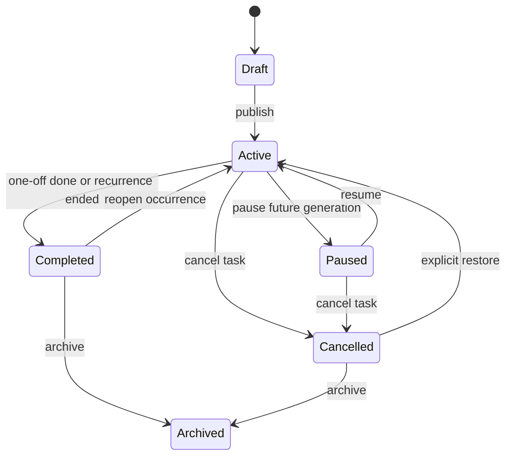
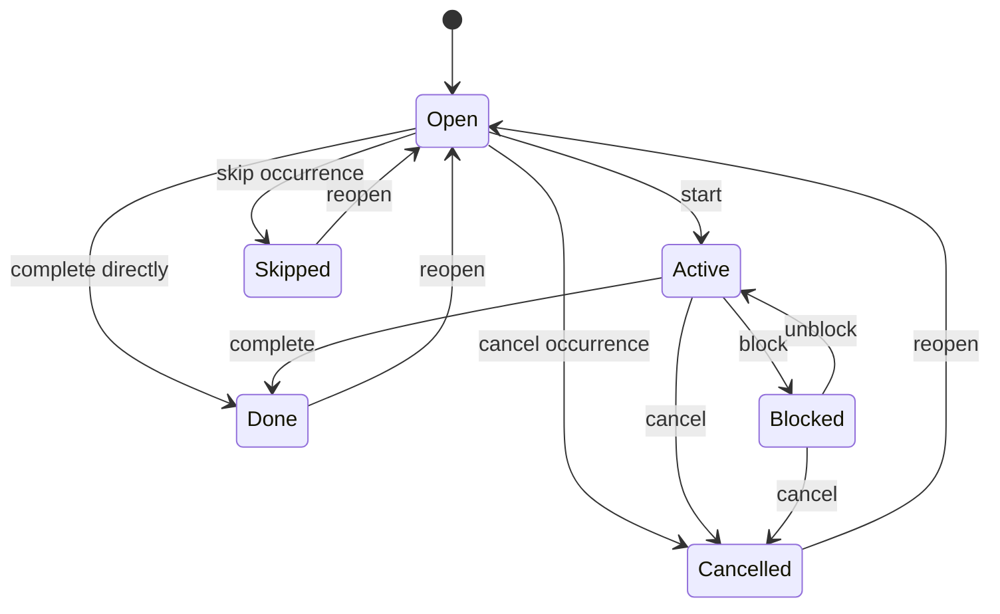
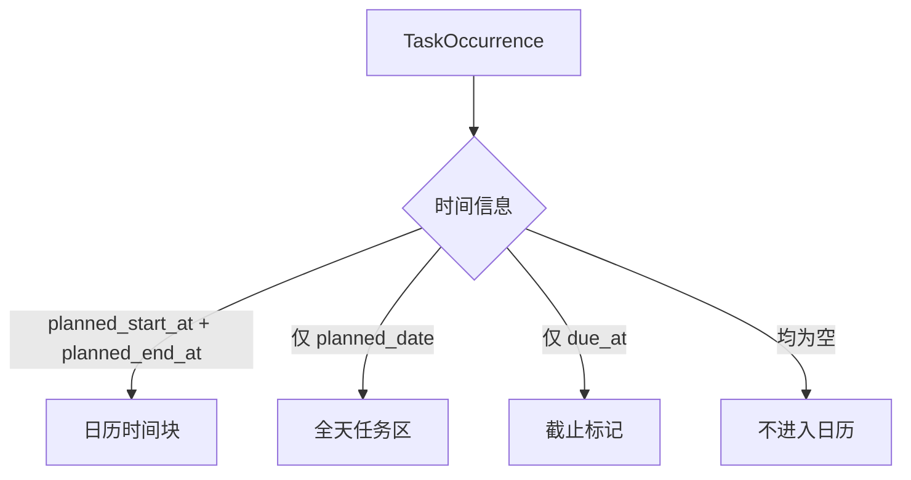
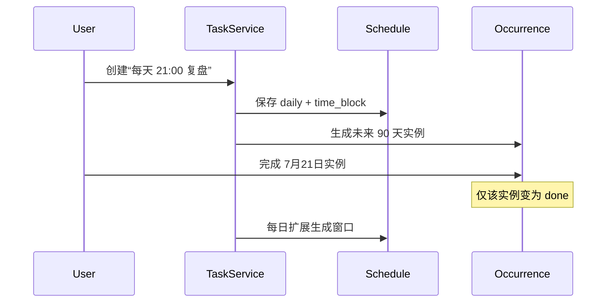
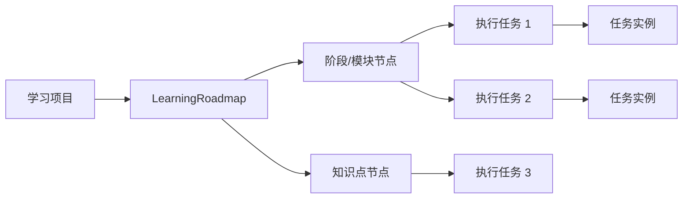
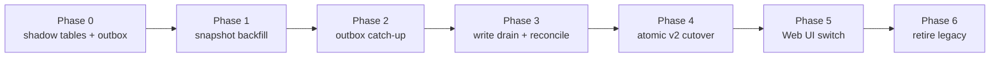
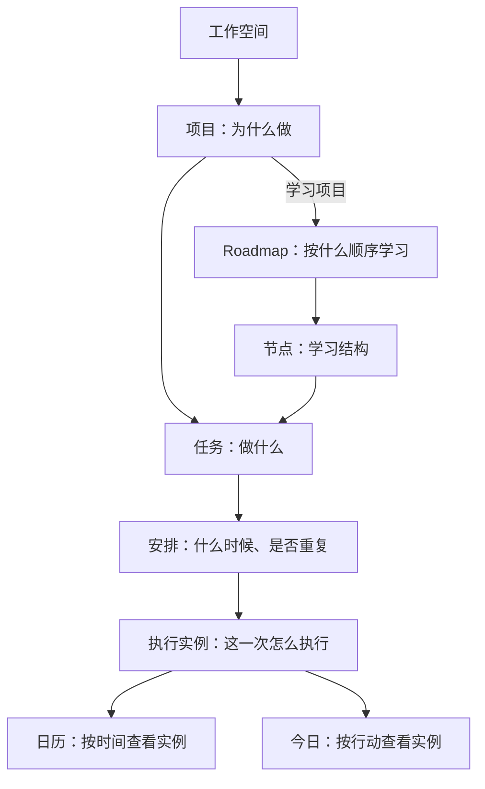

# 项目、任务与日程统一领域模型设计

## 结论

FlowSpace 将项目、任务、日程和重复任务统一为一条清晰的领域链路：

> **项目定义为什么做，任务定义做什么，执行实例表示某一次实际执行，日历只是执行实例的时间视图。**

核心调整如下：

1. 每个任务必须属于一个项目；快速捕获的任务自动进入 workspace 的系统收件箱项目。
2. 不再把日程建模为独立业务实体。具有明确开始、结束时间的任务实例就是日程。
3. 引入 `task_occurrences`。单次任务固定拥有一个实例，重复任务按规则产生多个实例。
4. 引入 `task_schedules`，统一表达未安排、指定日期、固定时间段和重复规则。
5. “普通/学习”与“短期/长期”拆成项目的两个正交维度，个人项目不再等同于短期项目。
6. Roadmap 节点负责学习结构，Task 负责实际执行；一个节点可以关联多个任务。
7. 所有数据面实体继续使用 `(workspace_id, id)` 复合身份；不同 workspace 可以安全复用 `personal` 等 ID。
8. Project、Task、Schedule 和 Occurrence 分别拥有自己的乐观锁 revision；Occurrence 的实体 revision 与生成它的 Schedule revision 严格分离。
9. 原 `events`、`tasks.horizon`、`tasks.scope` 和重复规则通过 v2 shadow tables、持久 outbox 和 workspace 级原子切换逐步收敛。

## 背景与现状问题

当前系统同时存在以下概念：

- 独立的 `tasks` 与 `events` 表；
- `task_projects.type = personal/regular/learning`；
- `tasks.horizon = week/long`；
- `tasks.scope = daily/monthly/yearly`；
- `tasks.execution_type = single/recurring`；
- 独立的重复规则与 occurrence；
- 学习项目、Roadmap 节点以及节点关联任务。

这些字段分别在不同阶段加入，但没有形成唯一语义。例如：

- `personal` 在页面中被解释成“短期项目”，`regular` 被解释成“长期项目”；
- 项目类别和任务 horizon 都在决定任务应显示在哪个区域；
- `planned_date` 和 `due` 经常被写为同一天，但一个应表示计划执行，一个应表示截止；
- 日程可以关联项目，却没有任务的执行状态和阻塞信息；
- 重复任务的模板状态与某一天实例的完成状态容易混淆；
- Roadmap 节点既像规划节点，又在部分交互中承担任务职责。

本设计的目标是先建立唯一领域语义，再据此调整数据库、API 和页面。

## 目标

1. 用户看到的所有可执行事项都属于任务体系。
2. 每个任务都能追溯到一个项目，包括快速捕获内容。
3. 普通任务、指定日期任务、固定时间日程和重复任务使用同一套状态与详情能力。
4. 重复任务的每次执行可以独立完成、跳过、取消、阻塞和改期。
5. 日历不再维护第二份业务数据，只展示任务实例的时间投影。
6. 短期、长期、学习三个概念可以组合，不再互斥。
7. Roadmap 保留结构化学习能力，但执行统一落到任务。
8. 旧数据可验证地迁移，现有网页 API 可以分阶段兼容。

## 非目标

第一版不处理：

- 跨 workspace 的项目或任务共享；
- 多人任务分派、审批流和复杂资源排班；
- CalDAV/Google Calendar 双向同步协议；
- 任意 RFC 5545 RRULE 的完整编辑器；
- `custom recurrence` 和自动跳过法定节假日；第一版只支持日、周、月规则；
- 子任务无限层级；第一版使用依赖关系和 Roadmap 节点表达复杂结构；
- 工时计费、人员容量和甘特图关键路径计算。
- 现有 mobile-v1 task/event mutation 的兼容和移动端页面调整。移动端将单独设计 mobile-v2；本方案的生产切换不得假设旧移动端能够继续写入。

## 本版评审决策

| 评审项 | 本版处理 |
| --- | --- |
| workspace 身份冲突 | 所有 tenant 实体改为 workspace 复合主键和复合外键 |
| occurrence 乐观锁缺失 | 新增独立 `revision`；保留语义不同的 `generated_schedule_revision` |
| 移动端兼容 | 明确移出范围，后续单独设计 mobile-v2；旧 mutation 在 cutover 前关闭 |
| Event 字段丢失 | Occurrence 增加 location、kind、notes、note、全天结束日期 |
| Task/Occurrence 状态矛盾 | 定义必须同事务执行的聚合状态转换 |
| 迁移不可执行 | 使用 `domain_*_v2` shadow tables、legacy outbox、domain state、write epoch 和 CAS cutover |
| 时间与 DST | 瞬间改用 `TIMESTAMPTZ`，明确本地日期、歧义时间和全天 exclusive end |
| Roadmap 跨项目关联 | 使用 `(workspace_id, project_id, roadmap_node_id)` 数据库复合外键 |
| Schedule 历史丢失 | 增加不可变 ScheduleVersion 和 effective range |
| 旧字段与系统项目冲突 | 补齐字段映射以及 personal/inbox 冲突处理规则 |
| 增量迁移漏删 | 对全部 legacy 源表安装事务型 DML outbox trigger，删除携带 tombstone/before-image，并做最终反向差集 |
| 全天 Event 兼容 | 旧 Web Event 查询同时投影 date 与 time_block，并持久保存迁移时区 |
| mobile-v1 冻结读取 | v2 cutover 同时关闭旧任务域 mutation、snapshot、changes 和 watch scope，失效 cursor/session |
| 状态机命令缺失 | 增加 publish/cancel/restore 显式命令，PATCH 禁止直接修改 lifecycle |
| DDL 不变量缺失 | 补齐状态、时间组合、开放版本和 blocked metadata 约束 |
| 生成器落后误完成 | 完成条件增加 watermark、预期 key 完整性和无待重试错误 |
| v2→legacy 不可逆 | v2 首次写入后不再承诺数据层回拨，只允许继续使用 v2 schema 的应用回滚 |

## 统一语言

| 中文名称 | 英文/代码名称 | 定义 |
| --- | --- | --- |
| 项目 | `Project` | 围绕一个结果组织任务、笔记和学习路线 |
| 任务定义 | `Task` | 稳定描述“要做什么”，不代表某一天的执行结果 |
| 安排策略 | `TaskSchedule` | 描述任务是否重复，以及实例应如何安排时间 |
| 执行实例 | `TaskOccurrence` | 一次真实可执行、可完成的任务 |
| 日程 | Calendar projection | 具有明确开始/结束时间的执行实例在日历中的表现 |
| 日期任务 | All-day task | 只指定执行日期、不占具体时间段的执行实例 |
| 重复任务 | Recurring task | 一个 Task 通过 Schedule 产生多个 Occurrence |
| 学习路线 | `LearningRoadmap` | 学习项目中的结构化知识与阶段规划 |
| 路线节点 | `RoadmapNode` | 学习结构节点，本身不是可勾选任务 |

## 领域总图

```mermaid
erDiagram
    WORKSPACE ||--o{ PROJECT : owns
    PROJECT ||--|{ TASK : contains
    TASK ||--|| TASK_SCHEDULE : follows
    TASK_SCHEDULE ||--|{ TASK_SCHEDULE_VERSION : versions
    TASK ||--|{ TASK_OCCURRENCE : produces
    TASK_OCCURRENCE ||--o{ TASK_EXECUTION_LOG : records
    PROJECT ||--o| LEARNING_ROADMAP : may_have
    LEARNING_ROADMAP ||--|{ ROADMAP_NODE : contains
    ROADMAP_NODE ||--o{ TASK : realized_by
    TASK ||--o{ TASK_DEPENDENCY : predecessor
    TASK ||--o{ TASK_DEPENDENCY : successor

    PROJECT {
        text workspace_id PK_FK
        text id PK
        text name
        text kind
        text horizon
        text status
        text system_role
        bigint revision
        timestamptz target_at
    }

    TASK {
        text workspace_id PK_FK
        text id PK
        text project_id FK
        text roadmap_node_id FK
        text title
        text description
        text lifecycle_status
        integer priority
        bigint revision
    }

    TASK_SCHEDULE {
        text workspace_id PK_FK
        text task_id PK_FK
        bigint revision
        bigint current_schedule_revision
        date generation_watermark
        text generation_status
    }

    TASK_SCHEDULE_VERSION {
        text workspace_id PK_FK
        text task_id PK_FK
        bigint schedule_revision PK
        date effective_from
        date effective_to
        text recurrence_type
        text timing_type
        text timezone
        date starts_on
        date ends_on
        json recurrence_rule
        time local_start_time
        integer duration_minutes
    }

    TASK_OCCURRENCE {
        text workspace_id PK_FK
        text id PK
        text task_id FK
        text occurrence_key
        date planned_date
        timestamptz planned_start_at
        timestamptz planned_end_at
        timestamptz due_at
        text execution_status
        text blocked_reason
        text next_action
        bigint revision
        bigint generated_schedule_revision
        timestamptz completed_at
    }

    TASK_EXECUTION_LOG {
        text workspace_id PK_FK
        text id PK
        text occurrence_id FK
        text action
        text note
        timestamptz created_at
    }

    LEARNING_ROADMAP {
        text workspace_id PK_FK
        text id PK
        text project_id FK
        text status
        bigint revision
    }

    ROADMAP_NODE {
        text workspace_id PK_FK
        text id PK
        text project_id FK
        text roadmap_id FK
        text parent_id FK
        text title
        text node_type
        text status
        bigint revision
    }
```

## 聚合边界

### Project 聚合

Project 是任务归属和页面组织边界，但不是大事务边界。删除项目不能级联删除历史任务。

```text
Project
├── project metadata
├── Task references
├── Note links
└── LearningRoadmap（仅 learning 项目）
```

### Task 聚合

Task 是核心写入聚合：

```text
Task
├── TaskSchedule（恰好一个）
├── TaskOccurrence（至少一个）
├── TaskDependency
└── TaskExecutionLog
```

创建 Task 时必须在同一事务中创建 Schedule 和首批 Occurrence：

- 单次任务：创建唯一 `occurrence_key = once` 的实例；
- 重复任务：创建滚动窗口内的实例，至少覆盖今天至未来 90 天；
- 未安排的单次任务：仍创建一个日期和时间均为空的实例，作为待办执行对象。

## Project 模型

### 字段

| 字段 | 取值 | 说明 |
| --- | --- | --- |
| `kind` | `standard/learning` | 项目能力类型 |
| `horizon` | `short/long` | 时间跨度，不决定项目能力 |
| `status` | `planning/active/paused/completed/archived` | 项目生命周期 |
| `system_role` | `inbox/personal/NULL` | 系统项目身份，普通项目为空 |
| `target_at` | nullable timestamptz | 项目目标完成时间 |
| `revision` | positive bigint | Project 自身的乐观锁版本 |

### 组合示例

| 项目 | kind | horizon | system_role |
| --- | --- | --- | --- |
| 收件箱 | standard | short | inbox |
| 个人事务 | standard | short | personal |
| 本周语音服务上线 | standard | short | NULL |
| FlowSpace 产品建设 | standard | long | NULL |
| 七天学习 React | learning | short | NULL |
| 日语 N1 学习 | learning | long | NULL |

### 不变量

1. 每个 workspace 恰好一个 `system_role=inbox` 项目。
2. 每个 workspace 恰好一个 `system_role=personal` 项目。
3. 系统项目不可删除、不可修改 `system_role`，可以重命名显示名称。
4. `kind=learning` 的项目最多拥有一个当前 Roadmap。
5. 项目归档时保留任务和执行历史；归档项目默认不出现在创建任务选择器。
6. 有未完成实例的项目不能直接标记 `completed`，除非用户明确选择同时取消或迁移这些实例。

## Task 模型

Task 只保存稳定定义，不保存某一天的执行状态。

建议字段：

```text
tasks
  workspace_id + id       COMPOSITE PRIMARY KEY
  project_id           NOT NULL
  roadmap_node_id      NULL
  note_id              NULL
  title
  description
  lifecycle_status     draft/active/paused/completed/cancelled/archived
  priority             0..3
  sort_order
  revision
  created_at
  updated_at
  archived_at          NULL
```

### Task lifecycle 状态



Task 的 `completed` 表示整个定义已经结束：

- 单次任务：唯一实例完成后自动完成；
- 重复任务：到达结束日期，并且生成水位覆盖结束日期、预期实例完整、没有生成失败且全部实例进入终态后完成；
- 完成某一次重复实例不会完成 Task。

重复 Task 的自然完成判定必须同时满足：

```text
now in schedule timezone > ends_on
AND generation_watermark >= ends_on
AND materialized occurrence keys = ScheduleVersion 规则在有效区间内的预期 key 集合
AND generation_status = idle
AND 不存在 retry_pending/failed generation job
AND 所有 occurrence 均为终态
```

判断过程由领域服务在同一 fenced transaction 中完成。不能仅用“当前查到的实例都已完成”推导 Task 完成；生成器落后时 Task 保持 `active` 并暴露 generation lag。

### Task 与 Occurrence 聚合规则

以下变化必须在同一个 fenced tenant transaction 中更新 Task、Schedule 和相关 Occurrence，不能由异步修复维持一致性：

1. 单次 occurrence 完成：Occurrence 进入 `done`，Task 原子进入 `completed`。
2. 单次 occurrence reopen：Occurrence 回到 `open`，Task 原子从 `completed` 恢复为 `active`。
3. 单次 occurrence 不允许 `skipped`；用户不再执行时使用 `cancelled`，并让 Task 进入 `cancelled`。
4. 取消 Task：停止生成新实例，并原子取消全部非终态 occurrence；历史终态实例不改写。
5. 暂停 Task：停止生成新实例，但已经生成的 occurrence 仍然可见、可执行；需要停止它们时使用“暂停并取消未来实例”这一显式命令。
6. 重复 Task 自然结束后，如果历史 occurrence 被 reopen，Task 从 `completed` 恢复为 `active`，但 `ends_on` 不改变，也不会生成结束日期之后的实例；该实例再次进入终态后 Task重新完成。
7. 已取消 Task 下的 occurrence 不能单独 reopen；必须先恢复 Task，再选择需要恢复的实例。
8. 所有命令同时校验 Task `revision` 和目标 Occurrence `revision`，成功后分别递增。

## TaskSchedule 模型

Schedule 使用两个正交维度，避免组合出大量互斥类型。

### 重复维度 recurrence_type

```text
none
daily
weekly
monthly
```

### 时间精度维度 timing_type

```text
unscheduled    未安排日期和时间
date           指定执行日期，但不占具体时间段
time_block     指定开始和结束时间，作为日程展示
```

因此可以自然组合：

| 场景 | recurrence_type | timing_type |
| --- | --- | --- |
| 普通待办 | none | unscheduled |
| 周五完成报告 | none | date |
| 周五 14:00 评审 | none | time_block |
| 每天阅读 | daily | date |
| 每天 21:00 复盘 | daily | time_block |
| 每周一提交周报 | weekly | date |

### recurrence_rule

第一版保持结构化 JSON，但必须由后端验证并规范化：

```json
{
  "interval": 1,
  "weekdays": [1, 3, 5],
  "month_days": []
}
```

规则解释必须绑定 `timezone`。服务端保存 IANA 时区，例如 `Asia/Shanghai`，不能依赖服务器本地时区。

### Schedule header 与不可变版本

`task_schedules` 只是当前指针和生成水位；实际规则保存在不可变的 `task_schedule_versions`：

```text
TaskSchedule
  revision                    Schedule header 乐观锁
  current_schedule_revision   当前规则版本
  generation_watermark        已生成到哪一天

TaskScheduleVersion
  schedule_revision
  effective_from              生效日期，含当天
  effective_to                失效日期，不含当天，可空
  recurrence/timing/timezone/rule
```

“仅本次”只把 occurrence 标记为 `manually_overridden`，不修改规则。“本次及以后”必须创建新的 ScheduleVersion，并把旧版本的 `effective_to` 设置为新版本的 `effective_from`；不能覆盖旧版本。Occurrence 的 `generated_schedule_revision` 复合外键引用产生它的不可变版本，因此历史始终可追溯。

### Schedule 不变量

1. `recurrence_type=none` 时 `recurrence_rule` 必须为空。
2. 重复规则必须有 `starts_on`，`ends_on` 可空。
3. `timing_type=time_block` 必须有本地开始时间和正数 duration。
4. `timing_type=date` 不允许保存伪造的 `00:00–23:59` 时间段。
5. 修改重复规则只影响尚未开始且未人工覆盖的未来实例。
6. 历史实例永远不因规则变化而被重写。
7. 非重复 `date/time_block` Task 必须使用 `starts_on` 指定唯一日期；`unscheduled` 的 `starts_on` 必须为空。
8. ScheduleVersion 的有效区间不得重叠，且 `effective_to > effective_from`。
9. 第一版不接受 `custom` 和 `skip_holidays`；节假日地区与规则另行设计。
10. `daily` 必须包含正整数 interval；`weekly` 还必须包含非空且不重复的 `weekdays(0..6)`；`monthly` 还必须包含非空且不重复的 `month_days(1..31)`。未知 JSON 字段直接拒绝。

## TaskOccurrence 模型

Occurrence 是用户真正执行、勾选和在日历中拖动的对象。

建议字段：

```text
task_occurrences
  id
  workspace_id
  task_id
  occurrence_key       once 或 YYYY-MM-DD/规则序号
  planned_date         NULL
  planned_start_at     NULL
  planned_end_at       NULL
  due_at               NULL
  execution_status     open/active/blocked/done/skipped/cancelled
  actual_start_at      NULL
  completed_at         NULL
  override_title       NULL
  override_description NULL
  location             NULL
  calendar_kind        NULL
  calendar_notes       NULL
  note_id              NULL
  all_day_end_date     NULL, exclusive
  revision             occurrence entity revision
  generated_schedule_revision
  created_at
  updated_at
```

约束：

- `UNIQUE(workspace_id, task_id, occurrence_key)`；
- `planned_end_at > planned_start_at`；
- 开始和结束时间必须同时为空或同时非空；
- `time_block` 实例必须有开始和结束时间；
- `done` 必须有 `completed_at`，非 `done` 必须清空 `completed_at`；
- `skipped/cancelled/done` 为终态，但允许显式 reopen；
- `all_day_end_date` 使用 exclusive 语义，并且必须晚于 `planned_date`；为空表示单日；
- `revision` 每次修改 occurrence 时递增；`generated_schedule_revision` 只表示来源规则，绝不能充当乐观锁；
- occurrence 的 project 通过 Task 获得，不重复保存可漂移的 `project_id`。

### 执行状态机



`blocked` 必须允许保存阻塞原因和下一步，放入 ExecutionLog 或 occurrence metadata，不能只保存一个颜色状态。

### 日历扩展元数据

旧 Event 的业务字段保存在 Occurrence 上，而不是丢弃或塞入 Task 描述：

| 字段 | 语义 |
| --- | --- |
| `location` | 地点或会议地址 |
| `calendar_kind` | `work/personal/reminder` 等展示类别 |
| `calendar_notes` | 某次日程实例的备注 |
| `note_id` | 与本次实例关联的笔记 |
| `all_day_end_date` | 全天多日事项的 exclusive 结束日期 |

Task 上的 `note_id` 表示稳定关联到任务定义的笔记；Occurrence 上的 `note_id` 表示只与某一次执行关联。两者不能在 DTO 中使用同一个含糊字段覆盖。

## 日程是任务实例的时间投影

日历不再读取独立 `events` 表，而是查询 Occurrence：



同一个实例可以同时具有计划时间段和截止时间：

- 时间块表达准备何时执行；
- 截止时间表达最迟何时完成；
- 超过 `due_at` 且未进入终态时才算逾期。

日历拖动规则：

1. 拖动单次实例：只修改该 occurrence。
2. 拖动重复实例：默认仅修改本次，并标记为人工 override。
3. 用户可以显式选择“本次及以后”，此时生成新的 schedule revision。
4. 已完成实例不能直接拖动；必须先 reopen。

### 时间与时区语义

1. PostgreSQL 中代表真实瞬间的 `planned_start_at`、`planned_end_at`、`due_at`、`actual_start_at` 和 `completed_at` 一律使用 `TIMESTAMPTZ`；SQLite 使用 UTC Unix seconds。
2. `planned_date`、`starts_on`、`ends_on` 和 `all_day_end_date` 是用户时区中的 `DATE`；`local_start_time` 是 `TIME`，它们不是 UTC 瞬间。
3. 非重复 `date/time_block` Task 的 `starts_on` 就是唯一实例日期。`time_block` 由 `starts_on + local_start_time + timezone + duration` 计算 UTC 起止时间。
4. `time_block` occurrence 的 `planned_date` 必须等于 `planned_start_at` 在 Schedule timezone 中对应的本地日期，由服务端生成而非客户端独立提交。
5. DST 跳时导致本地时间不存在时拒绝保存并返回 `nonexistent_local_time`；本地时间存在两个 offset 时返回候选 offset，要求客户端明确选择，不能静默猜测。
6. 全天多日事项用 `[planned_date, all_day_end_date)` 表达。例如 7 月 1–3 日保存为开始 `2026-07-01`、exclusive 结束 `2026-07-04`。
7. `due_at` 是截止瞬间，与计划执行时间正交；系统不再自动把日期任务的午夜写入 `due_at`。

## 重复实例生成

采用“滚动物化窗口”，而不是查询时无限展开：

1. 创建重复任务时生成今天至未来 90 天的 occurrence。
2. 后台任务每日把窗口向前补齐。
3. `(task_id, occurrence_key)` 唯一约束保证幂等。
4. schedule header 保存实体 revision；实例记录 `generated_schedule_revision` 并引用不可变 ScheduleVersion。
5. 修改规则时，仅重算未开始、未完成、未人工 override 的未来实例。
6. 已开始、阻塞、完成、跳过或取消的实例保留历史。



## Roadmap 与任务

Roadmap 只存在于 `kind=learning` 的项目中。



规则：

1. RoadmapNode 本身不提供任务执行状态复选框。
2. 节点状态为结构状态：`locked/available/in_progress/mastered/skipped`。
3. 节点可以创建多个 Task，Task 必须属于同一个 learning 项目。
4. 节点进度由关联任务实例汇总，不直接手工维护百分比。
5. 先修依赖由 RoadmapEdge 表达；实际工作依赖由 TaskDependency 表达。
6. 删除节点前必须解绑或迁移关联任务，不能级联删除执行历史。
7. RoadmapNode 提供 `(workspace_id, project_id, id)` 唯一键；Task 使用 `(workspace_id, project_id, roadmap_node_id)` 复合外键，数据库直接禁止跨项目关联。

## TaskDependency

第一版支持三类依赖：

```text
finish_to_start   前置完成后后续才能开始
related           相关但不阻断
suggested_order   推荐顺序
```

第一版 `finish_to_start` 只允许连接两个非重复 Task。重复 Task 没有单一可用于依赖判断的整体结束点；若以后需要“某次重复执行阻塞另一次执行”，应另行设计 occurrence 级依赖，不能复用 TaskDependency 猜测语义。

数据库必须禁止：

- 自己依赖自己；
- 重复边；
- 跨 workspace 依赖；
- `finish_to_start` 形成有向环。

循环检测由服务层在事务内完成，并配合 workspace 级写串行或可重试隔离级别。

## 查询模型与页面信息架构

### 项目页面

项目是一级入口：

```text
项目
├── 进行中
├── 短期
├── 长期
├── 学习
├── 已暂停
└── 已归档
```

“短期/长期”与“普通/学习”使用筛选器组合，不再做互斥实体类别。

项目详情统一包含：

- 项目概览；
- 未完成任务实例；
- 日历安排；
- 项目笔记；
- 学习路线（仅 learning）；
- 已完成历史。

### 任务页面

任务页面实际查询 occurrence：

```text
任务
├── 收件箱
├── 今天
├── 接下来
├── 已逾期
├── 无日期
├── 重复任务
└── 已完成
```

每一行显示：项目、任务标题、实例日期/时间、执行状态、重复标志和截止状态。

### 今日页面

默认展示：

1. 今天的固定时间实例；
2. 今天的日期任务；
3. 用户主动标记为“今天处理”的无日期任务；
4. 未来最近的未完成实例。

“已逾期”作为可切换 Tab，不抢占默认页面。

### 日历页面

日历查询统一返回 `CalendarEntry` 读模型：

```json
{
  "occurrence_id": "occ-123",
  "task_id": "task-123",
  "project_id": "project-1",
  "title": "语音服务评审",
  "display_type": "time_block",
  "planned_date": "2026-07-25",
  "start_at": 1784959200,
  "end_at": 1784962800,
  "due_at": null,
  "status": "open",
  "recurring": false,
  "location": "会议室 A",
  "calendar_kind": "work",
  "notes": "评审语音转写接入方案",
  "note_id": null,
  "all_day_end_date": null,
  "revision": 3
}
```

这是查询 DTO，不新增 `calendar_entries` 业务表。

## 数据库设计

### projects

由于现有 `task_projects`、`tasks` 和 `task_occurrences` 已经在线使用，迁移期不原地改表。新模型使用 shadow tables；以下 `domain_*_v2` 是实施期真实物理名称，稳定后是否重命名另行决策。

```sql
CREATE TABLE domain_projects_v2 (
  workspace_id TEXT NOT NULL,
  id TEXT NOT NULL,
  name TEXT NOT NULL,
  description TEXT NOT NULL DEFAULT '',
  kind TEXT NOT NULL CHECK (kind IN ('standard','learning')),
  horizon TEXT NOT NULL CHECK (horizon IN ('short','long')),
  status TEXT NOT NULL CHECK (status IN ('planning','active','paused','completed','archived')),
  system_role TEXT CHECK (system_role IN ('inbox','personal')),
  target_at TIMESTAMPTZ NULL,
  revision BIGINT NOT NULL DEFAULT 1 CHECK (revision > 0),
  created_at TIMESTAMPTZ NOT NULL,
  updated_at TIMESTAMPTZ NOT NULL,
  archived_at TIMESTAMPTZ NULL,
  PRIMARY KEY (workspace_id, id),
  UNIQUE (workspace_id, name)
);
```

PostgreSQL 使用 partial unique index 保证每个 workspace 的 system role 唯一；SQLite 使用触发器或 nullable 唯一组合兼容实现。

### tasks

```sql
CREATE TABLE domain_tasks_v2 (
  workspace_id TEXT NOT NULL,
  id TEXT NOT NULL,
  project_id TEXT NOT NULL,
  roadmap_node_id TEXT NULL,
  note_id TEXT NULL,
  title TEXT NOT NULL,
  description TEXT NOT NULL DEFAULT '',
  lifecycle_status TEXT NOT NULL CHECK (
    lifecycle_status IN ('draft','active','paused','completed','cancelled','archived')
  ),
  priority SMALLINT NOT NULL DEFAULT 0 CHECK (priority BETWEEN 0 AND 3),
  sort_order DOUBLE PRECISION NOT NULL DEFAULT 0,
  revision BIGINT NOT NULL DEFAULT 1 CHECK (revision > 0),
  created_at TIMESTAMPTZ NOT NULL,
  updated_at TIMESTAMPTZ NOT NULL,
  archived_at TIMESTAMPTZ NULL,
  PRIMARY KEY (workspace_id, id),
  FOREIGN KEY (workspace_id, project_id)
    REFERENCES domain_projects_v2(workspace_id, id),
  FOREIGN KEY (workspace_id, project_id, roadmap_node_id)
    REFERENCES roadmap_nodes(workspace_id, project_id, id),
  FOREIGN KEY (workspace_id, note_id)
    REFERENCES notes(workspace_id, id)
);
```

这要求 Roadmap tenant baseline 先为 `roadmap_nodes` 补齐 `project_id`，并建立 `UNIQUE(workspace_id, project_id, id)`；回填值来自 `learning_roadmaps.project_id`。所有关键引用都使用包含 `workspace_id` 的复合外键，不能只靠 handler 检查租户边界。

### task_schedules

```sql
CREATE TABLE domain_task_schedules_v2 (
  workspace_id TEXT NOT NULL,
  task_id TEXT NOT NULL,
  revision BIGINT NOT NULL DEFAULT 1 CHECK (revision > 0),
  current_schedule_revision BIGINT NOT NULL,
  generation_watermark DATE NULL,
  generation_status TEXT NOT NULL DEFAULT 'idle' CHECK (
    generation_status IN ('idle','running','retry_pending','failed')
  ),
  generation_error TEXT NULL,
  generation_retry_at TIMESTAMPTZ NULL,
  updated_at TIMESTAMPTZ NOT NULL,
  PRIMARY KEY (workspace_id, task_id),
  FOREIGN KEY (workspace_id, task_id)
    REFERENCES domain_tasks_v2(workspace_id, id) ON DELETE CASCADE
);

CREATE TABLE domain_task_schedule_versions_v2 (
  workspace_id TEXT NOT NULL,
  task_id TEXT NOT NULL,
  schedule_revision BIGINT NOT NULL,
  effective_from DATE NULL,
  effective_to DATE NULL,
  recurrence_type TEXT NOT NULL CHECK (recurrence_type IN ('none','daily','weekly','monthly')),
  timing_type TEXT NOT NULL CHECK (timing_type IN ('unscheduled','date','time_block')),
  timezone TEXT NOT NULL,
  starts_on DATE NULL,
  ends_on DATE NULL,
  recurrence_rule JSONB NOT NULL DEFAULT '{}'::jsonb,
  local_start_time TIME NULL,
  duration_minutes INTEGER NULL,
  created_at TIMESTAMPTZ NOT NULL,
  PRIMARY KEY (workspace_id, task_id, schedule_revision),
  FOREIGN KEY (workspace_id, task_id)
    REFERENCES domain_task_schedules_v2(workspace_id, task_id) ON DELETE CASCADE,
  CHECK (
    effective_to IS NULL
    OR (effective_from IS NOT NULL AND effective_to > effective_from)
  ),
  CHECK (ends_on IS NULL OR (starts_on IS NOT NULL AND ends_on >= starts_on)),
  CHECK (
    (recurrence_type = 'none' AND recurrence_rule = '{}'::jsonb AND ends_on IS NULL)
    OR
    (recurrence_type <> 'none' AND starts_on IS NOT NULL AND effective_from IS NOT NULL)
  ),
  CHECK (
    (timing_type = 'unscheduled'
      AND recurrence_type = 'none'
      AND starts_on IS NULL
      AND local_start_time IS NULL
      AND duration_minutes IS NULL)
    OR
    (timing_type = 'date'
      AND starts_on IS NOT NULL
      AND local_start_time IS NULL
      AND duration_minutes IS NULL)
    OR
    (timing_type = 'time_block'
      AND starts_on IS NOT NULL
      AND local_start_time IS NOT NULL
      AND duration_minutes > 0)
  )
);
```

`domain_task_schedules_v2.current_schedule_revision` 需要 deferred 复合外键指向对应 ScheduleVersion。版本有效区间不重叠由 PostgreSQL exclusion constraint、SQLite trigger 和共用 repository contract 共同保证。PostgreSQL 另建 partial unique index，保证每个 Schedule 最多一个 `effective_to IS NULL` 的开放版本；deferred constraint trigger 在事务提交时保证至少一个开放版本，且 header 必须指向它，因此最终是恰好一个。

`recurrence_rule` 的 interval、weekdays、month_days 和未知字段约束由数据库 validation trigger 与共用领域解析器执行；不能只依赖前端表单。迁移 SQL 必须为 PostgreSQL 和 SQLite 分别提供等价 trigger，并由同一组非法规则 contract tests 验证。

PostgreSQL 使用下列 deferred FK 闭合当前版本引用；SQLite 在同一 repository transaction 结束前执行等价校验：

```sql
ALTER TABLE domain_task_schedules_v2
  ADD CONSTRAINT domain_task_schedule_current_version_fk
  FOREIGN KEY (workspace_id, task_id, current_schedule_revision)
  REFERENCES domain_task_schedule_versions_v2(workspace_id, task_id, schedule_revision)
  DEFERRABLE INITIALLY DEFERRED;

CREATE UNIQUE INDEX domain_task_schedule_one_open_version_idx
  ON domain_task_schedule_versions_v2(workspace_id, task_id)
  WHERE effective_to IS NULL;
```

### task_occurrences

```sql
CREATE TABLE domain_task_occurrences_v2 (
  workspace_id TEXT NOT NULL,
  id TEXT NOT NULL,
  task_id TEXT NOT NULL,
  occurrence_key TEXT NOT NULL,
  planned_date DATE NULL,
  planned_start_at TIMESTAMPTZ NULL,
  planned_end_at TIMESTAMPTZ NULL,
  due_at TIMESTAMPTZ NULL,
  execution_status TEXT NOT NULL CHECK (
    execution_status IN ('open','active','blocked','done','skipped','cancelled')
  ),
  actual_start_at TIMESTAMPTZ NULL,
  completed_at TIMESTAMPTZ NULL,
  override_title TEXT NULL,
  override_description TEXT NULL,
  location TEXT NULL,
  calendar_kind TEXT NULL,
  calendar_notes TEXT NULL,
  note_id TEXT NULL,
  all_day_end_date DATE NULL,
  blocked_reason TEXT NULL,
  next_action TEXT NULL,
  revision BIGINT NOT NULL DEFAULT 1 CHECK (revision > 0),
  generated_schedule_revision BIGINT NOT NULL,
  manually_overridden BOOLEAN NOT NULL DEFAULT FALSE,
  created_at TIMESTAMPTZ NOT NULL,
  updated_at TIMESTAMPTZ NOT NULL,
  PRIMARY KEY (workspace_id, id),
  UNIQUE (workspace_id, task_id, occurrence_key),
  FOREIGN KEY (workspace_id, task_id)
    REFERENCES domain_tasks_v2(workspace_id, id) ON DELETE CASCADE,
  FOREIGN KEY (workspace_id, task_id, generated_schedule_revision)
    REFERENCES domain_task_schedule_versions_v2(workspace_id, task_id, schedule_revision),
  FOREIGN KEY (workspace_id, note_id)
    REFERENCES notes(workspace_id, id),
  CHECK ((planned_start_at IS NULL) = (planned_end_at IS NULL)),
  CHECK (planned_end_at IS NULL OR planned_end_at > planned_start_at),
  CHECK (
    all_day_end_date IS NULL
    OR (planned_date IS NOT NULL AND all_day_end_date > planned_date)
  ),
  CHECK ((execution_status = 'done') = (completed_at IS NOT NULL)),
  CHECK (
    (execution_status = 'blocked'
      AND NULLIF(trim(blocked_reason), '') IS NOT NULL
      AND NULLIF(trim(next_action), '') IS NOT NULL)
    OR
    (execution_status <> 'blocked' AND blocked_reason IS NULL AND next_action IS NULL)
  )
);
```

Occurrence 的 timing 组合依赖它引用的 ScheduleVersion，无法用单表 CHECK 完整表达。PostgreSQL 使用 deferred constraint trigger，SQLite 使用 repository transaction 末尾校验，强制：`date` 不得有瞬间字段、`time_block` 必须有起止瞬间且 `planned_date` 与 timezone 一致、`unscheduled` 不得有计划日期或时间。

### task_execution_logs

状态变化日志是不可变事实，同时保存 blocked 转换的原因和下一步：

```sql
CREATE TABLE domain_task_execution_logs_v2 (
  workspace_id TEXT NOT NULL,
  id TEXT NOT NULL,
  occurrence_id TEXT NOT NULL,
  from_status TEXT NULL,
  to_status TEXT NOT NULL CHECK (
    to_status IN ('open','active','blocked','done','skipped','cancelled')
  ),
  blocked_reason TEXT NULL,
  next_action TEXT NULL,
  actor_id TEXT NOT NULL,
  metadata JSONB NOT NULL DEFAULT '{}'::jsonb,
  created_at TIMESTAMPTZ NOT NULL,
  PRIMARY KEY (workspace_id, id),
  FOREIGN KEY (workspace_id, occurrence_id)
    REFERENCES domain_task_occurrences_v2(workspace_id, id),
  CHECK (
    to_status <> 'blocked'
    OR (
      NULLIF(trim(blocked_reason), '') IS NOT NULL
      AND NULLIF(trim(next_action), '') IS NOT NULL
    )
  )
);
```

数据库 trigger 拒绝 ExecutionLog 的 UPDATE/DELETE。Occurrence 上的 `blocked_reason/next_action` 是当前状态快照，ExecutionLog 是完整历史；领域事务必须同时写入二者。

索引至少包括：

- `(workspace_id, execution_status, planned_date)`；
- `(workspace_id, planned_start_at)`；
- `(workspace_id, due_at)`，过滤未完成状态；
- `(workspace_id, task_id, occurrence_key)` unique；
- `(workspace_id, project_id)` 通过 Task 查询时需要 Task 侧索引；
- 每个可更新实体都必须有独立 `revision`，更新使用 `WHERE workspace_id=? AND id=? AND revision=?` 后递增；
- `generated_schedule_revision` 不随 occurrence 普通修改而变化。

## API 设计

### Projects

```text
GET    /api/projects
POST   /api/projects
GET    /api/projects/:projectID
PATCH  /api/projects/:projectID
POST   /api/projects/:projectID/archive
POST   /api/projects/:projectID/complete
```

### Task definitions

```text
GET    /api/tasks
POST   /api/tasks
GET    /api/tasks/:taskID
PATCH  /api/tasks/:taskID
POST   /api/tasks/:taskID/publish
POST   /api/tasks/:taskID/pause
POST   /api/tasks/:taskID/resume
POST   /api/tasks/:taskID/cancel
POST   /api/tasks/:taskID/restore
POST   /api/tasks/:taskID/archive
```

`PATCH /api/tasks/:taskID` 只允许修改 title、description、priority、sort order、project/note/roadmap 关联等普通属性，明确拒绝 `lifecycle_status`、schedule 和 occurrence 状态字段。状态变化必须经过显式命令：

- `publish`：校验定义和 Schedule 后从 draft 进入 active，并生成首批实例；
- `pause/resume`：按聚合规则停止或恢复未来生成，不隐式取消既有实例；
- `cancel`：停止生成并原子取消所有非终态实例；
- `restore`：恢复 Task 定义，再由请求明确选择恢复哪些被取消实例；
- `archive`：只允许 completed/cancelled Task，保留全部历史。

所有命令必须调用同一个领域服务入口，旧 Web adapter 也不能绕过聚合事务直接更新 `lifecycle_status`。

创建请求把定义与安排一次提交，后端原子创建：

```json
{
  "project_id": "project-1",
  "title": "每日复盘",
  "description": "记录进展与阻塞",
  "priority": 1,
  "schedule": {
    "recurrence_type": "daily",
    "timing_type": "time_block",
    "timezone": "Asia/Shanghai",
    "starts_on": "2026-07-21",
    "local_start_time": "21:00:00",
    "duration_minutes": 30,
    "rule": { "interval": 1 }
  }
}
```

### Occurrences

```text
GET    /api/task-occurrences
GET    /api/task-occurrences/:occurrenceID
PATCH  /api/task-occurrences/:occurrenceID
POST   /api/task-occurrences/:occurrenceID/start
POST   /api/task-occurrences/:occurrenceID/block
POST   /api/task-occurrences/:occurrenceID/complete
POST   /api/task-occurrences/:occurrenceID/skip
POST   /api/task-occurrences/:occurrenceID/cancel
POST   /api/task-occurrences/:occurrenceID/reopen
```

`PATCH` 改期时要求 `expected_revision`，防止网页、后台生成器和同 workspace 的其他会话相互覆盖。

Project、Task 和 Schedule 的所有修改命令同样要求各自的 `expected_revision`。聚合命令需要同时返回被修改实体的新 revision；revision 不匹配统一返回 `409 revision_conflict`。Occurrence 的 `revision` 与 `generated_schedule_revision` 是两个独立字段。

### Calendar projection

```text
GET /api/calendar/entries?from=2026-07-01&to=2026-07-31&project_id=...
```

日历写操作最终调用 occurrence API，不允许出现第二套 event 写模型。

## 兼容策略

第一阶段保留旧接口并通过适配器转换：

| 旧接口 | 兼容行为 |
| --- | --- |
| `GET /api/events` | 同时查询 `time_block` 和 `date` occurrence，并转换为旧 Event DTO |
| `POST /api/events` | 创建单次 Task + Schedule + Occurrence |
| `PATCH /api/events/:id` | 更新对应 occurrence |
| `DELETE /api/events/:id` | 原子取消 occurrence 和其单次 Task，保留迁移 ID map |
| `GET /api/tasks` | 返回 Task 与当前/指定 occurrence 的扁平 DTO |
| occurrence complete 旧接口 | 转发到新的 occurrence command |

旧 Web DTO 以兼容新增字段方式返回 `task_id`、`occurrence_id`、`is_all_day` 和 `all_day_end_date`。旧 Event 的 `location/kind/note_id` 完整映射到 occurrence calendar metadata；全天多日事项映射到 `[planned_date, all_day_end_date)`。适配器使用该 ScheduleVersion 持久化的 timezone 合成旧 DTO 所需的 UTC start/end，不能读取当前用户时区临时换算。旧 PATCH 未提交全天扩展字段时保留原值，保证往返不丢失。

兼容期间严禁同时写旧表和新表形成双写。采用“新模型为唯一写源，旧 API 仅做适配”的方式。

### 移动端范围边界

本方案不设计或兼容现有 mobile-v1 的任务域读写，也不定义 mobile-v2 contract。移动端的离线身份、revision、tombstone、同步协议和页面信息架构将单独重新设计。

因此，本方案切换到 v2 唯一写源前必须满足以下部署前置条件之一：

1. 当前环境没有启用 mobile-v1；或
2. 同时关闭 mobile-v1 中涉及 task/event/task-occurrence 的 mutation、changes、snapshot 和 watch 读取 scope。

关闭时控制面递增 `mobile_contract_epoch`，使既有同步 cursor、watch token 和相关 session scope 失效；旧客户端访问受影响接口统一返回 HTTP 426 和 `mobile_task_domain_upgrade_required`，不能继续返回冻结的 legacy 数据。若现有聚合 snapshot 无法按 entity scope 局部关闭，则关闭整个 mobile-v1 sync/watch snapshot；语音上传等不读取任务域的独立能力可以继续服务。

不能因为本方案忽略移动端设计，就允许旧移动端在 cutover 后继续读写 legacy 数据。移动端重新开放任务域必须以独立评审通过的 mobile-v2 方案为前置条件。

## 旧数据迁移

### 迁移映射

#### task_projects

| 旧 type | 新字段 |
| --- | --- |
| `personal` | `kind=standard, horizon=short, system_role=personal` |
| `regular` | `kind=standard, horizon=long, system_role=NULL` |
| `learning` | `kind=learning, horizon=long, system_role=NULL` |

每个 workspace 额外创建 `system_role=inbox` 的收件箱项目。

冲突处理必须确定且可审计：

1. 同一 workspace 存在多个旧 `type=personal` 项目时，优先选择 `id=personal`，否则选择最早创建的一条作为系统 personal 项目。
2. 其余 personal 项目转换为普通短期项目，不自动合并任务；发生名称冲突时重命名为 `个人（迁移-<短ID>）`。
3. 已有普通项目名为“收件箱”时，先重命名为 `收件箱（原项目）`，再创建固定 ID `system-inbox` 的系统收件箱。
4. `task_domain_migration_id_map` 保存每个旧 project/task/event/occurrence ID 到 v2 复合身份的映射和冲突处理原因。

#### tasks

- 缺少 `project_id` 或引用无效项目：迁移到该 workspace 的 inbox 项目并记录审计。
- `execution_type=single`：创建 `recurrence_type=none` schedule 和 `occurrence_key=once` 实例。
- `planned_date`：映射到 occurrence 的 `planned_date`。
- `due`：只映射到 `due_at`，不再自动等于 `planned_date`。
- `status/open/active/blocked/done`：迁移到 occurrence 的 `execution_status`。
- `done=1`：强制 occurrence 为 `done` 并补齐 `completed_at`。
- `horizon/scope`：不再写入 Task；项目 horizon 优先按原项目类型映射。
- `content`：完整映射到 Task `description`，不做截断。
- `note_id`：映射到 Task 的稳定笔记关联，并校验同 workspace 复合外键。
- `sort_order`：原值映射到 Task `sort_order`。
- 整数 `priority`：校验并规范化到 `0..3`；超出范围的数据在预检阶段阻断迁移，不能静默截断。

#### recurring rules

- 原 Task 成为定义；
- 原 recurrence rule 转成 TaskSchedule；
- 原 occurrence 状态原样映射；
- 已完成和已跳过实例不重新生成；
- 未实例化的未来日期由新生成器补齐。

#### events

每条 Event 原子转换为：

```text
Task
  title/description/project_id

TaskSchedule
  recurrence_type = none
  timing_type = time_block 或 date

TaskOccurrence
  occurrence_key = once
  planned_start_at = event.start_time
  planned_end_at = event.end_time
  planned_date/all_day_end_date = 全天事项的 inclusive/exclusive 日期
  location = event.location
  calendar_kind = event.kind
  calendar_notes = event.notes
  note_id = event.note_id
  execution_status = open
```

无 `project_id` 的 Event 进入 personal 项目。全天和多日 Event 不伪造 UTC 午夜时间块，而是使用 `planned_date/all_day_end_date`。迁移审计表保存 `legacy_event_id -> (workspace_id, task_id, occurrence_id)`，便于兼容 Web API 和回滚核对。

旧 Event 没有可靠的事件时区，因此每个 workspace 在迁移开始前冻结一个 `migration_timezone`：优先使用 workspace 显式时区，其次使用 workspace owner 的用户时区，再其次使用部署级 `FLOWSPACE_DEFAULT_TIMEZONE`，最后才是 `UTC`。该值写入 `workspace_task_domain_state` 和每个迁移生成的 ScheduleVersion，后续用户修改个人时区不能改变历史解释。

- 普通 time-block Event 保留原 UTC 瞬间，只使用 migration timezone 计算并校验 `planned_date`；
- 全天 Event 把原开始/结束瞬间转换为 migration timezone 下的本地日期，并把结束日期保存为 exclusive `all_day_end_date`；
- 如果 legacy 数据的开始/结束不是当地日界或结束不晚于开始，预检阻断并要求人工选择时区/日期，不能静默偏移一天。

### 持久化领域版本与增量日志

迁移不是进程内开关。每个 workspace 在 tenant 数据库保存状态：

```text
workspace_task_domain_state
  workspace_id             PRIMARY KEY
  model_version            legacy | v2
  migration_state          idle | backfilling | catching_up | draining | ready | cutover | failed
  source_watermark         已回放 legacy outbox sequence
  cutover_revision         最终切换 sequence
  write_epoch              所有领域写请求必须匹配的持久 epoch
  accept_legacy_writes     legacy DML trigger 的数据库级开关
  migration_timezone       此次迁移解释 legacy 时间所用 IANA timezone
  v2_first_write_at        v2 首次业务写入时间，未写时为空
  migration_id
  last_error
  revision
  updated_at
```

Phase 0 必须覆盖 legacy `task_projects`、`tasks`、`task_recurrence_rules`、旧 `task_occurrences` 和 `events` 的 INSERT/UPDATE/DELETE。为避免旧服务实例绕过应用层 helper，PostgreSQL 和 SQLite 都通过数据库 DML trigger 在原业务事务中写入：

```text
legacy_task_domain_entity_versions
  workspace_id + entity_kind + entity_id   PRIMARY KEY
  logical_version
  deleted
  updated_at

task_domain_legacy_outbox
  sequence                                  单调主键
  workspace_id
  entity_kind                               project/task/rule/occurrence/event
  entity_id
  operation                                 upsert/delete
  source_logical_version
  row_image                                 INSERT/UPDATE after-image
  tombstone_image                           DELETE before-image
  created_at
```

Trigger 对每次 DML 原子递增逻辑版本并写 outbox：INSERT/UPDATE 保存规范化 after-image，DELETE 保存可独立投影的 tombstone/before-image。这样即使 project、rule 或 occurrence 被硬删除，回放器也不需要重新读取已不存在的源行；现有表本身没有 revision 时，以 ledger 的 `logical_version` 为准。外键级联删除也必须触发子实体 tombstone，contract test 分别验证 PostgreSQL 和 SQLite。

Outbox 只记录源模型变化，不写 v2 业务表，因此不是双写。投影器优先使用事件内 image；只有 image 明确标为可重新读取时才按同一 logical version 读取源行，版本不匹配则重新排队，不能把较旧值覆盖到 v2。

所有网页领域写入口必须先读取持久 `model_version + revision + write_epoch`，把 expected epoch 带入 fenced transaction，再由类型化 repository 路由到 legacy 或 v2；不能依赖进程内 feature flag。跨实例缓存通过持久 revision 校验和通知失效。

为拦截不认识 `write_epoch` 的旧二进制，legacy DML trigger 还必须获取 workspace fence row 的事务级共享锁并检查 `accept_legacy_writes`。drain 事务获取排他锁、设为 false 并提升 epoch：PostgreSQL 会等待已经触发写入的旧事务提交，SQLite 依靠单 writer transaction 串行化；此后旧实例直接收到 `legacy_task_domain_fenced` 数据库错误。cutover 预检还要检查服务实例 heartbeat，确保低于最低 task-domain writer protocol 的实例已退出流量，防止它们继续提供冻结读数据。

### 迁移阶段



1. **Phase 0**：创建 `domain_*_v2` shadow tables、domain state、ID map 和 legacy outbox；legacy 仍是唯一业务写源。
2. **Phase 1**：在 PostgreSQL `REPEATABLE READ` snapshot 或 SQLite 一致性读事务中记录 outbox snapshot sequence，按 workspace 把旧项目、任务、规则、occurrence 和 Event 幂等回填到 v2；legacy 继续服务写入。
3. **Phase 2**：按 sequence 回放 outbox image/tombstone，直到接近实时。重跑依靠 ID map、source logical version 和复合唯一键幂等；delete tombstone 必须按依赖顺序删除对应 v2 投影，不能把旧快照复活。
4. **Phase 3**：先关闭 mobile-v1 任务域读写并确认旧服务实例退出，再将 workspace state CAS 为 `draining`。数据库 fence 排空已进入的 legacy 事务并拒绝新写；记录 `cutover_revision`，回放到该 sequence 后执行最终全量重扫。重扫除行数、关键字段 checksum、外键和状态不变量外，还必须做双向 ID 差集：补齐 `source - v2`，删除/标记所有仍存在映射但源已不存在的 `v2 - source`；system-inbox 等明确标记为 generated 的记录排除在反向删除之外。
5. **Phase 4**：校验成功后在同一 tenant transaction 中把 `model_version` 从 `legacy` CAS 为 `v2`，v2 成为唯一写源；旧 Web API 通过 v2 adapter 工作。第一次成功的 v2 业务写原子设置 `v2_first_write_at`。
6. **Phase 5**：网页项目、任务、今日和日历页面切换 occurrence API，观察 legacy adapter 指标。
7. **Phase 6**：至少稳定一个发布周期且 mobile-v1 任务域读写均保持关闭后，归档 legacy 表；物理删除另开 migration，不与 cutover 同批执行。

迁移失败时把 `migration_state` 标为 `failed`，保留 `model_version=legacy` 并解除写栅栏。这里没有“旧 binding”概念，切换边界是持久化 domain version。

数据层回退边界如下：

- cutover 之前，或 cutover 后 `v2_first_write_at IS NULL`：允许在维护事务中把 domain state 切回 legacy，并重新开放 legacy fence；
- `v2_first_write_at IS NOT NULL`：不再承诺 v2→legacy 数据回拨。Dependency、ExecutionLog、ScheduleVersion 历史和新状态没有无损 legacy 表达，禁止通过降级投影丢数据；
- 此后的“应用回滚”只能部署仍支持 v2 schema 的上一兼容版本或向前修复，旧表只读保留用于审计，不是热回退源。

## TDD 验收策略

实现必须遵循 Red → Green → Refactor，每个阶段先提交失败测试，再实现最小功能。

### 领域单元测试

1. 项目 kind 与 horizon 可以任意合法组合。
2. 系统 inbox/personal 项目不可删除。
3. Task 缺少 project 时拒绝创建。
4. 单次任务恰好创建一个 `once` occurrence。
5. 重复任务生成窗口幂等，不产生重复 occurrence。
6. 完成一个重复实例不完成 Task。
7. 完成单次唯一实例自动完成 Task。
8. schedule 修改不覆盖已完成、已开始或人工改期实例。
9. fixed-time 结束时间不晚于开始时间时拒绝保存。
10. 不同 workspace 之间不能关联 project、roadmap node 或 dependency。
11. 两个 workspace 可以同时存在 `project.id=personal`、相同 task ID 和 occurrence ID。
12. occurrence `revision` 与 `generated_schedule_revision` 独立演进。
13. 单次实例 reopen、取消以及 Task pause/cancel 严格遵守聚合规则。
14. “本次及以后”创建不可变 ScheduleVersion，有效区间连续且不重叠。
15. `finish_to_start` 拒绝重复 Task。
16. DST 不存在和重复本地时间返回明确领域错误。
17. 生成水位未覆盖 ends_on、缺少预期 key 或存在 retry/failed job 时，重复 Task 不得自然完成。

### Repository contract tests

SQLite 和 PostgreSQL 运行同一套 contract：

- Project CRUD 与系统角色唯一性；
- Task + Schedule + Occurrence 原子创建；
- Project/Task/Schedule/Occurrence 各自的 optimistic revision；
- 日历日期范围查询；
- 逾期查询；
- 重复实例幂等生成；
- workspace 复合外键隔离；
- Roadmap 节点与 Task 同项目约束；
- ScheduleVersion 历史引用与 effective range；
- Event calendar metadata、全天与多日范围 round-trip；
- 非法 lifecycle/execution 状态、done/completed_at、schedule 字段组合和开放版本数量被数据库拒绝；
- blocked 状态同时保存当前 reason/next action 与不可变 ExecutionLog；
- 迁移后旧 ID 映射与行数一致。

### API tests

- 创建普通、日期、固定时间和重复任务；
- occurrence complete/block/reopen 的合法与非法转换；
- publish/pause/resume/cancel/restore/archive 命令执行完整聚合副作用，PATCH lifecycle_status 返回 400；
- 旧 `/api/events` 映射到新模型且不会双写；
- `GET /api/events` 同时返回 date 和 time-block occurrence；
- `location/kind/notes/note_id/all_day_end_date` 经旧 Web Event API 无损往返；
- 日历 DTO 不泄漏其他 workspace 数据；
- 两个请求使用相同旧 revision 时只有一个成功，另一个返回 409；
- project 归档后仍可读取历史，但不能创建新任务。

### 前端测试

- 项目筛选支持 `kind + horizon` 组合；
- 创建任务必须选择项目，快速捕获自动显示将进入 inbox；
- 日期任务进入全天区，固定时间任务进入时间网格；
- 日历拖动只修改对应 occurrence；
- 重复实例完成后下一实例仍未完成；
- Roadmap 节点创建执行任务后，节点展示聚合进度；
- 已逾期默认不选中，但可切换查看；
- 四个主要执行状态在列表中可辨认。

### 迁移测试

准备包含以下数据的固定 fixture：

- 无项目任务；
- personal/regular/learning 三类项目；
- 同时具有 planned_date 和 due 的任务；
- 已完成、阻塞和未开始任务；
- 单次与重复任务；
- 已完成、跳过的重复实例；
- 有项目和无项目的 Event；
- 有 location/kind/note、全天和跨多日的 Event；
- 多个 personal 项目和已占用“收件箱”名称的普通项目；
- Roadmap 节点关联任务。

迁移后验证：

- 所有旧任务和 Event 都能定位到唯一 Task/Occurrence；
- 项目、任务、实例数量符合映射公式；
- 完成历史与时间信息不丢失；
- 重跑迁移结果一致；
- 中途失败全部回滚；
- backfill 期间 legacy 新写可通过 outbox 追平；
- project/task/rule/occurrence/event 的 insert、update、硬删除和级联删除都生成带正确 logical version 的 outbox；
- 删除后源行不存在时，tombstone 仍能删除 v2 投影且旧 upsert 不会将其复活；
- 最终反向差集移除已经没有 legacy 来源的 mapped v2 行，但保留 generated system project；
- draining 后旧 epoch 写入被拒绝，cutover revision 之前的写全部投影；
- 不认识 write_epoch 的旧服务写入也被数据库 trigger 拒绝；
- domain version CAS 失败时不能有实例开始使用 v2；
- migration timezone 固化且 UTC 全天边界不会偏移一天；
- mobile-v1 mutation/snapshot/changes/watch 在 cutover 后返回 426，旧 cursor/token 无效；
- v2 首次写之前可以切回 legacy，首次写之后禁止数据层回拨；
- PostgreSQL 与 SQLite 结果语义一致。

## 可观测性与后台任务

新增指标：

```text
task_occurrence_generation_total
task_occurrence_generation_conflicts_total
task_occurrence_generation_lag_days
task_schedule_revision_conflicts_total
calendar_projection_query_duration_seconds
legacy_event_adapter_requests_total
task_domain_migration_failures_total
```

后台生成器要求：

- 按 workspace 分批 claim；
- 受 tenant runtime fence 保护；
- 每次执行重新解析当前数据 endpoint 和写 epoch；
- 依靠唯一约束幂等；
- 单 workspace 失败不阻塞其他 workspace；
- 记录 schedule revision、生成窗口 watermark、generation status 和可重试错误；
- 每次推进 watermark 前按 ScheduleVersion 规则验证预期 occurrence key 集合完整，不能先推进水位后补数据。

## 权限与审计

所有实体继承 workspace 权限。第一版仍由 workspace 成员共同管理项目和任务。

以下操作写审计：

- 项目归档、完成和恢复；
- 重复规则修改；
- “本次及以后”批量改期；
- 批量取消未来实例；
- 旧 Event 到 Task 的迁移；
- 管理员修复孤立任务。

审计保存 ID、旧值摘要、新值摘要和 revision，不保存任务正文的额外副本。

## 实施顺序

1. 固化术语和 Web API contract，先写领域状态机测试；移动端 contract 不在本阶段修改范围。
2. 创建 `domain_*_v2` shadow tables、Project 复合主键及 workspace 系统项目约束。
3. 增加 TaskSchedule header、不可变 ScheduleVersion、TaskOccurrence、ExecutionLog 和 Dependency 表。
4. 实现 SQLite/PostgreSQL 共用 repository contract。
5. 实现单次任务创建、Task publish/cancel/restore 等聚合命令和 occurrence command。
6. 实现重复生成器、ScheduleVersion、生成失败状态和完整性判定。
7. 实现 CalendarEntry 查询模型。
8. 为 project/task/rule/occurrence/event 安装 DML outbox/version/fence trigger，实现 domain state，并编写和演练迁移。
9. 按 mobile-v1 任务域关闭、旧实例下线、drain、双向差集 reconcile、CAS 协议切换为新模型唯一写源，保留旧 Web API 适配。
10. 重构项目、任务、今日和日历页面。
11. 移动端重设计另立 mobile-v2 方案；通过评审前不重新开放旧任务域读取或写入。
12. 稳定运行一个发布周期后只读归档旧表，后续独立删除旧字段；不实现有损 v2→legacy 回拨。

## 最终用户心智模型



用户不再需要判断“这是任务还是日程”：只需创建一个任务，并选择不安排、指定日期、指定时间段或重复规则。系统根据 TaskOccurrence 自动决定它应该出现在项目、任务、今日还是日历视图中。
