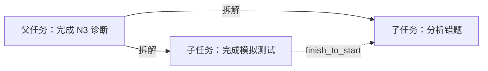
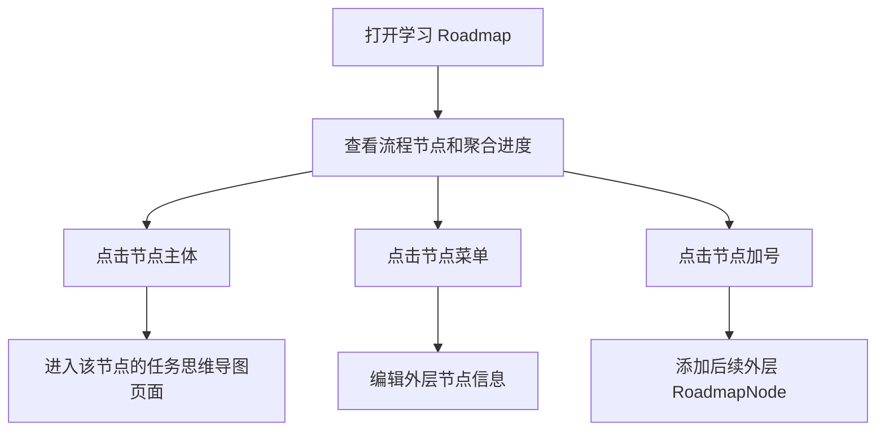
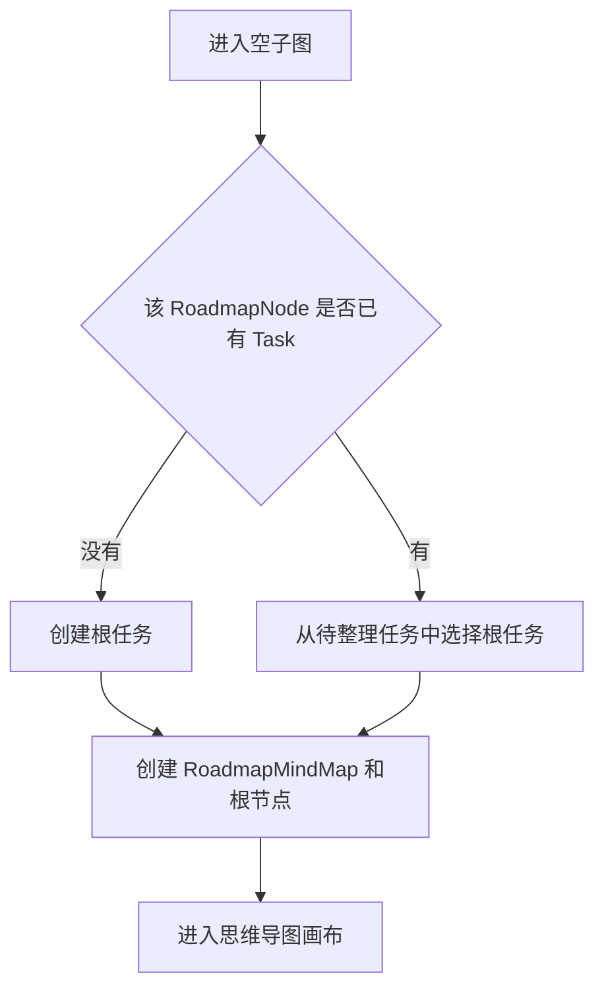

# Roadmap 节点子图、任务思维导图与文章绑定设计

> **决策状态：** 2026-07-26 已确认核心方向：思维导图根节点也是 Task；旧 RoadmapNode 文章进入待分配区，不静默绑定根任务。

## 结论

FlowSpace 的学习 Roadmap 保留两层结构：

1. **外层 Roadmap 流程图**表达学习阶段、先修条件和推荐顺序。
2. **内层任务思维导图**表达某个 RoadmapNode 下的任务拆解。
3. 点击外层 RoadmapNode 主体进入独立的思维导图页面。
4. 思维导图中每个可见节点都必须对应一个真实 Task，包括根节点；不允许创建只有文字、不能执行的虚拟节点。
5. 思维导图父子连线只表示“任务拆解”，不表示执行先后；执行依赖继续由 `TaskDependency` 表达。
6. 文章资源直接绑定到思维导图中的具体 Task。外层 RoadmapNode 不再新增文章链接，也不再维护独立的文章搜索提示词。
7. 同一篇文章可以关联多个 Task，但文章元数据在同一 workspace 只保存一份。
8. Task 仍然是标题、生命周期、排期、Occurrence 和执行状态的唯一事实源；思维导图只保存树结构、布局和任务级学习资源设置。

本设计是《项目、任务与日程统一领域模型设计》的扩展，不改变其中“Roadmap 负责结构、Task 负责执行、Occurrence 负责一次实际执行”的核心语义。

## 与统一领域模型的关系

```mermaid
erDiagram
    PROJECT ||--o| LEARNING_ROADMAP : owns
    LEARNING_ROADMAP ||--o{ ROADMAP_NODE : contains
    ROADMAP_NODE ||--o| ROADMAP_MIND_MAP : expands_to
    ROADMAP_MIND_MAP ||--|{ MIND_MAP_TASK_NODE : arranges
    TASK ||--o| MIND_MAP_TASK_NODE : projected_as
    TASK ||--o{ TASK_OCCURRENCE : materializes
    TASK ||--o{ TASK_ARTICLE_LINK : references
    ARTICLE_RESOURCE ||--o{ TASK_ARTICLE_LINK : reused_by
    TASK ||--o| TASK_RESOURCE_SETTINGS : configures
    ROADMAP_NODE ||--o{ UNASSIGNED_ARTICLE : quarantines
    ARTICLE_RESOURCE ||--o{ UNASSIGNED_ARTICLE : preserves

    ROADMAP_NODE {
        text workspace_id PK_FK
        text id PK
        text project_id FK
        text roadmap_id FK
        text title
        text node_type
        bigint revision
    }

    ROADMAP_MIND_MAP {
        text workspace_id PK_FK
        text roadmap_node_id PK_FK
        text project_id FK
        text root_task_id FK
        text layout_direction
        bigint revision
    }

    MIND_MAP_TASK_NODE {
        text workspace_id PK_FK
        text roadmap_node_id PK_FK
        text task_id PK_FK
        text parent_task_id FK
        text branch_side
        double sort_order
        double manual_x
        double manual_y
        boolean collapsed
        bigint revision
    }

    TASK_ARTICLE_LINK {
        text workspace_id PK_FK
        text task_id PK_FK
        text article_id PK_FK
        text note
        double sort_order
    }

    ARTICLE_RESOURCE {
        text workspace_id PK_FK
        text id PK
        text normalized_url UK
        text title
        text summary
        text source_type
        bigint revision
    }
```

### 唯一语义

| 对象 | 唯一职责 | 不负责 |
| --- | --- | --- |
| LearningRoadmap | 一条完整学习路线 | 任务执行状态 |
| RoadmapNode | 宏观阶段、主题或里程碑 | 勾选完成、文章收藏 |
| RoadmapMindMap | 一个 RoadmapNode 的任务子图 | 复制 Task 内容 |
| MindMapTaskNode | Task 在子图中的父子关系和布局 | 保存第二份标题、状态、排期 |
| Task | 可执行事项的稳定定义 | 保存画布坐标 |
| TaskOccurrence | 某一次实际执行 | 保存文章资源 |
| ArticleResource | workspace 内可复用的文章元数据 | 决定文章属于哪个任务 |
| TaskArticleLink | Task 与文章的精确关联 | 复制文章正文 |

## 目标

1. 用户能从外层学习路线快速进入任一阶段的具体任务图。
2. 所有思维导图节点都可以在任务列表、Today、Calendar 和执行详情中被统一处理。
3. 用户可以通过父子关系将复杂学习目标逐层拆解，而不引入第二套任务实体。
4. 文章搜索提示词、搜索结果和手动链接都与具体 Task 对应。
5. 任务状态变化可以立即投影到思维导图和外层 RoadmapNode 进度。
6. PostgreSQL 与 SQLite 具有相同的数据约束、事务语义和 API 行为。
7. 所有写入继续经过 workspace runtime、当前 epoch 和 fenced transaction。

## 非目标

第一版不处理：

- 任意网状知识图谱；主结构必须是一棵有根树。
- 用思维导图父子关系替代 TaskDependency。
- 同一个 Task 同时出现在多个 RoadmapNode 子图中。
- 跨 workspace 或跨 project 复用 Task。
- 文章全文抓取、网页镜像、离线阅读和版权内容存储。
- 多人实时协同拖动节点。
- 移动端思维导图编辑；mobile-v2 另立设计。
- 无限层级。第一版最大深度为 6，单个子图最多 200 个任务节点。
- 自动推断旧任务的父子语义或把旧文章静默绑定到任意任务。

## 核心决策

### 1. 外层节点不变成 Task

外层 RoadmapNode 继续表示学习结构，不提供完成复选框。它的进度来自同项目、同 RoadmapNode 下的 Task/Occurrence 聚合。

### 2. 思维导图根节点也是 Task

首次创建子图时，用户创建或从已有 Task 中选择一个根任务。根任务与其他节点使用同一 Task 模型，不引入 `summary_task` 或虚拟节点类型。

根任务不会因为子任务完成而自动完成。父子关系第一版只表达拆解结构，Task 与 Occurrence 的状态机保持不变。后续若需要“所有必需子任务完成后才能完成父任务”，应作为独立领域命令设计，不能在前端偷偷推导。

### 3. 子图父子关系不是执行依赖



实线为思维导图拆解关系，虚线才是 `TaskDependency`。自动布局只读取实线关系。

### 4. 文章属于 Task，不属于画布坐标

文章通过稳定 `task_id` 关联。节点拖动、折叠、重新布局不会影响文章；Task 在同一 RoadmapNode 内换父节点时文章仍然跟随 Task。

### 5. 同一 URL 允许复用

URL 经过规范化后，在同一 workspace 形成一个 `ArticleResource`。多个 Task 使用 `TaskArticleLink` 关联该资源，不重复保存标题、摘要和来源信息。

## 用户流程

### 外层 Roadmap



节点主体点击不再用于打开右侧文章搜索面板。外层页面只保留：

- 节点标题、类型和描述；
- 任务数量和 Occurrence 聚合进度；
- “进入任务图”提示；
- 编辑节点、添加后续节点等结构操作。

建议前端路由：

```text
/projects/:projectID/roadmap
/projects/:projectID/roadmap/nodes/:roadmapNodeID/mind-map
```

浏览器返回外层页面时恢复原来的缩放、滚动位置和聚焦节点。路由必须支持直接刷新和深链接，不能只依赖页面内临时 state。

### 首次进入空子图



系统不能在 GET 请求中自动创建 Task。首次写入必须由用户明确创建或选择根任务。

### 日常编辑

1. 点击任务节点：选中节点并在右侧打开 Task 详情。
2. 点击节点加号：创建子 Task，并在同一 fenced transaction 中写入 Task 聚合和子图关系。
3. 双击标题：通过现有 Task PATCH 命令修改标题。
4. 拖动节点：只更新布局坐标，不修改 Task revision。
5. 修改父节点：更新拆解关系，必须检查循环和深度上限。
6. 修改任务状态、排期或重复规则：继续使用现有 Task/Occurrence 命令。
7. 折叠节点：只更新 `collapsed`，不隐藏任务在 Today、Calendar 或任务列表中的投影。

## 页面设计

### 页面结构

```text
学习 Roadmap / 日语 N2 / 初期诊断与 N3 基础检查

[返回学习路径]  任务 3/8  进行中  [自动布局] [生成任务树] [全屏]

┌────────────────────思维导图画布────────────────────┬────────任务详情────────┐
│                                                    │ 标题                    │
│                  根任务                            │ 状态 / 排期 / 下一步     │
│                /    |    \                         │ 相关文章                │
│            子任务 子任务 子任务                    │ 搜索文章 / 添加链接       │
│                                                    │                         │
└────────────────────────────────────────────────────┴─────────────────────────┘
```

### 任务节点可见信息

- 执行状态图标或颜色；
- Task 标题；
- 日期、时间段或重复标记；
- 直接子任务数量；
- 文章数量；
- 阻塞、逾期、已归档等提示；
- 添加子任务、展开/折叠和更多操作。

节点不能复制保存 Task 标题或状态。渲染数据必须来自 Task DTO，布局 DTO 只提供父节点和坐标。

### 思维导图布局

第一版支持：

- `horizontal`：根节点居中，子树分布在左右两侧；
- `radial`：作为后续可选布局，第一版后端预留枚举但前端可以暂不开放；
- 自动布局；
- 手动拖动后的坐标保存；
- 缩放、平移、全屏和小地图；
- 节点折叠；
- 画布内按任务标题搜索并定位。

自动布局使用 `parent_task_id + branch_side + sort_order`，不覆盖已有手动坐标，除非用户明确点击“重新自动布局”。

### 文章交互

选择 Task 后，右侧“相关文章”区域提供：

1. 已关联文章列表；
2. 搜索文章；
3. 手动添加 URL；
4. 移除当前 Task 与文章的关联；
5. 在新窗口打开文章。

节点卡片显示文章数量。点击数量只展开当前 Task 的文章，不展示整个 RoadmapNode 的汇总文章。

外层 RoadmapNode 可以显示只读汇总，例如“共 18 篇文章”，但不能从该位置新增或删除关联。

## 文章搜索上下文

文章搜索必须要求已选中 Task。搜索提示词由以下内容组成：

```text
学习项目目标
+ 当前外层 RoadmapNode 标题、描述和验收目标
+ 从根任务到当前 Task 的祖先标题路径
+ 当前 Task 标题、描述和验收标准
+ 当前 Task 的自定义文章搜索提示词
+ 当前 Task 已有文章 URL，用于去重
```

任务级搜索设置建议独立存储：

```text
domain_task_resource_settings_v2
  workspace_id + task_id   COMPOSITE PRIMARY KEY
  search_prompt
  sources_json
  revision
  created_at
  updated_at
```

搜索请求使用创建任务时的 profile/endpoint 快照；写入关联时重新获取当前 runtime epoch。搜索失败不能返回固定模板结果，也不能静默使用平台默认 AI 服务。

## 数据模型

### `domain_roadmap_mindmaps_v2`

```text
workspace_id
project_id
roadmap_node_id        PRIMARY IDENTITY WITH workspace_id
root_task_id
layout_direction       horizontal/radial
revision
created_at
updated_at
```

约束：

- `(workspace_id, roadmap_node_id)` 主键；
- `(workspace_id, project_id, roadmap_node_id)` 引用同一 RoadmapNode；
- `root_task_id` 必须引用同 workspace、同 project、同 RoadmapNode 的 Task；
- 每个 RoadmapNode 最多一个当前子图；
- revision 与 RoadmapNode revision、Task revision 相互独立。

### `domain_task_mindmap_nodes_v2`

```text
workspace_id
project_id
roadmap_node_id
task_id
parent_task_id         NULL only for root
branch_side            center/left/right
sort_order
manual_x               NULL when auto layout
manual_y               NULL when auto layout
collapsed
revision
created_at
updated_at
```

数据库必须直接保证：

- `(workspace_id, roadmap_node_id, task_id)` 主键；
- Task 与父 Task 均属于同 workspace、同 project、同 RoadmapNode；
- 一个子图至多一个 `parent_task_id IS NULL` 的根节点；
- 根节点 `branch_side=center`；非根节点只能为 `left/right`；
- `manual_x` 与 `manual_y` 必须同时为空或同时非空；
- `task_id <> parent_task_id`；
- 同一个 Task 不能重复出现在子图中。

数据库复合外键负责租户和项目边界；领域服务使用递归检查禁止间接循环，并限制最大深度和节点数量。

“已有子图必须恰好一个根节点”由创建根任务的原子领域命令保证：RoadmapMindMap 与根 TaskPlacement 在同一 fenced transaction 中创建或一起回滚。不能依赖 PostgreSQL 专用 deferred constraint trigger，因为 SQLite 必须保持相同语义。

### `domain_article_resources_v2`

```text
workspace_id + id      COMPOSITE PRIMARY KEY
normalized_url
title
summary
source_type             link/search
revision
created_at
updated_at
```

`(workspace_id, normalized_url)` 唯一。URL 规范化至少包括：

- 只接受 `http` 和 `https`；
- scheme 与 hostname 转小写；
- 去掉 fragment；
- 去掉默认端口；
- 拒绝包含 username/password 的 URL；
- 保留有业务意义的 query，不自行删除追踪参数以外的参数；追踪参数清理策略另行配置。

### `domain_task_article_links_v2`

```text
workspace_id
project_id
roadmap_node_id
task_id
article_id
note
sort_order
created_at
```

约束：

- `(workspace_id, task_id, article_id)` 主键；
- Task 必须已经是当前子图节点；
- ArticleResource 必须属于同一 workspace；
- 同一文章可关联多个 Task；
- 从 Task 移除文章只删除 link，不硬删除 ArticleResource；
- ArticleResource 无任何引用后可以由异步清理任务回收。

### `domain_task_resource_settings_v2`

```text
workspace_id
project_id
roadmap_node_id
task_id                 COMPOSITE PRIMARY KEY WITH workspace_id
custom_prompt
enabled_sources_json    canonical JSON string array
revision
created_at
updated_at
```

约束：

- `(workspace_id, task_id)` 主键；
- Task 必须已经是同 workspace、同 project、同 RoadmapNode 的当前子图节点；
- `custom_prompt` 最长 4000 字符，空字符串表示使用系统生成的任务上下文；
- `enabled_sources_json` 由应用层规范化为去重、稳定排序的已知 source id 数组；
- PostgreSQL 与 SQLite 都保存相同的 canonical JSON 文本，避免 JSONB 与 SQLite TEXT 产生比较语义差异；
- 修改设置使用独立 revision，不提升 Task revision 或 MindMap revision。

### `domain_unassigned_roadmap_articles_v2`

该表是 legacy 资源迁移收件箱，不是新的 RoadmapNode→Article 业务关联。

```text
workspace_id + id       COMPOSITE PRIMARY KEY
project_id
roadmap_node_id
article_id
legacy_resource_id
state                   pending/assigned/dismissed
assigned_task_id        NULL until assigned
revision
created_at
updated_at
```

约束：

- RoadmapNode、ArticleResource 和可选的 assigned Task 必须属于同一 workspace/project；
- `(workspace_id, legacy_resource_id)` 唯一，保证 adopt/replay 幂等；
- `state=pending` 时 `assigned_task_id IS NULL`；
- `state=assigned` 时 `assigned_task_id IS NOT NULL`，且同一事务中已经存在 TaskArticleLink；
- 新业务 API 不得创建待分配记录；只有 legacy adopt/replay 可以写入；
- 分配或忽略采用 revision CAS，避免两个页面重复处理同一旧文章。

## 领域不变量

1. 外层 RoadmapNode 本身不是可执行 Task。
2. 每个可见思维导图节点必须对应一个 Task。
3. 一个 Task 第一版最多属于一个 RoadmapNode 子图。
4. MindMap Task 必须与 RoadmapNode 属于同一 learning Project。
5. 一个子图只有一个根 Task。
6. 父子关系必须无环，最大深度为 6。
7. 单个子图最多 200 个 Task；达到上限后 API 返回明确错误。
8. 父子关系不自动创建 TaskDependency。
9. Task 状态和排期只通过现有 Task/Occurrence 命令修改。
10. RoadmapNode 进度继续从 Task/Occurrence 查询投影计算，不保存第二份进度。
11. 文章关联必须指向具体 Task，不允许新建 `roadmap_node_id -> article_id` 关系。
12. 所有写操作绑定当前 workspace runtime epoch，并在同一 fenced transaction 中完成。

## 命令与事务边界

### 创建根任务

同一 fenced transaction 内：

1. 锁定并校验 workspace epoch；
2. 读取 RoadmapNode 和 learning Project；
3. 确认子图不存在；
4. 创建完整 Task 聚合、ScheduleVersion 和单次 Occurrence；
5. 创建 RoadmapMindMap；
6. 创建根 MindMapTaskNode；
7. 写入 tenant outbox；
8. 提交事务。

任一步失败时不得留下只有 Task、没有子图节点的半成品。

### 创建子任务

同一 fenced transaction 内：

1. 读取当前 MindMap revision；
2. 校验父 Task 在同一子图；
3. 校验节点上限与深度；
4. 创建 Task 聚合；
5. 创建 MindMapTaskNode；
6. 提升 MindMap revision；
7. 写入 outbox；
8. 提交事务。

### 修改布局或父节点

- 布局批量保存使用 `expected_mind_map_revision`；
- 单节点属性使用独立 `expected_node_revision`；
- 修改父节点必须重新做循环和深度检查；
- stale revision 返回 409，前端刷新后提示用户重试，不能覆盖其他页面的修改。

### 添加文章

同一 fenced transaction 内：

1. 校验 Task 是当前子图节点；
2. 规范化 URL；
3. 按 `(workspace_id, normalized_url)` upsert ArticleResource；
4. 创建或幂等更新 TaskArticleLink；
5. 写入 outbox；
6. 提交事务。

## API 设计

### 查询子图

```http
GET /api/roadmap-nodes/:roadmapNodeID/mind-map
```

子图不存在时返回 200：

```json
{
  "data": {
    "mind_map": null,
    "unplaced_tasks": [],
    "unassigned_articles": []
  }
}
```

存在时返回：

```json
{
  "data": {
    "mind_map": {
      "roadmap_node_id": "node-1",
      "root_task_id": "task-root",
      "layout_direction": "horizontal",
      "revision": 8,
      "nodes": [
        {
          "task": {
            "id": "task-root",
            "title": "完成基础诊断",
            "lifecycle_status": "active",
            "task_revision": 3,
            "schedule_revision": 2
          },
          "placement": {
            "parent_task_id": null,
            "branch_side": "center",
            "sort_order": 0,
            "manual_x": null,
            "manual_y": null,
            "collapsed": false,
            "revision": 1
          },
          "articles": []
        }
      ]
    }
  }
}
```

### 创建根任务或子任务

```http
POST /api/roadmap-nodes/:roadmapNodeID/mind-map/tasks
```

```json
{
  "parent_task_id": "task-root",
  "branch_side": "right",
  "sort_order": 10,
  "title": "完成模拟测试",
  "description": "",
  "priority": 1,
  "schedule": {
    "recurrence_type": "none",
    "timing_type": "unscheduled",
    "timezone": "Asia/Shanghai"
  }
}
```

首个任务必须省略 `parent_task_id` 并使用 `branch_side=center`。创建 Task 和子图节点必须原子提交。

### 将已有 Task 放入子图

```http
POST /api/roadmap-nodes/:roadmapNodeID/mind-map/placements
```

请求包含 `task_id`、父节点、位置和 Task 当前 revision。只允许 Task 已属于同一个 project 和 RoadmapNode。

### 修改节点关系和布局

```http
PATCH /api/roadmap-nodes/:roadmapNodeID/mind-map/tasks/:taskID/placement
PUT   /api/roadmap-nodes/:roadmapNodeID/mind-map/layout
```

### 任务文章

```http
POST   /api/tasks/:taskID/articles/search
POST   /api/tasks/:taskID/articles
DELETE /api/tasks/:taskID/articles/:articleID
PATCH  /api/tasks/:taskID/article-search-settings
```

手动添加：

```json
{
  "url": "https://example.com/guide",
  "title": "N3 诊断指南",
  "summary": "",
  "note": "先阅读第 2 节",
  "idempotency_key": "client-generated-key"
}
```

API 使用 `Idempotency-Key` 或请求字段中的稳定 key，重复提交不得产生重复资源或重复 link。

## 错误语义

| code | HTTP | 含义 |
| --- | ---: | --- |
| `mind_map_not_found` | 404 | 写操作要求已有子图，但子图不存在 |
| `mind_map_root_exists` | 409 | 已有根任务，不能再创建第二个根 |
| `mind_map_parent_not_found` | 422 | 父 Task 不属于当前子图 |
| `mind_map_cycle` | 422 | 修改会形成循环 |
| `mind_map_depth_limit` | 422 | 超过最大深度 |
| `mind_map_node_limit` | 409 | 超过单图节点上限 |
| `mind_map_revision_conflict` | 409 | 子图或布局 revision 已变化 |
| `task_not_in_mind_map` | 422 | 文章目标 Task 不是子图节点 |
| `invalid_article_url` | 422 | URL 协议、主机或凭据非法 |
| `article_already_linked` | 200 | 幂等成功，返回现有 link |
| `runtime_epoch_conflict` | 409 | 请求跨过存储迁移或 runtime 切换 |

错误不能降级为 legacy 写入，也不能静默绑定到根任务或外层 RoadmapNode。

## 删除、归档与移动

### 归档 Task

归档 Task 不删除思维导图节点。节点显示为灰色归档状态并默认折叠，用户可以查看历史文章和结构。

### 从子图移除

第一版只允许移除叶子 Task。命令必须在同一事务中：

1. 删除 MindMapTaskNode；
2. 清除 Task 的 `roadmap_node_id`；
3. 保留 Task、Occurrence、ExecutionLog 和文章关系；
4. 提升 MindMap revision。

移除有子节点的 Task 时返回冲突，要求用户选择“移动整个分支”或先重新挂载子节点。

### 移动分支

第一版只支持同一 RoadmapNode 内换父节点。跨 RoadmapNode 移动会同时改变多个 Task 的 `roadmap_node_id`、资源上下文和进度投影，应另立批量命令，不能复用普通 PATCH。

### 删除文章关联

只删除 TaskArticleLink。ArticleResource 由引用计数/后台清理判断是否可回收，不能因一个 Task 移除而影响其他 Task。

## 进度与状态投影

外层 RoadmapNode 沿用现有聚合：

```text
tasks       = 当前 RoadmapNode 下 Task 数量
total       = 物化 Occurrence 数量
open        = open Occurrence 数量
active      = active Occurrence 数量
blocked     = blocked Occurrence 数量
done        = done Occurrence 数量
skipped     = skipped Occurrence 数量
cancelled   = cancelled Occurrence 数量
```

思维导图只展示这些事实，不自行推导新的 Task 状态。重复 Task 完成一次 Occurrence 后，节点仍显示 Task 为 active，并显示下一次执行。

## 旧数据迁移

### 已有关联 Task

旧数据只有 `Task.roadmap_node_id`，没有可靠父子关系。迁移后：

- Task 保留原 RoadmapNode 关联；
- 在子图页面显示为“待整理任务”；
- 用户明确选择根任务和父节点后才写入 MindMapTaskNode；
- 系统不能按创建时间、标题相似度或 sort_order 自动猜测语义。

### 已有 RoadmapNode 文章

旧 `roadmap_resources` 只知道外层 RoadmapNode，不能证明属于哪个 Task。迁移后：

- 进入“待分配文章”列表；
- 用户逐篇选择 Task，或明确执行“全部关联到根任务”；
- 分配完成后写入 ArticleResource 和 TaskArticleLink；
- 未分配文章在兼容窗口内保持可读，但不能被新 API 当成任务文章；
- 不允许静默绑定到根任务。

### 存储迁移

数据库 endpoint 切换的 snapshot、outbox replay、reconcile 和反向差集必须覆盖：

- RoadmapMindMap；
- MindMapTaskNode；
- TaskResourceSettings；
- ArticleResource；
- TaskArticleLink；
- UnassignedRoadmapArticle；
- 删除 tombstone。

cutover 前必须排空不认识这些实体的旧 writer。回滚遵循统一领域模型既有规则：首次 v2 写入后不承诺数据层回拨，只允许应用版本回滚并继续读写 v2 数据。

## 安全与外部访问

1. workspace、project、RoadmapNode、Task 和 Article 全部使用复合外键约束。
2. API 不接受客户端传入 workspace_id 或 actor_id，以认证上下文为准。
3. 手动添加 URL 只保存链接，不由服务端主动抓取任意网页，避免 SSRF。
4. 搜索服务继续使用安全 outbound client：关闭环境代理、逐跳校验重定向、每次拨号校验目标 IP。
5. 文章链接使用新窗口打开，并设置 `noopener noreferrer`。
6. 标题、摘要、提示词和 URL 设置长度上限；所有文本按纯文本渲染，不能插入 HTML。
7. 文章搜索请求与结果不得记录 API Key、URL 中的凭据或用户隐私数据。

## TDD 验收矩阵

### 纯领域测试

先写失败测试证明：

- 首个 Task 能原子创建根子图；
- 第二个根被拒绝；
- 子 Task 的父 Task 必须在同一子图；
- 跨 workspace/project/RoadmapNode 关联被拒绝；
- 直接和间接循环被拒绝；
- 深度 6 允许，深度 7 拒绝；
- 第 200 个节点允许，第 201 个拒绝；
- 父子关系变化不修改 Task lifecycle；
- 添加文章只关联指定 Task；
- 同 URL 复用 ArticleResource，不重复创建；
- 一个 Task 移除文章不影响其他 Task 的 link。
- Task 文章搜索设置使用独立 revision，且 canonical sources 顺序稳定；
- legacy 文章只进入待分配区，明确分配后才产生 TaskArticleLink。

### PostgreSQL/SQLite provider contract

两个 provider 运行同一契约套件：

- 复合外键阻止跨租户、跨项目和跨 RoadmapNode 关联；
- 单根 partial unique index 生效；
- Task 创建和节点创建同事务回滚；
- article upsert 与 link 创建同事务回滚；
- stale mind-map/node revision 返回相同领域错误；
- 待分配文章 adopt 幂等，两个并发分配只有一个 CAS 成功；
- 关闭 transaction 后 writer 拒绝写入；
- 查询顺序、NULL 坐标和布尔字段语义一致。

### Handler/API 测试

- 未认证请求返回 401；
- legacy workspace 对 v2 子图 API fail-closed；
- URL/path 中的 ID 不能越过 workspace；
- 空子图 GET 返回 200 和 `mind_map=null`；
- 创建根/子任务 DTO 严格拒绝未知字段；
- 幂等 key 重试返回同一结果；
- revision 冲突返回可刷新重试的 409；
- 文章目标 Task 不在子图时返回 422。

### 前端组件测试

- 点击外层 RoadmapNode 主体进入正确路由；
- 节点菜单仍能编辑外层节点且不会误导航；
- 空子图展示“创建/选择根任务”；
- 创建子任务后立即显示在正确父节点下；
- 选择 Task 后右侧展示该 Task 的文章，不混入兄弟节点文章；
- 添加同一文章到两个 Task 时两边都可见；
- 拖动和折叠不修改 Task 内容；
- 浏览器返回恢复外层画布位置；
- 409 冲突提示刷新，不覆盖服务器布局；
- 归档节点保持结构但视觉弱化。

### E2E

在独立 SQLite v2 workspace 中验证：

```text
登录
→ 创建 learning Project 和 RoadmapNode
→ 点击节点进入空子图
→ 创建根 Task
→ 创建两个子 Task
→ 给不同 Task 添加文章
→ 完成一个 Task 的 Occurrence
→ 返回外层 Roadmap
→ 聚合进度更新
→ 再进入子图
→ 布局、状态和文章保持一致
```

PostgreSQL 跑相同核心路径并额外验证复合外键和并发 revision 冲突。

## 实施边界

建议后续实施拆成以下独立切片，每个切片严格 RED → GREEN → REFACTOR：

1. 领域类型、不变量、循环/深度检查和纯领域测试；
2. PostgreSQL/SQLite migration 与共享 provider contract；
3. fenced repository、应用 facade、API 和错误映射；
4. 外层节点导航与独立思维导图只读页面；
5. 创建根/子 Task、布局保存和 revision 冲突；
6. Task 文章资源、搜索设置和旧资源待分配流程；
7. outbox、存储迁移、reconcile 和故障注入；
8. 浏览器 E2E、性能上限和灰度验收。

在本设计评审通过之前，不新增数据库 migration、不接生产路由，也不修改当前 legacy Roadmap 数据。
