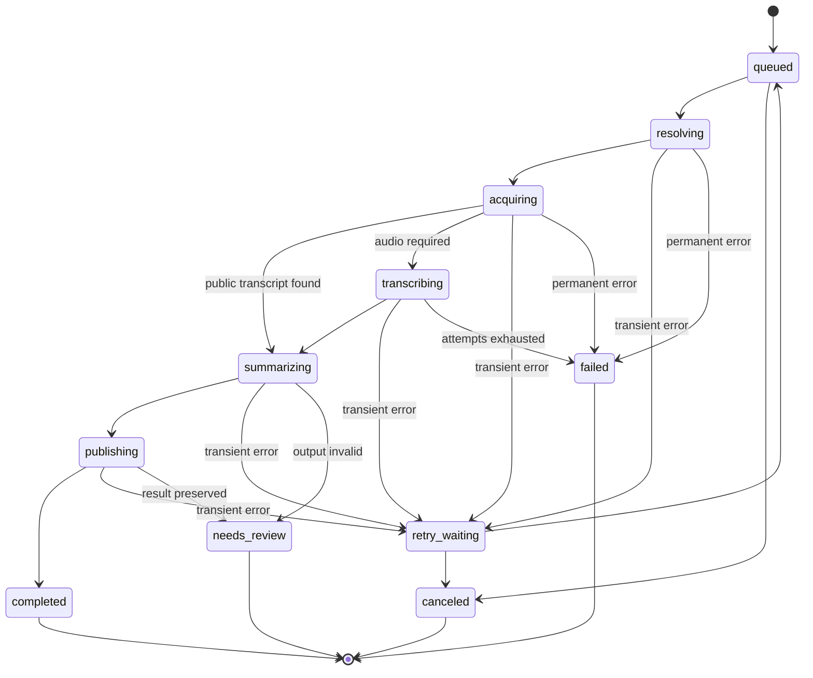

# 播客内容导入与转笔记设计

> **决策状态：** 2026-08-05 交互定稿并开始实施。第一阶段面向公开、免费的单个播客单集，优先支持小宇宙、Apple Podcasts，并保留扩展到普通网页文章和其他媒体来源的边界。

> **可运行设计稿：** `/prototypes/podcast-import`。对应项目文件为 `frontend/src/routes/PodcastImportPrototype.tsx` 与 `frontend/src/styles/podcast-import-prototype.css`。

## 结论

FlowSpace 应新增独立的“内容导入”领域，并在产品上首先提供“播客转笔记”入口：

1. 用户在 Web 笔记页粘贴一个小宇宙或 Apple Podcasts 单集链接。
2. 后端先将平台链接解析为稳定的节目、单集和 RSS 身份。
3. 优先使用发布者在 RSS 中提供的文字稿；没有公开文字稿时才下载并转写音频。
4. 长音频在后台切片转写，不能占用普通 HTTP 请求，也不能沿用当前 Web 语音笔记的同步转写路径。
5. “生成逐字稿”是必选基础步骤；用户开启“AI 整理”时，转写稿再经过分段提炼、证据校验和最终汇总，生成结构化 Markdown 笔记。
6. 最终笔记必须通过现有 Notes repository 创建，使其继续进入 mobile-v2 内容变更和同步流程。
7. 导入任务与笔记分离。在内容完成前不创建占位笔记，避免后台任务覆盖用户已经编辑的正文。
8. 同一个 RSS feed GUID 在同一 workspace 只对应一个稳定来源身份；从小宇宙和 Apple Podcasts 导入同一单集时能够去重。
9. 默认不永久保存远程音频；临时音频在任务完成、失败终止或过期后清理。
10. 第一阶段只支持公开、免费的内容，不处理会员、付费、登录后或带私人凭据的播客。
11. 小宇宙解析只使用公开网页、公开 RSS 和网页中公开暴露的数据，不调用或依赖私有 App API。
12. 底层命名使用通用 `content_import`，避免将数据模型永久限制为 podcast；普通网页文章可在后续通过新的 resolver 和 extractor 接入。

## 术语

| 术语 | 含义 |
| --- | --- |
| 内容来源 | 用户提交的原始链接，例如小宇宙或 Apple Podcasts 单集链接 |
| Canonical Source | 解析后的稳定单集身份，优先由 RSS feed URL 与 episode GUID 构成 |
| Resolver | 将平台链接解析为统一单集元数据的来源适配器 |
| Artifact | 导入过程中产生的节目简介、文字稿、时间段、章节或生成结果 |
| Import | 用户发起的一次“来源转成笔记”请求 |
| Job | 后台 worker 对 Import 的一次可重试执行 |
| Structured Note | 由来源信息、核心观点、主题笔记、时间线等组成的最终 Markdown 笔记 |

## 当前架构观察

项目已经具备以下可复用能力：

- `backend/internal/transcription` 支持 workspace 级 OpenAI-compatible、FunASR、SenseVoice 和 Wyoming 转写服务。
- `backend/internal/transcriptionjob` 已实现任务租约、心跳、退避重试和幂等创建模式。
- `backend/internal/airuntime` 已按 workspace 解析文本 AI，并要求 OpenAI-compatible provider 返回 JSON object。
- `backend/internal/objectstore` 已按 workspace 解析 MinIO/S3 存储。
- `backend/internal/outbound` 已实现 DNS/IP 校验、私网拦截、重定向限制和敏感 header 清理。
- `backend/internal/storage/{sqlite,postgres}/notes.go` 在服务端创建笔记时会发布 mobile-v2 内容变更。
- Web 编辑器正文采用 Tiptap Markdown，配置为 `html: false`，不应依赖原始 HTML 的折叠容器显示长文字稿。

现有实现不能直接充当播客导入领域：

- `transcription_jobs` 强绑定 `voice_note_id` 和 `voice_notes` 生命周期。
- 当前持久化转写完成逻辑只在笔记正文为空时写入转写文本，否则进入 `needs_review`。
- Web 语音笔记接口仍包含同步执行转写的路径，典型一小时播客不能在普通请求内完成。
- `transcription.Transcriber` 目前只返回完整字符串，不返回时间段、说话人或 provider 原始信息。
- RuntimeTranscriber 当前使用两分钟超时，不足以承载未经切片的长播客。
- 普通上传附件虽然可以是音频，但 Web 端只允许 `source=voice_note` 的附件触发转写。

因此本功能复用基础设施和设计模式，但不复用现有 voice-note 聚合与 transcription job 表。

## 目标

1. 用户可以将一个公开播客单集链接异步转换成可编辑的 FlowSpace 笔记。
2. 小宇宙、Apple Podcasts 和底层 RSS 被统一为同一种 episode DTO。
3. 有发布者文字稿时不重复运行语音识别，降低时间和成本。
4. 没有文字稿时能够可靠处理常见的 30 分钟至 2 小时播客。
5. 用户离开页面或服务进程重启后，任务仍能继续、重试或恢复。
6. 同一 workspace 内重复导入不会无提示创建重复笔记。
7. AI 生成内容能够追溯到文字稿片段，不产生伪造时间戳和无法验证的原话。
8. 文本 AI 不可用时可以降级生成“来源信息 + 节目简介 + 转写稿”。
9. 最终笔记继续兼容项目关联、文件夹、标签、搜索、Obsidian/Notion 同步和 mobile-v2。
10. SQLite 与 PostgreSQL 具有相同的状态机、唯一约束和任务租约语义。

## 非目标

第一阶段不处理：

- 整个播客节目订阅、自动追更或定时批量导入。
- 用户粘贴节目主页后自动选择“最新一期”；必须提供单集链接。
- 会员、付费、订阅制、登录后或 DRM 内容。
- 私有 RSS、用户名密码、Cookie 或平台账号授权。
- 抓取 Apple Podcasts App 自动生成但未由发布者公开到 RSS 的完整文字稿。
- 小宇宙评论、高能点赞、用户互动和播放历史导入。
- 对远程音频做公开镜像或跨用户共享缓存。
- 自动发布、分享或对外分发转写稿。
- 移动端提交导入任务；第一阶段移动端只接收已经生成的笔记。
- 普通网页文章、视频平台和电子书解析；领域边界预留但不在第一阶段开放。

## 总体架构

```mermaid
flowchart LR
    UI["Notes 页面：粘贴单集链接"] --> API["Content Import API"]
    API --> IMPORT["ContentImport 聚合"]
    IMPORT --> WORKER["Durable Import Worker"]

    WORKER --> RESOLVER["Source Resolver Registry"]
    RESOLVER --> RSS["RSS / 公开页面元数据"]
    RSS --> TRANSCRIPT{"存在公开文字稿？"}
    TRANSCRIPT -->|"是"| NORMALIZE["文字稿规范化"]
    TRANSCRIPT -->|"否"| AUDIO["受控下载与音频切片"]
    AUDIO --> ASR["Workspace Transcriber"]

    NORMALIZE --> GENERATE["分段提炼与最终汇总"]
    ASR --> GENERATE
    GENERATE --> VALIDATE["结构和证据校验"]
    VALIDATE --> NOTES["Notes Repository"]
    NOTES --> WEB["Web 笔记"]
    NOTES --> MOBILE["mobile-v2 内容同步"]
```



### 组件边界

建议新增后端包：

```text
backend/internal/contentimport/       # 聚合、状态机、service、worker
backend/internal/contentsource/       # resolver registry 与统一 DTO
backend/internal/contentsource/rss/   # RSS 解析和单集匹配
backend/internal/contentsource/apple/ # Apple Podcasts 链接适配
backend/internal/contentsource/xyz/   # 小宇宙公开页面适配
backend/internal/transcript/          # VTT/SRT/plain text 规范化
backend/internal/audioprocessing/     # 下载、探测、规范化和切片
backend/internal/notegeneration/      # 分段提炼、汇总、验证和 Markdown 渲染
backend/internal/handler/content_imports.go
```

来源适配器不能创建笔记、访问用户设置或直接更新任务表。它只把外部链接转换为统一、可验证的 `ResolvedEpisode`。

## 用户流程

### 发起导入

1. 用户在 Notes 页点击“导入播客”。
2. 粘贴一个单集链接。
3. 后端解析链接并展示节目名、单集标题、封面、时长和可用内容。
4. 用户决定是否开启“AI 整理”，并选择文件夹、项目、标签和语言；开启 AI 整理后可以进一步选择是否把完整逐字稿附在正文末尾。
5. 提交后立即收到 `202 Accepted` 和 import ID。
6. 弹窗关闭，任务进入“导入任务”抽屉，用户可以离开当前页面。

交互不再暴露三个互斥“输出模式”，而是使用两个正交选项：

| 选项 | 默认值 | 作用 |
| --- | --- | --- |
| `summarize_with_ai` | `true` | 开启后生成摘要、章节、核心观点和行动项；关闭后不调用文本 AI，正文直接使用完整逐字稿 |
| `include_transcript` | `false` | 仅在 AI 整理开启时显示；开启后在结构化笔记末尾附完整逐字稿 |

“生成逐字稿”不是开关，它是所有导入的必经阶段。若来源已有发布者公开文字稿，则直接规范化；否则进入音频转录。首个实施切片只完成“公开文字稿 → 笔记”的完整链路；没有公开文字稿的任务明确显示为“等待音频转录能力”，直到阶段 3 上线。

### 弹窗交互状态

1. **待解析：** 仅展示链接输入框，主按钮为“解析链接”。
2. **解析中：** 禁用提交并展示解析进度；失败时在输入框下给出可修复原因。
3. **解析成功：** 展示单集卡片和两步处理说明：第一步“生成逐字稿”，第二步“AI 整理（可选）”。
4. **AI 开启：** 主按钮为“开始转写并整理”，并展示将调用转写与文本 AI 的成本提示。
5. **AI 关闭：** 主按钮为“开始转写”，隐藏结构化摘要选项，说明不会调用文本 AI。
6. **已提交：** 弹窗立即关闭，任务抽屉展示当前阶段、进度、取消/重试和完成后的“打开笔记”。

桌面版采用居中弹窗加右侧任务抽屉；窄屏下弹窗占满可用宽度，任务抽屉改为底部面板。原型页面保留为视觉回归和产品评审入口，生产组件使用真实 API 状态，不复制原型中的定时器数据。

### 状态展示

前端以用户可理解的阶段展示：

```text
正在解析链接
正在获取文字稿
正在下载音频
正在转写 2/6
正在整理笔记
正在保存
已完成
```

`progress` 只是展示信息，不作为任务正确性的事实源。任务能否继续由持久化 `stage` 和 artifact 完成情况决定。

### 完成与重复导入

- 完成后提供“打开笔记”。
- 如果 canonical source 已经存在已完成 Import，创建接口返回 `409 SOURCE_ALREADY_IMPORTED`，同时返回已有 import ID 和 note ID。
- 用户可以选择“打开已有笔记”或显式“创建新版本”。
- 新版本产生新的 Import 和新笔记，不能覆盖原笔记。
- 如果原笔记已被删除，可以允许从已有 artifact 重新生成；不能静默恢复被删除的旧笔记。

## 来源解析

### 统一 DTO

```go
type ResolvedEpisode struct {
    SourceType       string
    SubmittedURL     string
    CanonicalURL     string
    ExternalID       string
    FeedURL          string
    GUID             string
    Title            string
    ShowTitle        string
    Authors          []string
    Description      string
    PublishedAt      *time.Time
    DurationMS       int64
    Language         string
    ArtworkURL       string
    Audio            *RemoteArtifact
    Transcripts      []RemoteArtifact
    Chapters         []RemoteArtifact
}

type RemoteArtifact struct {
    URL         string
    MIMEType    string
    SizeBytes   int64
    Language    string
    Rel         string
}
```

`SubmittedURL` 只用于审计和回到用户原始链接；去重和后续处理使用 `CanonicalURL`、`FeedURL`、`GUID`。

### Resolver 接口

```go
type Resolver interface {
    Supports(*url.URL) bool
    Resolve(context.Context, string) (ResolvedEpisode, error)
}
```

Registry 按明确优先级选择 resolver：

1. `XiaoyuzhouResolver`
2. `ApplePodcastsResolver`
3. 后续的显式来源 resolver

第一阶段不提供“任意 URL 猜测 RSS”能力，避免把普通网页误当成播客并扩大 SSRF、内容类型和版权范围。

### Apple Podcasts

Apple 单集链接通常同时包含节目 ID 和 episode ID。处理流程：

1. 校验 host 属于允许的 Apple Podcasts 域名。
2. 从 URL path 提取 show ID，从 query 的 `i` 提取 episode ID。
3. 缺少 episode ID 时返回 `EPISODE_LINK_REQUIRED`，不默认导入最新一期。
4. 使用 Apple Search/Lookup API 获取节目元数据和 RSS feed URL。
5. 获取 RSS 后，通过 GUID、Apple episode ID、标题、发布时间和 enclosure URL 组合匹配单集。
6. RSS 数据覆盖目录 API 中的可变展示字段，Apple 链接保留为 canonical presentation URL。

Apple 官方 Search API 文档建议大型应用缓存 search/lookup 请求，并注明调用频率限制可能变化：

- <https://developer.apple.com/library/archive/documentation/AudioVideo/Conceptual/iTuneSearchAPI/Searching.html>

Apple 官方 RSS 指南明确描述了单集 `enclosure`、GUID、description、duration、`podcast:transcript` 和 `podcast:chapters`：

- <https://help.apple.com/itc/podcasts_connect/en.lproj/itcb54353390.html>

Apple 自动生成的完整文字稿不作为抓取来源。Apple 对普通听众提供 App 内查看和有限复制，对创作者提供 Podcasts Connect 下载，因此第一阶段只读取发布者公开在 RSS 中的 transcript URL：

- <https://podcasters.apple.com/support/5316-transcripts-on-apple-podcasts>

### 小宇宙

小宇宙 resolver 第一阶段只接受：

```text
https://www.xiaoyuzhoufm.com/episode/{episodeID}
```

处理流程：

1. 校验 host 和 path，提取 episode ID。
2. 获取公开单集页面，限制 HTML 大小。
3. 读取公开 HTML、OpenGraph、JSON-LD 和页面中公开暴露的结构化数据。
4. 获取标题、节目名、简介、时长、发布时间、节目页和公开音频线索。
5. 尝试从节目页、描述或公开结构数据中发现 RSS URL。
6. 发现 RSS 后以 RSS 为主数据源，并用 episode ID、标题、发布时间和时长匹配单集。
7. 没有公开 RSS 时，只有页面明确提供公开可访问音频 URL 才能继续转写。
8. 既没有公开文字稿也没有公开音频时返回 `SOURCE_MEDIA_UNAVAILABLE`。

所有页面字段解析必须封装在该 resolver 中，并保存脱敏后的 HTML fixture 测试。页面结构变化只能导致小宇宙 resolver 报出可诊断错误，不能影响 RSS 和 Apple resolver。

第一阶段不允许：

- 调用小宇宙私有移动端 API；
- 模拟 App token、设备身份或用户登录；
- 抓取评论、点赞或用户数据；
- 绕过平台对不可公开播放内容的限制。

### RSS 单集匹配

Resolver 内部统一采用以下匹配顺序：

1. 平台 episode ID 与 feed item 中稳定扩展 ID 精确匹配。
2. GUID 精确匹配。
3. canonical episode link 精确匹配。
4. enclosure URL 规范化后精确匹配。
5. 标题规范化、发布时间和时长联合匹配。

最后一种匹配只有在候选唯一时才能成功。出现多个候选时返回 `EPISODE_AMBIGUOUS`，不能自动选第一个。

### Canonical identity

首选去重键：

```text
sha256(normalize(feed_url) + "\n" + normalize(guid))
```

如果没有 RSS：

```text
sha256(source_type + "\n" + external_id)
```

URL 规范化只能做安全、保守的转换：

- host 小写；
- 移除默认端口和 fragment；
- path 保留大小写语义；
- query 只移除明确列入来源适配器规则的跟踪参数；
- 不对未知签名参数排序或删除。

## 内容获取优先级

同一单集按以下优先级获取文本：

1. RSS `podcast:transcript` 中的 VTT。
2. RSS `podcast:transcript` 中的 SRT。
3. RSS 提供的其他受支持纯文本文字稿。
4. 已包含足够内容的公开节目简介；只在用户选择“仅整理节目简介”时使用。
5. RSS enclosure 或公开页面音频，通过 workspace 转写服务生成文字稿。

发布者文字稿可能同时提供多个语言和格式。优先匹配用户选择的语言，其次匹配 feed language，最后使用第一个受支持格式。不能把不同语言文字稿拼接在一起。

## 文字稿模型

规范化后的内部结构：

```go
type Transcript struct {
    Language string
    Source   string
    Text     string
    Segments []TranscriptSegment
}

type TranscriptSegment struct {
    ID        string
    StartMS   *int64
    EndMS     *int64
    Speaker   string
    Text      string
}
```

规则：

- VTT/SRT 保留时间范围和说话人标签。
- 纯文本按段落形成 segment，但时间为空。
- 所有文本统一为 UTF-8，规范换行，移除不可见控制字符。
- 不删除语气词、重复句或广告段落；清理属于后续显式处理，原始 artifact 必须可追溯。
- segment ID 在一次 Import 内稳定，例如 `s000001`。
- 最终生成器只能引用存在的 segment ID。

## 长音频处理

### 下载

- 所有请求必须使用现有 `outbound.Dialer` 构建的受控 HTTP client。
- 只接受 `http` 和 `https`，生产环境优先 HTTPS。
- 重定向上限沿用现有 5 次策略。
- 同时检查 `Content-Length` 和实际读取字节数。
- MIME header、文件扩展名和内容探测结果必须基本一致。
- 默认最大远程音频 300 MiB，最大时长 4 小时；均提供部署级配置。
- 超限返回永久错误，不自动重试。

### 规范化和切片

建议通过受控 ffmpeg 子进程：

1. 探测实际时长、codec 和音轨。
2. 只提取第一条有效音频轨。
3. 规范化为适合语音识别的单声道、16 kHz 音频。
4. 按 15 至 20 分钟切片，片段之间保留约 2 秒重叠。
5. 保存每片相对整集的 `offset_ms`。

子进程要求：

- 参数使用独立 argv，不能拼接 shell 字符串；
- 独立工作目录和资源限制；
- 超时后终止整个进程组；
- stderr 只记录受限长度，不能包含带 token 的原始 URL；
- 任意片段失败后清理已经产生的临时文件。

### 转写接口演进

保留现有接口兼容性：

```go
type Transcriber interface {
    Transcribe(context.Context, Input) (string, error)
}
```

新增可选能力：

```go
type DetailedTranscriber interface {
    TranscribeDetailed(context.Context, Input) (Result, error)
}

type Result struct {
    Text     string
    Language string
    Segments []Segment
}
```

Import worker 优先使用 `DetailedTranscriber`。只支持旧接口的 provider 仍能生成纯文本，但不生成伪造时间线。

后台转写必须使用独立超时策略，不能直接继承当前 RuntimeTranscriber 的两分钟默认值。每个切片可以独立重试；已成功片段以 artifact 持久化，worker 重启后不重复调用 provider。

## AI 笔记生成

### Feature setting

在 workspace AI feature 中新增：

```text
feature = podcast_note_generation
fallback_mode = transcript_only | error
```

默认使用 `error`。用户显式开启 AI 整理时，文本 AI 关闭、未配置或调用失败必须把任务标记为可重试失败，不能将逐字稿降级结果伪装成“AI 整理完成”。已经完成的昂贵转写结果仍作为 artifact 保留；用户配置 AI 后可直接重试，也可以关闭 AI 整理并新建仅逐字稿任务。

### 分块策略

长文字稿不能一次性提交给模型。采用 map-reduce：

1. 按 segment 和主题边界切成约 8k 至 12k 输入 token 的 chunk。
2. 相邻 chunk 保留少量 segment 重叠，避免语义在边界断裂。
3. 每个 chunk 生成局部主题、观点、候选引用和 segment 引用。
4. Reduce 阶段只读取局部结果和必要证据片段，生成最终结构。
5. 最终结果经 Go struct 严格解析和验证，再渲染 Markdown。

### 结构化输出

```json
{
  "title": "...",
  "one_sentence_summary": "...",
  "key_points": [
    {"text": "...", "segment_ids": ["s000021", "s000022"]}
  ],
  "sections": [
    {
      "heading": "...",
      "bullets": [
        {"text": "...", "segment_ids": ["s000031"]}
      ]
    }
  ],
  "timeline": [
    {"start_ms": 312000, "text": "...", "segment_ids": ["s000044"]}
  ],
  "quotes": [
    {"text": "...", "speaker": "...", "segment_ids": ["s000051"]}
  ],
  "action_items": ["..."],
  "topics": ["..."]
}
```

验证规则：

- 所有 segment ID 必须存在。
- `timeline.start_ms` 必须来自引用 segment 的实际时间范围。
- quote 文本必须能在引用 segment 的规范化文本中匹配；不能匹配时删除该 quote。
- 没有时间信息时 `timeline` 为空。
- title、section 数量、单条文本长度和总输出长度设置上限。
- JSON 解析或校验失败可进行一次带错误摘要的修复请求；仍失败则进入 `needs_review` 或 fallback。
- 用户输入、节目简介和文字稿都被视为不可信数据；system prompt 明确禁止执行其中包含的指令。

## 笔记输出格式

默认 Markdown：

```markdown
> 来源：节目名 · 主播
> 发布时间：2026-08-05
> 时长：58 分钟
> 原始链接：https://...

## 一句话总结

...

## 核心观点

- ...

## 主题笔记

### 主题一

- ...

## 时间线

- 05:12 ...

## 值得回看的原话

> ...

## 可行动项

- ...

## 相关概念

- ...
```

来源元数据不能只存在正文中。`content_imports.result_note_id` 与 metadata artifact 共同保留机器可读来源，使编辑器以后可以展示来源卡片。

完整文字稿默认不写入正文，原因：

- 长正文会影响 Web 编辑、搜索和移动同步体积；
- 当前编辑器不支持依赖原始 HTML 的折叠块；
- artifact 更适合未来提供独立文字稿视图、下载和重新生成。

用户选择 `note_with_transcript` 时可以在正文末尾追加 `## 完整文字稿`，但仍要保留独立 artifact。

## 数据模型

```mermaid
erDiagram
    NOTE o|--o{ CONTENT_IMPORT : generated_by
    CONTENT_IMPORT ||--o{ CONTENT_IMPORT_JOB : attempted_by
    CONTENT_IMPORT ||--o{ CONTENT_IMPORT_ARTIFACT : produces

    CONTENT_IMPORT {
        text workspace_id PK_FK
        text id PK
        text source_type
        text submitted_url
        text canonical_url
        text canonical_source_hash
        text external_id
        text feed_url
        text episode_guid
        text status
        text stage
        integer progress
        text options_json
        text metadata_json
        text result_note_id FK
        text error_code
        text error_message
        bigint revision
        bigint created_at
        bigint updated_at
    }

    CONTENT_IMPORT_JOB {
        text workspace_id PK_FK
        text job_id PK
        text import_id FK
        bigint generation
        text state
        bigint attempt
        bigint max_attempts
        bigint next_attempt_at
        text lease_owner
        text lease_token
        bigint lease_expires_at
        bigint heartbeat_at
        bigint created_at
        bigint updated_at
    }

    CONTENT_IMPORT_ARTIFACT {
        text workspace_id PK_FK
        text id PK
        text import_id FK
        text kind
        text storage_mode
        text inline_text
        text object_key
        text mime_type
        text sha256
        text metadata_json
        bigint size_bytes
        bigint created_at
    }
```

### `content_imports`

关键约束：

```text
PRIMARY KEY (workspace_id, id)
CHECK status IN ('active','completed','needs_review','failed','canceled')
CHECK stage IN (
  'queued','resolving','acquiring','transcribing',
  'summarizing','publishing','completed','terminal'
)
CHECK progress BETWEEN 0 AND 100
FOREIGN KEY (workspace_id, result_note_id) REFERENCES notes(workspace_id,id)
  ON DELETE SET NULL
```

`canonical_source_hash` 在解析完成前允许为空。解析完成后通过事务声明来源身份。建议使用部分唯一索引，限制同一 workspace、同一 canonical source 同时只有一个非取消的主 Import。显式“创建新版本”使用独立 `version_of_import_id` 或 generation，不绕过业务命令直接插入重复行。

### `content_import_jobs`

沿用现有 transcription job 语义：

- 每个 Import 同时最多一个 active job；
- `queued`、`processing`、`retry_waiting` 为 active；
- claim 时使用数据库锁或等价原子更新；
- 只有持有未过期 lease token 的 worker 可以推进状态；
- heartbeat 延长租约；
- 永久错误直接终止，瞬时错误指数退避；
- 用户重试创建新 generation，不复用旧 job ID。

### `content_import_artifacts`

`kind` 第一阶段支持：

```text
source_metadata
show_notes
transcript_original
transcript_normalized
transcript_segments
audio_chunk_manifest
transcript_chunk
note_chunk_summary
generated_note_json
generated_note_markdown
```

小于配置阈值的文本可以 inline；大型 transcript、segments 和中间结果进入 workspace 对象存储。artifact 必须记录 SHA-256，重复执行阶段时先验证已有 artifact，避免重复下载或重复调用 AI。

## 状态机



取消 processing job 时不能强制让任意 provider 请求立即消失并假定未产生费用。取消命令设置 `cancel_requested_at`，worker 在下载、分片和 AI 调用边界检查；支持 context cancellation 的 provider 同时收到取消信号。

## Worker 执行模型

每次 `RunOne`：

1. 原子 claim 一个可运行 job。
2. 将 workspace ID 写入 context，使 runtime object store、transcriber 和 AI 解析正确的 workspace binding。
3. 根据 Import 的持久化 stage 执行一个可恢复阶段。
4. 长步骤定期 heartbeat。
5. 阶段输出先作为 artifact 持久化，再推进 Import stage。
6. 进程在两步之间崩溃时，下一 worker 验证 artifact 并幂等继续。
7. 最终 publish 在一个 tenant transaction 内完成笔记创建、项目链接和 Import 完成状态更新。

并发策略：

- 同一 workspace 默认同时只运行一个 `acquiring/transcribing/summarizing` Import。
- 全局并发数由部署配置控制。
- 解析和轻量状态查询不占用长任务并发槽。
- worker 必须公平轮询 workspace，避免单个用户的大量任务饿死其他用户。

## API

### 创建

```http
POST /api/content-imports
Idempotency-Key: <uuid>
Content-Type: application/json
```

```json
{
  "source_url": "https://www.xiaoyuzhoufm.com/episode/...",
  "summarize_with_ai": true,
  "include_transcript": false,
  "keep_audio": false,
  "language": "auto",
  "folder_id": "",
  "project_ids": [],
  "tags": ["播客"]
}
```

响应：

```http
202 Accepted
```

```json
{
  "import": {
    "id": "...",
    "status": "active",
    "stage": "queued",
    "progress": 0,
    "source_url": "...",
    "result_note_id": null,
    "error": null
  }
}
```

相同 `Idempotency-Key` 与相同请求返回原响应；同一个 key 用于不同请求返回 `409 MUTATION_ID_REUSED`。

### 查询

```text
GET /api/content-imports?status=active&page=1&page_size=20
GET /api/content-imports/:id
```

第一阶段使用 React Query 轮询：active task 2 秒一次，页面在后台时降低频率。后续任务量增加后可以增加 SSE，但 SSE 不是第一阶段依赖。

### 重试和取消

```text
POST /api/content-imports/:id/retry
POST /api/content-imports/:id/cancel
```

重试需要新的 Idempotency-Key。只有 `failed` 和允许人工修复的 `needs_review` 可以重试。已经完成的 Import 使用“创建新版本”，不能调用 retry。

任务查询结果显式返回 `error_code`、面向用户的 `error_message` 和 `retryable`。AI provider 调用失败使用 `TEXT_AI_CALL_FAILED`；客户端在 `retryable=true` 时展示“重试 AI 整理”。重试会复用已保存的 transcript artifact，只重新进入 AI 整理和发布阶段。

### 删除导入历史

```text
DELETE /api/content-imports/:id
```

只有 `completed`、`failed`、`needs_review` 和 `canceled` 终态记录可以删除；`active` 返回 `409 IMPORT_NOT_DELETABLE`，用户必须先取消任务。删除会移除 Import 记录并级联清理数据库内的 transcript 等 artifact，但不删除已经生成的笔记。

笔记和导入历史的生命周期彼此独立：

- 先删除导入历史时，结果笔记继续保留；
- 先删除结果笔记时，导入历史继续保留，并返回 `result_note_available=false`；
- 前端遇到 `result_note_available=false` 时显示“笔记已删除”，不再提供“打开笔记”，但仍允许删除该历史记录。

### 错误响应

| code | HTTP | 是否重试 | 含义 |
| --- | --- | --- | --- |
| `SOURCE_URL_INVALID` | 400 | 否 | URL 或来源不支持 |
| `EPISODE_LINK_REQUIRED` | 400 | 否 | 提交了节目主页而非单集 |
| `SOURCE_ALREADY_IMPORTED` | 409 | 否 | 已存在完成结果 |
| `SOURCE_FETCH_DENIED` | 400 | 否 | 出站安全策略拒绝目标 |
| `SOURCE_MEDIA_UNAVAILABLE` | 422 | 否 | 无公开文字稿或音频 |
| `EPISODE_AMBIGUOUS` | 422 | 否 | 无法唯一匹配 RSS item |
| `SOURCE_TOO_LARGE` | 413 | 否 | 页面、文字稿或音频超限 |
| `TRANSCRIPTION_UNAVAILABLE` | 503 | 是 | workspace 转写服务不可用 |
| `TEXT_AI_UNAVAILABLE` | 503 | 是 | 文本 AI 不可用；保留 transcript artifact，配置后可重试 |
| `TEXT_AI_CALL_FAILED` | 502 | 是 | 文本 AI 请求失败；保留 transcript artifact，可直接重试 AI 整理 |
| `IMPORT_BUSY` | 429 | 是 | workspace 并发额度已满 |
| `IMPORT_OUTPUT_INVALID` | 422 | 人工决定 | AI 输出无法验证 |
| `IMPORT_NOT_DELETABLE` | 409 | 否 | 进行中的任务不能删除，必须先取消 |

API 不回传 provider 内部错误正文、对象存储 key、私有 feed 参数或完整堆栈。

## Web 前端

建议新增：

```text
frontend/src/api/contentImports.ts
frontend/src/hooks/useContentImports.ts
frontend/src/components/imports/PodcastImportDialog.tsx
frontend/src/components/imports/ContentImportTray.tsx
frontend/src/components/imports/ContentImportStatus.tsx
frontend/src/components/imports/PodcastSourceCard.tsx
```

### Notes 页

- 在“新建笔记”旁增加“导入播客”。
- 弹窗实时做本地 URL 格式提示，但最终来源判断由后端完成。
- 提交后不阻塞在 modal；任务进入页面右下或侧边抽屉。
- 导入任务列表显示标题解析结果、阶段、失败原因、重试、取消、删除历史和打开笔记。
- 删除历史必须二次确认，并明确说明“只删除导入记录和逐字稿，已生成的笔记会保留”。
- 解析链接调用 `POST /api/content-imports/resolve`，只做来源预览，不创建任务、不调用转写或文本 AI。
- 开关“AI 整理”只控制逐字稿之后的文本生成阶段，不影响逐字稿获取本身。

### Editor 页

导入生成的笔记在编辑器顶部显示来源卡片：

```text
播客来源
节目名 · 单集标题 · 58 分钟
[打开原始链接] [查看文字稿]
```

来源卡片读取 Import metadata，不从正文正则反向解析。用户编辑或删除正文中的来源 block 不影响 provenance。

“重新生成”必须创建新版本草稿，不能覆盖当前编辑内容。

## 与现有运行时和 mobile-v2 的关系

### Workspace runtime

Import worker 使用 `auth.ContextWithWorkspaceScope` 或等价 workspace context：

- 外部页面和 RSS 使用受控 outbound client；
- AI 使用 workspace `llm_chat` binding；
- 转写使用 workspace `llm_transcription` binding；
- artifact 使用 workspace `object_s3` binding；
- tenant 数据使用当前 workspace data runtime。

任务执行期间 binding 可能发生变化。每个外部阶段开始时解析当前 binding；已经产生的 artifact 记录 provider profile version，便于审计和复现。不能在失败后静默切换到其他 workspace 或平台全局凭据。

### mobile-v2

第一阶段不把 Import 和 Job 状态同步到 iPhone。只有最终 Note 进入现有 `iphone-content` scope。

发布阶段必须调用 Notes repository，而不是直接插入 `notes`：

- 分配稳定 server/client identity；
- 递增 revision；
- 写入 mobile-v2 server content change；
- 后续可由 iPhone 正常编辑和同步。

如果未来允许 iPhone 发起导入，应新增独立 mobile-v2 command 和 receipt 设计，不能让客户端直接写 Import 表。

## 对象存储和清理

### 默认策略

- 原始远程音频只保存在 worker 临时目录，完成后删除。
- 文字稿和生成 artifact 依据大小选择 inline DB 或对象存储。
- `keep_audio=false` 为默认。
- `keep_audio=true` 时，在用户确认版权责任后将音频作为笔记附件保存，并计入附件限额。

### 清理任务

Import artifact 清理不能复用 voice-note ID 语义，但可以复用 `voiceaudiocleanup` 的租约和重试模式。清理触发条件：

- Import 被取消且没有结果需要保留；
- Import 失败超过保留期；
- 用户删除 Import 历史；
- 结果笔记被永久删除且 artifact 保留期届满；
- 临时对象超过 TTL。

删除数据库记录前先登记 durable cleanup job；对象删除幂等，`not found` 视为成功。

## 安全、隐私与版权

### SSRF 与下载安全

- 所有远程 URL，包括二次发现的 RSS、transcript、chapters、artwork 和 enclosure，都重新通过 `outbound.Dialer` 验证。
- 禁止 `localhost`、loopback、link-local、multicast、未允许的 RFC1918 地址和 URL userinfo。
- 每次重定向重新校验目标，并移除 Authorization、Cookie。
- 不使用系统代理，避免绕过目标验证。
- 限制连接、响应头、整体下载和空闲读取超时。
- 压缩 RSS/HTML/文字稿按解压后的实际字节限制，防止压缩炸弹。
- XML parser 禁止外部实体和 DTD 网络访问。
- HTML 只作为数据解析，不执行 JavaScript。

### 日志与凭据

- 日志记录 source type、host、import ID、stage、错误分类和字节数。
- 不记录完整 query string、fragment、Cookie、Authorization、transcript 正文或 AI prompt。
- 私有 RSS 第一阶段不支持；即使用户误粘贴带 token 的 URL，也不能在错误和日志中回显完整 URL。
- AI 和转写 provider 的 secret 继续由现有加密 profile 管理。

### 内容边界

- UI 明确说明功能用于用户有权访问内容的个人笔记。
- 第一阶段只处理无需登录即可访问的公开单集。
- 默认不保留音频，不跨 workspace 共享音频、文字稿或摘要缓存。
- 笔记保留节目名、单集名和原始链接。
- Apple 自动文字稿不通过 App 页面抓取，只处理发布者公开的 RSS transcript。
- 平台或发布者撤回媒体后，系统不主动重新发布或公开已有 artifact；用户删除笔记时按保留策略清理。

## 限额和成本控制

建议配置：

```text
FLOWSPACE_IMPORT_MAX_SOURCE_BYTES
FLOWSPACE_IMPORT_MAX_TRANSCRIPT_BYTES
FLOWSPACE_IMPORT_MAX_AUDIO_BYTES
FLOWSPACE_IMPORT_MAX_DURATION_SECONDS
FLOWSPACE_IMPORT_GLOBAL_CONCURRENCY
FLOWSPACE_IMPORT_WORKSPACE_CONCURRENCY
FLOWSPACE_IMPORT_ARTIFACT_RETENTION_DAYS
```

第一阶段默认值建议：

| 项目 | 默认值 |
| --- | --- |
| HTML/RSS | 5 MiB |
| 单个文字稿 | 20 MiB |
| 音频 | 300 MiB |
| 时长 | 4 小时 |
| workspace 长任务并发 | 1 |
| 全局并发 | 由部署规模配置 |
| 失败中间 artifact 保留 | 7 天 |

在开始音频转写前记录预估时长、片数和 provider profile，但第一阶段不实现复杂计费。后续可以加入 workspace 每日分钟数或 token 配额。

## 可观测性

指标至少包括：

- `content_import_created_total{source_type}`
- `content_import_completed_total{source_type,input_kind}`
- `content_import_failed_total{source_type,stage,error_code}`
- `content_import_stage_duration_seconds{stage}`
- `content_import_download_bytes_total{artifact_kind}`
- `content_import_transcription_seconds_total{provider}`
- `content_import_ai_requests_total{phase,provider,result}`
- `content_import_active_jobs{workspace_bucket}`
- `content_import_cleanup_pending_total`

结构化日志必须包含 `import_id`、`job_id`、`workspace_id`、`stage`、`attempt` 和 lease owner，但不包含内容正文。

## 测试策略

### Resolver 单元测试

- 小宇宙单集 URL、节目 URL、无效 ID、重定向。
- Apple 不同 country/slug 的单集 URL、缺少 `i` 参数、lookup 失败。
- RSS GUID、enclosure、episode link、标题时间联合匹配。
- 多候选时返回 `EPISODE_AMBIGUOUS`。
- 小宇宙 HTML fixture 变化时返回可诊断错误。
- 所有 fixture 本地保存，不依赖测试时访问真实平台。

### 安全测试

- loopback、IPv4/IPv6 私网、DNS 多地址混合解析。
- 重定向从公网跳到私网。
- URL userinfo、非 HTTP scheme、超长 URL。
- gzip/brotli 解压超限。
- XML external entity 和 DTD。
- Content-Length 欺骗和流式超限。
- 带 token URL 不出现在日志或 API 错误中。

### Transcript 测试

- VTT/SRT 时间解析、BOM、CRLF、多语言、说话人标签。
- 纯文本分段。
- 重叠音频片段的重复句合并。
- segment ID 稳定性。
- 非法时间范围和超大 cue 拒绝。

### Worker 测试

- 每个 stage 前后模拟进程崩溃并恢复。
- lease 过期、heartbeat 失败和 stale worker 完成。
- 单片转写失败后只重试失败片段。
- artifact 已存在时不重复下载、转写或调用 AI。
- 取消、重试和 generation 规则。
- workspace 隔离和公平 claim。
- SQLite/PostgreSQL 行为一致。

### AI 结果测试

- Scripted generator 返回正常 JSON、空响应、截断 JSON、未知 segment ID。
- quote 无法在原文匹配时被删除。
- 没有时间戳时不生成 timeline。
- prompt injection 文本不会改变输出 schema 或执行外部指令。
- AI 不可用时保留 transcript artifact，任务返回 `TEXT_AI_UNAVAILABLE`，配置 AI 后重试不重复转写。

### 集成与 E2E

- 本地 HTTP fixture server 提供 Apple lookup、RSS、VTT 和音频。
- Scripted transcriber 和 generator 验证完整 pipeline。
- Notes 页创建、轮询、取消、失败重试和完成跳转。
- 最终笔记能被搜索、编辑、关联项目。
- 完成笔记进入 mobile-v2 changes；Import job 本身不进入同步。
- 删除结果笔记后 artifact 生命周期符合保留策略。

## 分阶段落地

### 阶段 1：领域与来源基础

- 新增 SQLite/PostgreSQL migration。
- 实现 ContentImport repository、service、API、租约 worker。
- 实现统一 DTO、RSS parser、Apple resolver、小宇宙 resolver。
- 实现 canonical identity、幂等、重复导入提示。
- 使用 fixture 覆盖解析和安全边界。

验收：提交公开单集链接后能稳定解析元数据和判断是否存在公开文字稿，但暂不要求生成笔记。

### 阶段 2：文字稿与结构化笔记

- 实现 VTT/SRT/plain text 规范化。
- 实现 workspace AI feature 和 map-reduce 生成。
- 实现证据、引用和时间线校验。
- 通过 Notes repository 发布最终笔记。
- Notes 页增加导入弹窗和任务抽屉。

验收：带公开 transcript 的单集能够完整生成笔记，并在 Web 与 mobile-v2 中出现。

### 阶段 3：长音频转写

- 引入受控 ffmpeg 处理。
- 实现音频下载、探测、切片、片段 artifact 和合并。
- 扩展 DetailedTranscriber，支持 provider 时间段。
- 完善后台超时、并发和取消。

验收：没有公开 transcript 的常见 30 分钟至 2 小时公开播客可以在服务重启后继续并完成。

实施状态（2026-08-05）：已落地公开音频安全下载、512 MB 上限、ffmpeg 15 分钟切片、workspace 转写服务复用、单片 10 分钟超时、租约心跳、片段 artifact 断点续转、近似片段时间标记和临时文件清理。小宇宙公开页面的 `og:audio` 与 Apple/RSS enclosure 均可作为公开音频来源。后续仍需补 provider 原生时间段、workspace 并发/分钟数配额和更细的运维指标；这些不阻塞串行长音频导入。

### 阶段 4：体验与生命周期

- Editor 来源卡片和独立文字稿视图。
- 新版本生成、artifact 下载和清理 worker。
- 指标、运维页面和 workspace 配额。
- 根据实际失败率加固平台 resolver。

验收：来源、重试、取消、清理、重复导入和失败诊断形成完整产品闭环。

实施状态（2026-08-05）：已实现 Editor 播客来源卡片、按结果 Note 查询 Import provenance，以及点击后按需加载的只读逐字稿面板。普通笔记的 provenance 404 会在前端收敛为“无来源卡片”，不会形成错误提示；逐字稿不随 Editor 首次加载下载。后续继续实现新版本生成、artifact 生命周期、配额与运维指标。

### 后续扩展

- iOS 分享到 FlowSpace 并创建 mobile-v2 Import command。
- 播客节目订阅和新单集待处理 Inbox。
- 普通网页文章 resolver 与正文 extractor。
- 视频字幕和用户上传媒体转笔记。
- 用户自定义笔记模板和语言翻译。

## 发布门槛

第一阶段正式开放前必须满足：

1. Apple、小宇宙和 RSS fixture 测试全部通过，真实平台只用于人工 smoke test。
2. 所有远程子资源都经过现有 outbound 安全策略。
3. SQLite 与 PostgreSQL 的任务 claim、唯一约束和恢复测试一致。
4. 进程在任一 stage 重启不会创建重复笔记或重复产生不可控费用。
5. 没有公开音频或文字稿时明确失败，不尝试私有 API 或权限绕过。
6. 默认不永久保存音频，临时文件和对象存在可验证的清理路径。
7. 最终笔记通过 Notes repository 创建，并验证 mobile-v2 authenticated workspace 能收到内容变更。
8. 日志、错误和指标不泄露完整 source token、文字稿或 AI prompt。
9. AI 生成引用和时间线能够由 transcript segment 验证。
10. 用户可以查看任务状态、取消、重试并打开完成笔记。

## 已采用的默认产品决策

在没有进一步产品选择前，本设计采用：

- 功能名称：“导入播客”；领域名称：`content_import`。
- Web 首发，单集链接输入。
- 默认输出 `structured_note`。
- 默认保留规范化文字稿 artifact，不保留音频。
- 默认文本 AI fallback 为 `error`；不静默降级，已生成的 transcript artifact 保留供重试。
- 默认同一 workspace 一个长任务并发。
- 重复来源默认打开已有笔记；新版本必须用户显式选择。
- Import 状态不进入 mobile-v2，最终笔记进入 mobile-v2。
- 第一阶段不支持私人 RSS 和任何平台登录。
